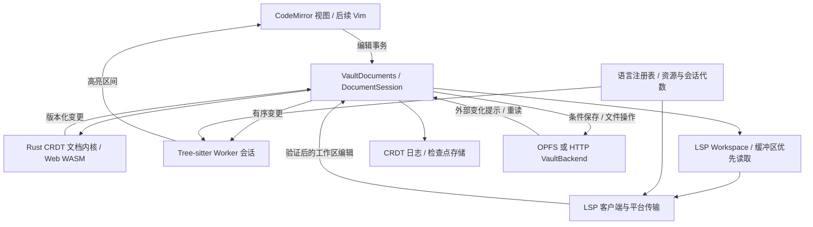

# 下一里程碑：Rust / CRDT 编辑器内核、Tree-sitter 与 LSP

日期：2026-10-03。初始状态：实施方案，本文列出的阶段当时尚未在 Celestite 实现。本文整合当日 Tree-sitter / LSP 调查与归档 Notist 编辑器分析，形成可以拆成多轮 PR 的里程碑计划。调查结论与版本边界在本文内记录，不依赖外部会变化的文档。

修订：2026-10-04，按用户决定统一为 `celestite-core`，WASM 放在 feature 后面，并将 Vault 的目录身份、文件发现和未打开文件同步提前纳入核心与最小协作闭环。详细规则与新增实验见 [Vault 级 CRDT 同步设计](<2026-10-04 vault-crdt-design.md>)。

实施进展（2026-10-04）：文档内核、WASM feature、无头 server 宿主及文本历史恢复已完成第一轮实现，见 [无头 server 实施记录](<2026-10-04 headless-editor-kernel.md>)。Catalog CRDT、Web 内核迁移、Tree-sitter 和 LSP 仍待实施；下文的“当前基线”保留原调查时点。

模型确定（2026-10-04）：见 [Vault 实例模型](<2026-10-04 vault-instance-model.md>)。Vault 是逻辑定义，VaultInstance 持有本机资源，Vault 列表登记本机实例；存储、目录映射、主动连接和对外共享分别配置。Web 使用 WASM core，Tauri 通过 IPC 访问 native core；独立 server 复用 native 运行时。后续实施按该模型拆分，同时保留本路线图的语言功能验收。

## 里程碑目标与用户可见结果

将现有“CodeMirror 缓冲区 + 整文件保存”升级为以 Rust 文档内核为基础的编辑系统：CRDT 负责文本历史和协作编辑语义，CodeMirror 负责交互，Tree-sitter 负责语法高亮，LSP 提供语言功能。四者使用同一份版本化内存正文。

完成后，用户可以继续使用默认 OPFS Vault 和 URL 连接的远端 Vault，编辑、切换标签、撤销、保存及处理外部修改；试点语言具备 Tree-sitter 高亮，以及诊断、补全、hover、定义跳转和可用的格式化。未保存内容参与分析，切换标签和重载语言资源不会丢失正文或撤销历史。语言服务失败不阻断普通编辑和保存。

CRDT 从单人编辑开始参与，不等到多人协作时才换内核。同步范围是整个 Vault，采用目录文档、每文件独立文本历史与附件引用，而不是仅同步活动标签。本里程碑要求验证副本离线合并、Rust / WASM 一致性，以及最小双客户端的文件发现、目录变化和未打开正文更新；复杂传输、生产成员管理及完整离线附件镜像后续推进。现有 HTTP Vault 在该闭环实现前仍使用条件保存，不宣称已支持 CRDT 协作。

Tauri 原生 Vault 与本机 LSP 进程继续延后。Rust 内核先以 native 测试与 Web WASM 验证，首个语言功能闭环在纯 Web 完成。远端 Vault 位于服务器目录时，可按需接入该服务器上的 LSP，但不以完成 Tauri 为前提。

| 阶段                | 主要交付                                       | 前置条件       |
| ------------------- | ---------------------------------------------- | -------------- |
| A：Rust 编辑内核    | CRDT 文档、Vault 模型、冲突语义与 WASM feature | 归档契约提取   |
| B：编辑、恢复与同步 | CM6、日志、保存协调与最小 Vault 同步闭环       | A              |
| C：Tree-sitter      | 试点高亮、增量解析、语言资源管理               | B；可与 D 并行 |
| D：LSP              | Web 服务、工作区、语言功能与受控修改           | B；可与 C 并行 |
| E：里程碑收口       | 动态重载、故障恢复、集成验收和性能记录         | C、D           |

## 当前基线与归档证据

### Celestite 当前实现

代码基线为 `390cba8`（2026-10-03）。

- `Vault` 拥有 `VaultBackend`、`VaultDocuments`、文件树和编辑器缓冲区。默认 OPFS Vault 不可删除，远端 Vault 通过 URL 连接。
- `VaultBackend` 以 Vault 内相对路径提供文件操作。OPFS 的 `watch()` 接受订阅但不发事件；应用内部操作可以主动通知上层。
- `VaultDocuments` 管理正文、自动保存、文件操作队列与保存冲突。当前文档 ID 在运行时内保持稳定，没有持久化的 CRDT 文档身份和历史身份。现有 `revision` 是后端文件版本，不是正文变更序号。
- 正文解码为 UTF-8，内存换行规范为 LF；保存时恢复记录的换行形式和 BOM。超过 5 MiB 的文件当前不进入正常编辑流程，此限制在本里程碑中先保留。
- `CodeEditor` 使用 CM6 自己的历史；切换标签会销毁视图、缓存 `EditorState`。当前语言包使用 Lezer，并提供高亮、折叠、缩进等能力。
- HTTP server 支持目录文件操作、ETag 条件保存和外部变化提示，没有 CRDT 历史交换或 LSP 会话。
- 外部文件变化后显式保存或关闭时已有“覆盖保存 / 丢弃编辑 / 取消”流程，迁移不能退化为静默覆盖。

### 归档实现可复用的部分

核查了归档 `notist` 的 `refactor` 分支，固定提交 `f4e121d84b77a80bb4608636519903a1fd6d6fdb`。主要编辑器尝试位于 `editor/`，其中 `d0c423c` 为 `WIP: editor-attempt`。

| 部分                          | 已实现能力                                | 迁移判断                             |
| ----------------------------- | ----------------------------------------- | ------------------------------------ |
| `editor-document`             | Loro 文本、事务、因果版本、锚点、协作撤销 | 作为 Rust 内核起点，保留契约和测试   |
| `editor-node-wasm` 与 JS 包装 | Rust / Web 共用文档、异步事件交付         | 提取文档绑定，保留单一文档实例       |
| `source-projection`           | CM6 / Tiptap 共用源码，未知语法受保护     | 留作富文本后续设计参考               |
| `PeerNode`                    | 版本补齐、重连、多跳转发、持久化确认      | 保留协议经验，正式传输后续接入       |
| IndexedDB / redb 日志         | 有序追加、确认已提交版本、历史恢复        | 复用持久化语义，增加检查点和文件协调 |
| `text_file` 输出              | 临时文件替换、哈希检查、外部修改保护      | 不能直接沿用其数据库权威模型         |

归档文档内核固定 `loro = 1.16.2`。它维护一个 `LoroText("source")`，不依赖语言栈；网络节点和视图共用同一个文档 handle。初始历史创建一次，其他副本从快照加入，不能分别从相同字符串初始化后视为同一历史。

归档的 Loro / CM6 实验在固定版本中观察到初始化竞态、嵌套 dispatch、只恢复主选区、非 CM 本地写入不刷新视图，以及远端导入拆分 IME 撤销组。官方同步服务实验也观察到 ACK 早于持久化及异步保存竞争。这些是当时版本的观察，不宣称后续版本仍然如此；迁移时应保留对应回归场景，不能直接把旧官方绑定或参考服务端视为已满足验收。

Vim 实际位于归档 `obsidian-notist`，固定提交 `39b07fcd13c51d29571c224d387e0a4ac5871ca4`，使用 `@replit/codemirror-vim ^6.4.0`。它包含模式切换、中文输入处理、visual block、多光标，以及另一套 LSP / tree-sitter 接入，但没有与上述 CRDT 内核整合。该插件已声明 deprecated；其语言实现不能视为兼容当前 Notist。

本次实际重跑了文档内核 12 项、同步状态机 8 项和投影模型 7 项测试，共 27 项通过。未重跑完整 native 网络、WASM 浏览器和真实系统输入法链路。归档 README / ROADMAP 的阶段状态落后于实际代码，实施以源码和复跑测试为依据。

## 统一分层与所有权

### 稳定层

`Vault` 继续拥有运行时，不把网络同步对象塞进所有文件操作。`VaultBackend` 继续描述文件和目录，不承担文本撤销、语法解析或 CRDT 合并。

`VaultDocuments` 管理打开文档的生命周期、路径映射、保存和文件操作协调。每份打开的文档拥有一个 `DocumentSession`，其正文与历史由 Rust 内核维护。CM6 状态中的文本是显示副本，不能与内核形成互不约束的两份正文。

`VaultInstance` 持有本机运行时资源：目录 Catalog 管理整个库的身份与结构，文本存储管理独立正文历史，调度器后台补齐未打开文件。打开文档会话是其工作集的一部分，关闭标签不解除 Vault 同步，也不要求所有文件同时驻留内存。

文档会话独立于视图：切换标签仅 detach / attach 视图，后台文档仍接收内核变更、诊断和工作区编辑。关闭文档时显式处理保存、日志与语言会话；缓存的 CM6 状态重新挂载前必须追上内核版本。

### 可替换服务层

Tree-sitter、LSP 客户端和服务器会话从语言注册表创建，可以重载、失败或降级。语言服务不能直接写正文，也不能要求用户先保存才能读取未保存内容。

建议新增模块如下，名称是实施建议，不是现有接口：

| 位置                                | 职责                                                                              |
| ----------------------------------- | --------------------------------------------------------------------------------- |
| `crates/celestite-core`             | 共享 Rust 编辑内核：文档、Vault 结构与同步状态机；WASM 绑定位于 `wasm` feature 下 |
| `crates/celestite-server/src/vault` | 现有原生目录 IO 迁入此模块，组合内核、文件协调与服务端传输                        |
| `web/src/lib/editor`                | 文档会话、CM6 适配、日志与保存协调                                                |
| `web/src/lib/languages`             | 语言 ID、文件匹配、资源版本、语法与服务配置                                       |
| `web/src/lib/syntax`                | Worker、解析树、query、高亮结果与资源释放                                         |
| `web/src/lib/lsp`                   | 工作区、URI 映射、客户端、传输及会话管理                                          |

Rust 内核负责编辑语义，不要求把 Tree-sitter 和所有语言服务一并搬进 Rust。Web 初期可以在主线程调用文档 WASM，分析放 Worker；若实测输入开销过大，再评估内核 Worker 化及异步事务协议。

## 关键契约

### 身份与版本

必须区分以下概念，不能复用一个 `revision` 字段：

| 标识                   | 用途                                                                |
| ---------------------- | ------------------------------------------------------------------- |
| `documentId`           | 持久化文档身份，文件在应用内移动后不变                              |
| `historyId`            | 某份独立 CRDT 历史；历史丢失或重新建史必须换代                      |
| writer ID              | 活跃写入者身份；恢复与新实例使用新 writer，不能重复使用已有操作身份 |
| CRDT version           | 同一历史中的因果版本，供增量交换和事务预条件使用                    |
| content revision       | 当前文档会话的有序变更序号，供解析和分析追踪                        |
| session epoch          | 文档关闭重开后的实例代数，避免序号重用误收旧结果                    |
| backend revision       | ETag 或其他文件版本，供条件保存使用                                 |
| language generation    | grammar / query / 配置代数                                          |
| LSP session generation | 当前客户端和服务器会话代数                                          |

文档身份与 Vault 内路径的映射必须持久化。应用内 rename 更新映射并保留历史；外部 rename 无法可靠识别时应保守地按删除 / 新建处理，不凭内容相同推断身份。跨 Vault 移动、复制及历史丢失后的行为需要明确，不能意外共享两份独立文件的历史。

LSP URI 是项目地址，不是文档身份。文件或父目录移动后关闭旧 URI、打开新 URI，清理旧诊断；文档历史继续保留。URI 按组件编码，不能直接拼接含空格、`#`、`%` 的路径。

### 编辑入口、事件与坐标

本地写入统一进入 `transact(expectedVersion, edits, origin, undoContext)`；网络 CRDT 包通过验证历史身份的 `import` 入口。键盘输入、粘贴、多光标、格式化、LSP 工作区修改、外部文本回载和后续 Agent 编辑都要经过同一文档会话。

本地编辑范围采用事务执行前正文的 UTF-16 半开区间，排序且不重叠，拒绝代理对中间的端点。一次事务包含全部光标的改动。CM6 使用 `ChangeSet` 提供的精确多范围编辑，不能沿用原型每次取全文后只生成一个大替换的方式。

内核变更事件携带前后版本、序号、来源和准确的文本变化。跨副本导入产生的显示差异只用于更新视图和分析，不重新当作本地 CRDT 操作提交。允许因果状态变化而可见文本不变，此时版本仍应推进。

事件交付与 CM6 更新时序明确隔离，禁止嵌套 dispatch 和监听器重入；订阅回调错误不能把已经提交的编辑报告为失败。多个同步变更与缓存视图恢复时，保证有序消费或请求完整重同步。

内部正文继续使用 LF 和 UTF-16 坐标。Rust 字符串为 UTF-8，原生 Tree-sitter 字节位置需转换；Web Tree-sitter 坐标必须按实际版本验证，不能套用原生字节假设。LSP position encoding 单独协商，首期明确要求 UTF-16 或提供转换；stdio 的 UTF-8 字节编码与 position encoding 是不同概念。

### 撤销与视图状态

Rust 内核拥有唯一的文本撤销历史。CM6 自有历史与后续 Tiptap 历史不能并行充当正文撤销来源。内核撤销保留远端修改，宿主为所有选区端点提供可变换的位置和视图元数据。

明确普通连续输入、IME、粘贴、格式化及多光标的分组规则。归档实现的“import 结束撤销组”作为需要评估的基线，不能直接视为满足真实输入法体验。撤销栈初期仅限编辑会话，不承诺重启后恢复；CRDT 持久化历史不等于持久化撤销栈。

切换标签、重载 query、grammar 或 LSP 保留正文、撤销、选区和滚动位置。外部回载或丢弃编辑可能需要主动清理撤销，但必须由明确的用户操作触发。

### 日志、普通文件与外部修改

编辑中的内存正文由内核管理；Vault 普通文件仍是用户和其他程序可以读写的文件。CRDT 日志用于恢复和同步，不能照搬归档“数据库永远权威、普通文件只是单向输出”的规则。

本里程碑先采用以下保守策略：

1. 持久化历史身份、日志、最后成功写出的文本基线及对应文件版本。浏览器优先评估归档 IndexedDB 日志实现，普通文件继续走 OPFS / HTTP；两类存储不需要使用同一种引擎。
2. 日志确认只覆盖实际提交的版本；明确区分内存已应用、日志已持久化、文本已写回，以及未来的远端已持久化。保存中新增编辑不能被旧批次的回执标成已保存。
3. 恢复时核对普通文件与最后写回基线。磁盘匹配而日志有更新时，可恢复未写出的编辑；磁盘已变化时保留双方内容、阻止自动覆盖，进入外部修改处理。
4. 普通文件缺失时不自动重新生成。区分明确的应用内删除与无法确认的外部删除，允许用户决定恢复为新文件或接受删除。
5. 保留覆盖、丢弃和取消流程。覆盖重新读取后端版本并条件保存；丢弃通过明确的内核回载事务更新当前状态、清理相关撤销，并使旧待写任务失效，避免下次恢复重新写出已丢弃内容。

外部编辑没有 CRDT 操作身份。若后续支持自动导入，应基于“上次磁盘正文 / 当前内存正文 / 新磁盘正文”转换差异或三方合并，重叠修改继续提示。不能将新磁盘全文直接替换当前 CRDT 并宣称协作修改已安全保留。本里程碑要求可靠检测与冲突处理，自动合并不是完成门槛。

日志与文件分属不同存储，保存不是跨存储原子事务。需用写回意图 / 检查点记录区分写回前后崩溃，恢复时核对实际内容；归档的 pending / written 哈希思路可以复用，但不能把哈希重检当作跨进程文件锁。OPFS 当前没有条件保存能力，不能继承 HTTP ETag 的保证；多标签编辑同一持久化会话先用明确的独占锁规则限制，或后续通过真正的协作协议协调。

保留尚未满足因果依赖的原始更新包，恢复不能只依赖一个可能遗漏 pending 包的快照。初期保留完整历史，设置存储预算与失败报告；检查点、压缩及旧副本接入策略在压缩启用前另行验证，不能静默裁剪历史破坏锚点。

### 工作区读取与修改

新增不触发保存的工作区读取入口：已打开文档读内存，未打开文件读 backend。当前 `treeBackend.readFile` 会先保存缓冲区，不适合作为 LSP 或项目分析读取入口。

工作区编辑先验证 Vault / URI 范围、文档版本、服务代数、只读 / 锁定状态及编辑重叠，再进入统一队列。后台文档和未打开文件都要有明确处理，必要时创建临时文档会话。多文件修改不具备现成的文件系统原子回滚能力，失败时报告已完成范围。

应用内 create / rename / remove 产生业务事件供语言工作区消费；不要求 OPFS `watch()` 发事件。外部变化提示是不完整的重读线索，不是有序编辑日志。

## 阶段 A：迁入 Rust 编辑内核并确定 Vault 模型

目标：在不依赖 UI、语言服务和网络的条件下，建立可测试的通用编辑内核。

交付：将现有目录 IO 迁入 server，在 `celestite-core` 建立共享编辑内核及 feature-gated WASM 绑定；提取归档事务、身份、版本、锚点、撤销和事件契约，固定并验证 Loro 版本。建立独立 Catalog、稳定 EntryId、正文引用、路径投影与删除记录；保留归档测试，增加 Vault 双副本测试。公共接口不泄漏原始 Loro container，也不包含具体文件 IO 或语言语法。

验收：

- 多范围编辑、无效范围、过期版本、Unicode 和空文本正常；验证失败不部分修改正文。
- 两个以上内存副本离线编辑、乱序和重复交付后收敛；协作撤销保留对方修改。
- 快照、增量和历史身份校验有效；新 writer 恢复，writer 碰撞和跨历史导入被拒绝。
- pending 更新恢复不丢失；完整历史下锚点插入亲和性及删除行为稳定。
- Rust native 与正式 WASM 绑定对同一操作序列得到一致文本、版本和位置结果。
- 并发移动保持无环，同名条目保留两份内容；删除 / 编辑 / move 及目录后代处理符合应用策略。
- 目录文档与正文独立建史，新建、引用乱序和文件移动不会生成第二份正文历史。

## 阶段 B：编辑、可靠恢复与最小 Vault 同步

目标：将内核接入真实 Celestite 编辑与保存流程，形成可被语言功能依赖的稳定文档运行时。

交付：`DocumentSession`、CM6 事务适配、全部选区恢复、日志存储、身份映射与保存检查点；增加有序内容事件、成功保存事件、文件操作事件和缓冲区优先读取。建立最小连接与 Vault 内容调度，支持未打开文件的后台验证、持久化和补齐。保留原有 Vault、自动保存、文件树和冲突提示行为；协作模式与旧 HTTP 文件保存模式明确区分。

验收：

- 键盘、粘贴、中文组合输入、多光标、撤销 / 重做正常；没有嵌套 dispatch 或编辑回声。
- 标签切换、后台修改、视图重建后正文一致，撤销与选区不丢失。
- 刷新或重启可恢复已确认日志；存储失败不虚报成功，已有普通文件仍可读取。
- 自动保存、保存中继续输入、文件 / 目录移动、删除、只读 Vault 与关闭冲突正常。
- 外部修改及恢复时磁盘变化不会静默覆盖；丢弃后不会由日志或旧任务复活。
- 旧纯文本文件可以打开并建立新历史；历史损坏 / 丢失有明确错误和安全重建路径，不冒充原历史。
- 两个编辑器发现新文件与目录变化；另一端从未打开或已关闭的文本也能补齐更新，活动标签不是同步范围。
- 全库索引与驻留工作集分开，总文件数不受打开实例上限限制；附件未取得时不虚报完整离线可用。

这是 Tree-sitter 与 LSP 接入的共同前置阶段。其后的两条分析链路可以独立开发和验收，但统一消费本阶段的事件。

## 阶段 C：Tree-sitter 高亮与语言资源管理

目标：在 Worker 中维护与文档版本一致的解析会话，通过 CM6 装饰呈现高亮。

首期选择 JSON 作为试点，后续扩展到 JavaScript / TypeScript，以及 Markdown / HTML 的注入语言。保留 Lezer 的折叠、缩进和语言数据，拆开默认高亮与语言能力，让试点语言只有一个明确的颜色来源。Tree-sitter 装饰不会自动替代 CM6 的语法树 API，不把 AST 转成 Lezer Tree 作为首期任务。

实现要点：

- grammar WASM、运行时和 query 作为配套语言资源打包，固定版本与内容摘要，按需加载。核查过的 Web 坐标证据是 0.25.10，不把它当作实施时的最新版本要求。
- 按语言资源组隔离 Worker，共享 grammar / query；parser / tree 按文档会话维护，不为每个文件单独起 Worker。
- 初次发送完整快照，后续使用内核事件增量编辑旧树，再增量解析。多范围修改统一使用旧坐标从后向前应用或明确的逐步映射。
- 请求携带 document ID、session epoch、base revision、目标 revision 与 language generation；缺失事件则完整重同步。
- 旧装饰先映射位置，再接受匹配版本的新 capture。解析与可见区间绘制分别调度，滚动不反复发送全文。
- 明确 query 谓词、locals 和 injections 的支持范围；不能仅依赖 AST 结构 changed ranges 忽略字符串内容引起的 query 变化。
- 替换树、关闭文档、卸载 Worker 时释放 WASM 资源。首期用普通单线程 WASM，不预设 SharedArrayBuffer 部署要求。

验收：试点语言高亮正确；中文 / emoji、多行和多范围编辑坐标一致；相同语法结构的文本修改仍刷新捕获；快速切换语言、关闭重开和慢 Worker 的旧结果均不覆盖当前状态；资源失败降级为可编辑文本或原有语言支持。

## 阶段 D：LSP 工作区与首个 Web 语言服务

目标：为试点语言提供真实可用的语言功能，并让服务读取未保存正文和项目内容。

先评估固定版本的 `@codemirror/lsp-client`，通过自定义工作区接入文档会话。此前核查的源码版本是 6.2.2 镜像，包含诊断、补全、hover、签名、格式化、跳转和重命名等能力；正式依赖选择时必须重新验证，不能把调查中的能力或局限推广到所有版本。

核查版本的默认工作区跟随视图，工作区编辑主要操作现存视图，重命名未完整覆盖未打开文件；服务器主动请求、保存退出和 semantic tokens 也不能假定齐全。应用需补齐适配，或在目标服务器要求超出边界时选择 JSON-RPC 层与自有 CM6 扩展。

首个纯 Web 试点选 JSON 的浏览器语言服务，为其增加薄的 Worker LSP 包装，通过正式客户端完成真实请求闭环。直接适配语言服务 API 可以用于前期验证，但不作为 LSP 接入完成的依据。另用受控协议服务验证 initialize、能力协商、文档同步、服务器主动请求及错误处理；为远端服务及后续桌面服务保留相同传输边界。

平台与工作区规则：

| 方案                | 服务运行位置                   | 项目内容来源                        |
| ------------------- | ------------------------------ | ----------------------------------- |
| 纯 Web Worker       | 可浏览器运行的 JS / WASM 服务  | 缓冲区优先的虚拟文件系统            |
| Web + 远端 Vault    | server 上受管理的语言服务器    | server Vault 目录 + 未保存文档同步  |
| Web OPFS + 远端 LSP | 后续按需提供项目镜像或文件 RPC | 必须另建同步规则，不由 URI 自动实现 |
| 后续 Tauri          | Rust 管理的本机子进程          | 原生 Vault 根目录 + 未保存文档同步  |

普通语言服务器不能直接读取 OPFS URI；`didOpen` / `didChange` 也不能代替未打开文件、配置、标准库和依赖访问。Node 服务器不能直接塞进 Web Worker，JS / TS 完整项目分析等逐语言规划。

实现要点：

- 会话按 Vault、项目根和服务器类型复用，后台标签不因视图销毁而 didClose。
- 初始化后按协商同步能力发送内存正文；实际文件保存成功后才发送适用的 didSave，日志持久化不触发 didSave。
- 补全、hover、格式化及工作区修改捕获请求时文档版本和服务代数；诊断按协议提供的版本校验，服务器不带版本时不能宣称严格消除所有过期诊断。
- 定义跳转通过 URI 打开或激活文档。格式化和工作区修改进入统一事务入口，不能绕过撤销或版本检查。
- 受支持的服务器主动请求要明确处理，不支持的请求返回协议错误，不能静默忽略。
- 远端会话只能访问绑定项目范围；服务断开或崩溃可恢复，不影响编辑保存。

验收：诊断、补全、hover、定义跳转和可用的格式化闭环；未保存内容参与分析；后台及未打开文件可被工作区读取 / 修改；重命名无旧 URI 诊断残留；只读、过期和越界修改被拒绝；服务故障和重启不丢正文。

## 阶段 E：资源重载、故障恢复与里程碑收口

目标：高亮和语言服务可持续迭代，验证四个模块组合后的实际体验。

语言资源采用可版本化的包描述，包含 manifest、grammar、`highlights.scm`、可选 injections / locals 及服务设置。默认资源随构建发布；用户 / 开发覆盖来源与 Vault 正文分开管理。

| 修改                                 | 重载行为                                          |
| ------------------------------------ | ------------------------------------------------- |
| 颜色与 capture 样式映射              | 重绘装饰，复用解析树                              |
| query                                | 编译验证后替换，重新捕获                          |
| grammar 或运行时                     | 新 Worker 用当前正文重建树，不复用旧 grammar 的树 |
| 注入规则或依赖语言                   | 使相关解析会话失效并重建                          |
| 支持动态更新的 LSP 设置              | 通知服务器；不支持则受控重启                      |
| LSP 程序、参数、初始化配置或适配代码 | 重建对应服务 / 客户端会话                         |

统一入口建议为 `reloadLanguage(languageId)` 和 `restartLanguageServer(sessionId)`。按“准备候选 → 验证 → 从内存快照初始化并追上后续编辑 → 切换 → 清理旧实例”执行；资源加载期间不能丢掉新输入。相邻变更合并，同一目标串行重载，被替代的候选释放资源。

错误 query 或 grammar 保留旧资源。服务器若必须独占启动，则先停旧服务，失败后尝试旧配置恢复；不承诺所有 LSP 都能无缝双实例切换。服务重启后同步最新内存正文，拒绝旧会话回包。重连远端 WebSocket 不必然等于重启服务器，需明确服务会话协议。

开发文件监听、Vite 更新事件和生产手动命令走同一套注册表入口。grammar 源码先完成 WASM 构建再触发重载。Web 不借此改变 OPFS 空 watch；语言配置写入事件可以主动触发更新。

验收：重载成功和失败均保留正文、撤销、选区、滚动和后台标签；连续输入期间替换 Worker / LSP 不丢编辑；旧回包不能修改新会话；重复重载不累积 Worker、监听器、parser 或服务进程。

## 后续阶段：保留方向，但不扩大本次完成门槛

### Vim 与完整编辑交互

复用归档插件的 Compartment、模式事件、焦点恢复、visual block 和 Alt 多光标经验。normal / visual 关闭 DOM editable 以减少 IME 干扰，但不能把文档设为 readOnly，Vim 删除和粘贴仍需编辑。模式事件延迟 dispatch，并增加实例代数和启用状态检查，避免旧回调在切换文档或关闭 Vim 后生效。

接入统一内核撤销，验证 `u`、`Ctrl-r`、`.`、operator、insert 分组和多选区；不能只覆盖 `Ctrl-z`。`:w`、`:q`、`:wq` 走现有保存、关闭及冲突流程。真实系统输入法需要独立回归，不能只以合成 composition 事件代替。

### 扩展协作传输与成员管理

在阶段 B 的最小 Vault 连接与未打开文件同步闭环之上，再考虑 WebRTC、STUN / TURN、多跳和常驻中继。采用历史身份、增量版本交换、重连补齐及已持久化版本确认，不能将 socket ACK 当作远端已落盘。

现有 URL 连接远端 Vault 的方式保留，服务端声明是否支持协作及历史服务。普通 HTTP Vault 的多个客户端可以各自使用本地 CRDT 历史，但它们仍依赖文件 CAS 与冲突处理，不自动成为同一 CRDT 文档。

最小协作阶段已经需要共同 Vault / 文档历史、目录发现与删除 / 冲突语义。后续完善读写权限、成员撤销、临时 presence、跨 Vault 复制及更复杂的跨文件操作，不把正文 CRDT 当作完整 Vault 协作。

### Tauri 与 native 语言服务

先实现原生 Vault，再由 Rust 管理语言服务器的 executable、参数、工作目录、stdio、stderr 和进程退出。stdio 按 UTF-8 字节 `Content-Length` 解帧，支持头 / 正文分片和多消息粘连；前端接收完整 JSON，写入有序有界队列。超时退出回收子进程。

开发可使用用户安装的服务器，发布再决定 sidecar 与运行时依赖。桌面方案不自动推广到移动端。Tree-sitter 先复用 Web Worker，避免每次编辑经过 native IPC。

### 富文本投影与更完整语言能力

沿用“源码是权威文本、富文本是投影”的方向。可编辑结构需要可靠的 parser / 源码映射，未知结构保留受保护源码区域；不把归档的有限手写映射当作完整 Markdown / Notist 编辑器。两视图统一撤销、多选区和 IME，再评估局部投影更新。

跨文件符号重命名、code actions、semantic tokens、更多语言，以及 Tree-sitter 折叠 / 缩进完整替换在试点稳定后推进。大量附件、长文档性能、日志压缩和持久化撤销历史另作专项。

## 里程碑完成定义与提交方式

阶段 A 至 E 完成后才宣布本里程碑完成。各阶段按可独立验证的 PR 递进，不用一个大 PR 同时迁入归档网络、富文本和桌面代码。

- Rust / WASM 文档内核是正式编辑入口；普通文件编辑、CRDT 合并、协作撤销和恢复的契约通过测试。
- 默认 OPFS 与远端 HTTP Vault 原有编辑、文件操作和保存冲突流程无回归；身份映射及日志 / 文件协调已实际实现。
- 最小双客户端 Vault 同步覆盖目录变化、未打开正文与关闭标签后的补齐；同名、并发移动和删除冲突不丢内容。
- 至少一种试点语言的 Tree-sitter 高亮和 Web 语言功能真实可用；LSP 协议适配不是只有接口骨架。
- 未保存正文、后台标签、文件移动及工作区编辑使用同一文档运行时；旧服务结果不越过版本检查。
- query / grammar / LSP 的受控重载和故障降级通过，编辑保存不依赖服务在线。
- 实测记录冷启动、输入主线程开销、分析延迟、WASM / Worker 内存、日志增长与接近当前文件上限的退化；不预先承诺未经测量的时延或容量。

验证以纯 Rust / WASM 契约、真实 CM6 浏览器交互、存储恢复和故障注入、Worker / LSP 时序测试组成。重点覆盖 Unicode、多范围编辑、真实 IME、保存期间新编辑、刷新恢复、外部修改、后台工作区编辑及重载竞争。各 PR 只运行与其变化相关的检查，收口时跑完整回归。

修改 Web 代码后执行 `bun run --cwd web format`，交付前通过 `bun run --cwd web format:check`；Rust 按修改范围执行格式化和测试。文档为规划结果，不表示已安装 Loro、Tree-sitter、LSP 依赖或完成上述迁移。
