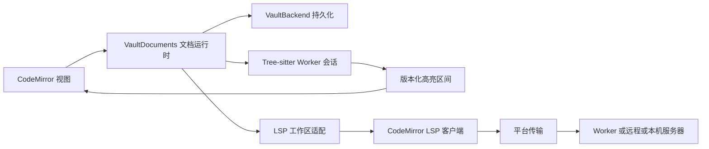

# Tree-sitter 高亮与 LSP 接入调查

日期：2026-10-03。范围：Celestite 当前 CodeMirror 6 编辑器、Web OPFS Vault，以及未来 Tauri 原生目录。本文记录本次代码核查、方案判断与后续验收条件；本次没有安装语言服务依赖或实现接入。

建议保留 CodeMirror，把 Tree-sitter 高亮和 LSP 作为两个可独立启用的扩展。Tree-sitter 首先采用 Web Worker 中的 WASM，实现 Web 与 Tauri 共用；LSP 优先评估官方 `@codemirror/lsp-client`，由应用提供文档工作区和平台传输。Tauri 桌面语言服务器由 Rust 管理子进程，Web 则逐语言选择 Worker 或远程服务。

## 当前代码提供的接入点

`web/src/components/editor/languages.ts` 按扩展名加载 CodeMirror 语言包。这些包使用 Lezer；当前已经具备增量语法解析，并非全靠正则表达式高亮。`CodeEditor.tsx` 用 `HighlightStyle` 将语法类别映射到 CSS，折叠、缩进、局部补全也依赖语言扩展。

`VaultDocuments` 管理稳定的文档 ID、正文、保存队列，以及文件移动和删除。它尚未提供内容 revision、增量修改事件、成功保存事件或编辑器事务接口。存储仍整文件保存；增量解析和 LSP 同步可以独立于保存频率运行。

`VaultEditor` 只挂载当前文档的 `CodeEditor`，切换标签时销毁旧视图、缓存 `EditorState`。解析树和 LSP 已打开文档的生命周期因此应跟随文档运行时，视图只负责显示、光标和发送编辑事务。

当前 Tauri 的 `src/lib.rs` 仍只有示例 `greet` 命令，未实现原生 Vault、语言服务器进程或 IPC 桥接。首页在 Tauri 容器中也仍打开 OPFS。原生 LSP 能读取真实目录，是后续实现原生 Vault 后的方案，不能视为当前已有能力。

## Tree-sitter 接入方式

建议实现独立的 CodeMirror 扩展：编辑事务 → Worker 增量解析 → query 捕获区间 → `Decoration.mark`。CodeMirror 已安装版本提供 `StateField`、`StateEffect`、`DecorationSet`、`ViewPlugin` 和 `visibleRanges`，无需替换编辑器 DOM。

每种语言需要运行时 WASM、grammar WASM 和匹配 grammar 版本的 `highlights.scm`。HTML、Markdown 代码块等还需要注入语言的调度；`locals.scm` 的作用域处理和查询谓词也需明确支持范围。只有调用 query 并遍历 captures，尚不足以保证与成熟 Tree-sitter 编辑器同样的高亮效果。

建议用 Worker 服务持有按文档 ID 区分的 parser/tree 会话，grammar 和编译后的 query 按语言复用。为支持下文的动态重载，初期按语言资源组隔离 Worker，而非所有语言共用一个 Worker，也不为每个文件创建 Worker；Worker 懒启动并限制闲置资源。闲置文档可释放解析树并在重新激活时重建；替换树、关闭文档或销毁服务时释放 WASM 资源。

### 增量更新与异步结果

初次打开传完整正文。后续从 CodeMirror `ChangeSet` 提取改动，先 `tree.edit` 更新旧树的位置，再 `parser.parse(newText, oldTree)` 复用旧树。一个事务包含多个修改时，必须统一坐标约定，例如按旧文档位置从后向前应用，或逐个映射到中间文档；不能混用 `fromA` 和 `fromB`。

Worker 消息建议包含 `documentId`、`revision`、语言配置代数，以及 `baseRevision`。Worker 先验证基准 revision，缺失编辑序列则要求完整重同步。主线程只接受当前文档和配置版本的结果；语言切换、重命名为不同扩展名、关闭后重新打开均应使旧结果失效。

编辑发生后，可以先通过 `DecorationSet.map(changes)` 映射已有装饰，等新结果到达后替换。后台完整解析与可见区间高亮分别调度，避免滚动触发整篇正文反复传输。增量解析并不自动使 query 增量化：首次实现可以对有界正文重新执行 query，随后根据实测优化；不能仅凭结构 changed ranges 忽略字符串内容和查询谓词的变化。

### 字符坐标

CodeMirror 位置使用 UTF-16 code unit。已核查的 `web-tree-sitter` 0.25.10 Web 桥接在 JS 与 C 之间转换 UTF-16 code unit 和字节偏移，因此其节点 index 与列坐标不能套用“原生 UTF-8 字节数”的假设。若以后改用 Rust Tree-sitter 解析 UTF-8 输入，则需另外转换字节位置。

应用内部高亮区间统一约定 UTF-16；实现时对选定版本验证中文、emoji、代理对、多行插入和多个编辑。文档运行时已将 CRLF/CR 规范为 LF，解析与 LSP 使用这份内存正文，保存时再恢复原换行形式。

### 与现有 Lezer 共存

初期保留 Lezer 的折叠、缩进和语言数据，为试点语言替换高亮输出。需要把当前 `languageSupport()` 返回的语言能力与默认高亮配置拆开，明确哪个高亮层负责最终颜色，避免嵌套装饰互相覆盖。

直接把 Tree-sitter AST 转成 Lezer Tree 会牵涉节点类型、位置、局部重解析和混合语言机制，不建议作为第一阶段。只用 Tree-sitter 装饰，也不会自动让 CodeMirror 的语法树 API、折叠和缩进读取 Tree-sitter AST；完整替换需要逐项实现这些能力。

Web 和 Tauri 首先共用 WASM Worker，避免每个编辑事务都经过 Rust IPC。grammar 与 query 应随构建打包、按语言懒加载、记录版本和校验值。普通单线程 WASM Worker 不天然要求 SharedArrayBuffer 或跨源隔离；若选用线程化运行时，需单独验证部署要求。

## LSP 客户端评估

本次核查到官方 GitHub 已归档镜像中的 `@codemirror/lsp-client` 源码，其 `package.json` 标注 6.2.2，MIT 许可。它的 CodeMirror 依赖范围覆盖本项目目前版本，新增依赖包括 `@codemirror/lint` 和协议类型包。新维护站点访问返回 403，因此本文不宣称 6.2.2 是最新版本，也不将镜像局限推广到所有后续版本。

核查版本包含补全、hover、签名提示、诊断、格式化、跳转和符号重命名，以及可自定义的 `Workspace`。其传输约定是 `send(message: string)`、`subscribe(handler)`、`unsubscribe(handler)`，消息是完整 JSON 文本，不带 stdio 的 LSP 头。推荐按功能选择扩展，试点先启用诊断、补全和 hover。

核查版本的限制需要在选定正式版本时重新验证：

| 能力           | 核查发现及接入影响                                                                                 |
| -------------- | -------------------------------------------------------------------------------------------------- |
| 默认工作区     | 跟随编辑器视图打开和关闭；需要适配我们的后台标签与文档生命周期                                     |
| 跨文件跳转     | 应用实现 `displayFile(uri)`，打开或激活目标文档并返回视图                                          |
| 符号重命名     | 源码处理 `response.changes`，且跳过未打开的文件；不能直接承诺整个 Vault 的跨文件重命名             |
| 工作区修改     | 默认 `updateFile` 只向现存视图 dispatch，应用需处理后台及未打开文档                                |
| 服务器主动请求 | 核心接收代码对未实现请求返回 MethodNotFound；`workspace/applyEdit`、配置和动态注册等不能假定已支持 |
| 语义高亮       | 已核查导出没有 semantic tokens 扩展；需要单独实现或重新评估正式版本                                |
| 保存和退出     | 应用需补充适用服务器的 didSave、shutdown/exit 与实际进程终止协调                                   |

应先验证官方客户端的具体版本和目标服务器，再决定是否增加适配或维护小补丁。若目标服务器依赖大量双向请求与动态能力，可进一步评估 Microsoft JSON-RPC 库搭配自有 CodeMirror 功能扩展；这会增加位置映射和 UI 接入工作量。没有必要仅为 LSP 切换到 Monaco。

## Web 与 Tauri 的运行方式

| 平台方案   | 语言服务器在哪里运行      | Vault 文件如何提供                       |
| ---------- | ------------------------- | ---------------------------------------- |
| Web Worker | 能浏览器化的 JS/WASM 服务 | 应用为服务提供虚拟文件系统和变更同步     |
| WebSocket  | 后端服务器上的进程        | 建立服务器端项目副本或服务特定的文件 RPC |
| Tauri 桌面 | Rust 管理的本机子进程     | 使用原生 Vault 根目录及 `file:` URI      |

浏览器没有启动任意本机进程的通用 API。Worker 也不会自动让 Node `fs`、系统依赖或编译器工具链可用。OPFS 数据属于浏览器的站点存储，普通语言服务器不能从一个 `opfs:` URI 直接读取它。

`didOpen`/`didChange` 可以提供打开文档的正文，但不能代替未打开文件、配置、依赖和标准库的访问。Web Worker 的虚拟文件系统应从 Vault 填充按需内容，并同步新建、保存、重命名和删除；远程方案还需保持服务器副本一致。文件读取不能使用目前会强制保存的 `treeBackend.readFile`，应新增读取“未保存缓冲区优先、后端兜底”的工作区接口。

首个 Web 试点可以选择 JSON/CSS 等浏览器语言服务，直接适配其语言服务 API，或加薄的 Worker LSP 包装。JS/TS 全项目服务还需要虚拟模块解析、标准库与依赖内容，普通 Node TypeScript language server 并不能直接塞进浏览器 Worker。Rust、Python 等逐语言评估，不作所有服务器都能编译到 WASM 的承诺。

Tauri 桌面建议将进程启动、工作目录、stdio、stderr 和退出回收放在 Rust 服务中，前端只获取会话及 JSON 消息。Tauri 支持 sidecar 打包和 Channel；若用 shell 插件读取 stdout，应开启 raw 输出并自行按字节解帧，避免默认逐行读取破坏协议。也可以直接使用异步 Rust 子进程 API。

stdio 的 `Content-Length` 是 UTF-8 正文字节数。接收端需处理头或正文分片、多个消息粘在一起、中文与 emoji，以及 stderr 和 stdout 分流。Rust 解帧后的完整 JSON 可经有序 Channel 交给前端；反向发送排入有界、有序写队列。CodeMirror `Transport.send` 是同步接口，桥接中的异步写入失败、进程退出及重连应由会话层统一报告。

安装型服务器可先用于开发试点，发布时再选择随 sidecar 分发或用户配置可执行文件。Node 服务器还需要 Node 运行时。桌面进程方案不能自动推广到 iOS/Android，需要单独选择移动端能力。

## 推荐的应用边界

建议新增 `lib/languages` 管理语言 ID、扩展名、grammar/query 资源及服务配置；`lib/syntax` 管理解析会话；`lib/lsp` 管理客户端、工作区和 URI 映射。现有语言 `Compartment` 保留，另外增加高亮和 LSP `Compartment`，分别加载与降级。

文档运行时需要提供如下能力。这是拟定契约，尚未实现：

| 能力                          | 目的                                                                |
| ----------------------------- | ------------------------------------------------------------------- |
| `revision` 和有序内容编辑事件 | 解析会话和语言服务器使用同一份版本化正文                            |
| view attach/detach            | 切换标签时保存后台文档会话，重建视图后恢复诊断                      |
| 成功保存事件                  | 在真实写入成功后发送适用的 didSave                                  |
| 缓冲区优先读取                | 项目分析读到未保存修改，不强迫落盘                                  |
| 文档 URI 映射                 | Web 使用虚拟项目 URI，native 使用实际 file URI，路径仍由 Vault 管理 |
| 工作区编辑队列                | 将格式化、符号重命名等修改应用到活动、后台和未打开的文件            |
| 文件操作事件                  | 按服务器能力同步文件移动、删除与创建，无须改变 OPFS 的空 watch      |

会话可按 Vault、项目根和服务器种类复用，一份 Vault 可以有多个项目根与服务器。URI 不是文档 ID：重命名保留我们的编辑缓冲区 ID，同时关闭旧 URI、打开新 URI，清理旧诊断。虚拟 `file:` URI 只用于与特定浏览器服务器的兼容约定，不表示机器上真的存在该目录；URI 必须做组件编码，不能简单拼接包含空格、`#` 或 `%` 的路径。

工作区编辑要先验证 URI 范围、文档版本、只读/锁定状态和编辑重叠，再进入统一队列。现有多文件保存没有事务性；应用失败时应明确报告已完成范围，不能承诺原子回滚。LSP position encoding 与传输 UTF-8 编码是两回事；核查客户端的坐标实现按 UTF-16 处理，应确保服务器使用 UTF-16，或增加明确的编码转换。

## 动态重载与迭代方式

补充需求：语言配置、高亮规则、grammar 和 LSP 服务应方便迭代。推荐将重载作为语言运行时的正式能力，开发环境的文件监听和生产环境的手动命令均调用同一套入口。以下是设计契约，尚未实现。

| 改动内容                                       | 重载范围                                                   |
| ---------------------------------------------- | ---------------------------------------------------------- |
| 颜色、capture 到样式的映射                     | 更新 CSS 或映射并重绘装饰，复用解析树                      |
| `highlights.scm`                               | 在现有 grammar 上编译新 query，验证后替换并重新捕获        |
| `injections.scm` 或作用域规则                  | 替换规则并重新建立相关注入及局部分析状态                   |
| grammar WASM                                   | 启动对应语言资源组的新 Worker，用当前正文重建树            |
| Tree-sitter 运行时 WASM 或 Worker 实现         | 重建受影响的 Worker，按内存快照恢复解析会话                |
| LSP 可动态调整的设置                           | 向支持该设置更新的服务器发送配置变化                       |
| LSP 可执行文件、启动参数、初始化参数或服务实现 | 重启对应项目/服务器会话，重新初始化与同步打开文档          |
| LSP 客户端适配代码                             | 在稳定文档工作区之上重建客户端与会话，替换 CodeMirror 扩展 |

grammar 更新后，旧树不作为新 grammar 的增量解析输入。采用新 Worker 也能回收旧 Worker 中加载的 WASM 模块和内存，避免反复迭代 grammar 时依赖未明确支持的模块卸载。共享 grammar、注入语言及对应查询的依赖关系由语言注册表记录，例如 JavaScript grammar 改动应同时使 HTML/Markdown 内相关注入会话失效。

### 稳定文档与可替换服务

`VaultDocuments`、编辑器视图和撤销历史属于稳定层；语言注册表持有可替换的定义，解析及 LSP 服务从定义创建实例。常规语言重载不销毁编辑器、不刷新页面，也不要求先把未保存内容写入 Vault。

推荐入口为 `reloadLanguage(languageId)` 和 `restartLanguageServer(sessionId)`，另有重载全部语言的开发命令。调用者只提出目标；注册表对比 grammar、query、设置和服务程序的资源版本，决定实际替换范围。语言服务进程版本与高亮资源版本分别管理，以免改配色时重启 LSP。

沿用文档 `revision`，另增加解析配置 `generation` 和 LSP `sessionGeneration`。结果必须同时匹配所属文档、会话和版本。旧会话的诊断、补全、hover、格式化或工作区编辑回包不能在新会话中应用；取消请求只是辅助，版本核对仍为必需。

重载按“准备候选 → 加载并验证 → 同步最新正文 → 切换实例 → 清理旧实例”执行。准备期间继续记录编辑，候选先从某个 revision 的快照初始化，再按序补齐之后的修改；最终切换前验证已追上当前 revision。不能忽略用户在 Worker 启动或服务器 initialize 期间输入的内容。

query 编译失败、grammar 不兼容或候选服务启动失败时，保留旧配置并显示具体错误。必须独占的 LSP 进程可以先停旧服务再重启；失败后以旧配置尝试恢复，并保留正常编辑保存能力，不能承诺所有服务器都支持同时启动两个实例。成功重启后清除旧诊断和补全结果，重新发送内存缓冲区的 didOpen，随后继续 didChange；LSP 文档版本在新的会话内重新建立，应用自身的 revision 保持连续。

LSP 没有要求所有服务器提供统一的程序热替换命令。配置更新通知是否实际生效取决于服务器；无法确认支持时，用受控重启兜底。桌面进程按 shutdown/exit 尝试退出，超时后终止并回收；浏览器服务终止并新建 Worker。远程方案必须与后端约定项目会话重启接口，单纯重连 WebSocket 不保证服务器或其项目状态已重建。

### 配置来源和开发触发

把语言描述、query 和 grammar 资源组织为可版本化的语言包，例如一个语言目录包含 manifest、`highlights.scm`、可选 `injections.scm` 及 grammar WASM。manifest 记录语言 ID、文件匹配、资源摘要和 LSP 启动/设置描述。默认包随应用发布，开发或用户覆盖包由独立配置来源提供；不是必须把可执行服务程序放进 Vault。

开发环境可用 Vite 的模块更新入口接入适配代码，query/manifest/WASM 则由开发插件监听文件、发送自定义更新事件给语言注册表。grammar 源码变更仍需先编译出 WASM；等构建完成并校验后才触发重载，不能把 grammar 生成器当作运行时动态解释器。

生产环境的 Tauri 使用配置目录监听，Web 使用应用自己的配置写入事件、版本检查或手动重载。OPFS `watch()` 继续保持不发事件：应用内写入后主动通知即可，外部直接修改 OPFS 不保证自动被检测到。资源按内容版本加载，避免 URL 缓存返回旧 grammar；不依赖反复动态 import 同一个 URL 来替换模块。

多个相邻文件变化合并为一次重载，grammar 与其 query 作为一致的资源版本验证。同一目标的并发重载串行并合并到最新版本；候选被新请求取代时释放资源。开发 HMR 的销毁钩子负责清理监听和旧适配实例，稳定文档层则明确保留。这个保证适用于语言扩展的受控重载；整个文档运行时代码的变更若无法兼容，仍需另行处理状态迁移。

新增验收：改 query 后即时更新；错误 query 保留旧高亮；grammar 重载期间连续输入不丢编辑；重复重载不累积 Worker、监听器或语言服务器；旧 LSP 返回的工作区修改被拒绝；成功和失败重载均保留撤销历史、光标、滚动位置、后台标签及未保存内容。

## 建议实施顺序与验收

1. 增加文档 revision、内容/保存/文件操作事件与缓冲区优先读取，保持 OPFS 存储接口稳定。
2. 用一种语言验证 Tree-sitter Worker、资源打包、增量解析和高亮装饰，运行 Web 与 Tauri WebView；随后覆盖 Markdown 代码块和混合语言。
3. 为一个可浏览器运行的服务接入补全、hover 和诊断，验证未保存内容参与分析、快速切换与过期响应处理。
4. 接入原生 Vault 与 Rust 进程传输，试点一个桌面服务器，验证 stdio 分帧、崩溃、重连和工作区关闭。
5. 补跨文件跳转、格式化与完整工作区编辑；最后评估 semantic tokens、code actions 和更多服务器。

关键验收包括：中文和 emoji 的位置一致；撤销/重做及多光标增量修改；同一结构的字符串修改仍更新高亮；快速切换和关闭不应用旧结果；重命名文件/目录后不残留旧诊断；后台标签参与跨文件操作；断开的语言服务器不阻断编辑保存。性能数据应实测首开延迟、输入时主线程开销、WASM 内存、grammar 体积与大文件退化，不在调查阶段给出未经测量的承诺。

## 证据范围与提交状态

本文只链接固定提交的外部源码：[Tree-sitter 0.25.10 的 Web 桥接](https://github.com/tree-sitter/tree-sitter/blob/da6fe9beb4f7f67beb75914ca8e0d48ae48d6406/lib/binding_web/lib/tree-sitter.c)。其余外部核查内容以本次观察和版本限定记录，不引用会变化的站点文档或分支链接。Tree-sitter 发布列表已出现 0.27.0；0.25.10 只是这里的坐标证据基线，实施应固定并验证所选运行时、CLI、grammar 和 query 的配套版本。

LSP 客户端功能与限制来自上述 6.2.2 镜像的 client/workspace/rename/definition/diagnostics 源码核查；新维护站点的后续实现未核查，也没有运行集成原型。本次没有更换解析器、安装 LSP 包或启动语言服务器。

提交前 `web` 格式检查与 `git diff --check` 已通过。执行 `git add` 和 `git commit` 均因 `.git` 只读、无法创建 `index.lock` 而失败，未生成 commit，也未成功暂存。计划提交现有编辑器、侧栏与全局 UI 改动；`.stepcode/` 不属于本次提交范围。
