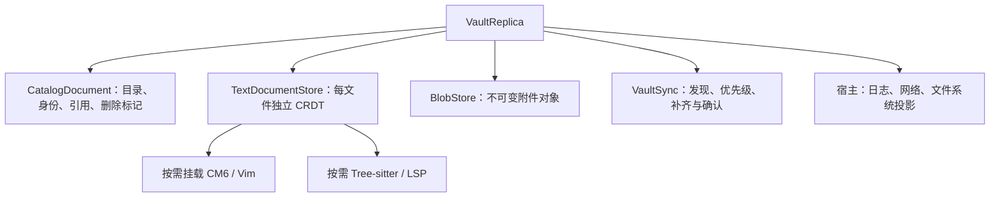

# 编辑器核心与 Vault 级 CRDT 同步设计

日期：2026-10-04。设计时状态：进一步设计与语义验证，尚未迁移产品代码。本文修订前一天以单文档为主的方案，明确 `celestite-core` 的边界，以及两个编辑器同步同一 Vault 时的结构、正文和文件系统语义。

实施进展（同日后续）：目录操作已迁入 server，core 已迁入文档内核并接入无头 HTTP 测试与历史持久化，见 [无头 server 实施记录](<2026-10-04 headless-editor-kernel.md>)。本设计中的 Catalog 和 VaultSync 尚未实现，下文保留设计基线。

## 已确定的组织方式

Celestite 本身就是编辑器，共享 Rust 库直接命名为 `celestite-core`。WASM 绑定放在同一个 crate 的 `wasm` feature 后面，不再单独建立 editor-core / editor-wasm crate。

当前 `celestite-core` 实际只有原生目录操作，代码基线为 `390cba8`。它应迁入 `celestite-server` 的文件后端模块；随后在 `celestite-core` 中建立文档与 Vault 编辑内核。此文只确定组织方式，没有执行该迁移。

```text
crates/
  celestite-core/
    src/
      document/     文本、事务、版本、锚点、撤销
      vault/        文件身份、目录结构、内容引用、删除与冲突策略
      sync/         多文档发现、版本交换、调度与确认状态
      wasm/         feature + wasm32 target 下的绑定
  celestite-server/
    src/
      vault/        原生目录 IO、文件监听、文本写回与协调
      ...           配置、鉴权、HTTP / 同步传输、后续 LSP 进程
web/
  src/lib/
    editor/         CM6、会话、视图状态与宿主存储适配
    syntax/         Tree-sitter Worker
    lsp/            语言工作区、客户端、传输
```

core 的共享领域代码不能依赖 Axum、浏览器对象或本地文件路径。同步模块处理消息与状态，宿主执行网络和存储 IO；服务器把它与原生目录组合，Web 把它与 OPFS、浏览器存储和网络组合。

Cargo 采用 `rlib` / `cdylib` 输出，默认不启用 WASM 绑定。`wasm-bindgen` 等绑定依赖为 optional，绑定模块同时检查 feature 和 `wasm32` target。native 的 core 测试不需要浏览器运行时，Web 构建启用 feature 后导出同一套内核的薄包装；JS 中不再创建第二份独立 CRDT 正文。具体依赖版本在迁移时固定并验证。

## 同步范围从标签页提升到 Vault

两个编辑器连接同一个 Vault，期望共享的是该库中的文件集合及其内容。打开的标签页只决定哪些文档需要编辑视图、高频交互和语言分析，不能决定哪些文件存在于同步系统中。

需要区分三件事：

| 概念         | 含义                                            |
| ------------ | ----------------------------------------------- |
| 同步范围     | 此副本有权发现和同步的 Vault 文件与目录         |
| 内容复制策略 | 哪些正文 / 附件已经下载，哪些后台补齐或按需获取 |
| 内存工作集   | 当前驻留的 CRDT、CM6、解析树和语言服务状态      |

建议默认同步整个 Vault 的目录索引，合格文本文件后台补齐内容；活动文档优先。附件先同步引用与可用性，正文按需获取或加入完整离线下载。附件未下载、文本尚未追上时要有明确状态，不能将“目录已出现”标为“完整离线可用”。将来可增加按目录选择复制，但目录层级不自动等于权限边界。

同一远端 Vault 的两个 Web 客户端不必各有一份物理目录才能参与协作。server 保有共享目录，Web 保有目录元数据、文档历史与内容缓存。未来 native / OPFS 的完整镜像则由相同逻辑状态驱动自己的文件后端。

每个新 OPFS 默认 Vault 仍是独立库。连接一个远端 Vault，加入的是它的逻辑身份，不会自动把本地默认库合并进去。

## 选择：目录 CRDT + 每文件文本 CRDT + 附件对象

| 方案                                      | 优点                                 | 主要代价                                                       |
| ----------------------------------------- | ------------------------------------ | -------------------------------------------------------------- |
| 整个 Vault 一个 CRDT 文档，正文都嵌在其中 | 事务和版本交换统一                   | 工作集、历史、恢复和独立订阅边界粗；不能假定支持按文件选择同步 |
| 每个文件一个 CRDT，仅靠扫描路径发现       | 易复用单文档内核                     | 缺少共同文件身份、目录移动、删除与新文件发现语义               |
| Vault 目录文档 + 独立文本历史 + 附件对象  | 结构发现统一，内容与工作集可独立管理 | 需要处理跨文档依赖与部分完成                                   |

采用第三种。对 Loro 默认按文档交换历史的能力，不预设“嵌套 container 就自动支持独立同步”。正文保持独立文档，不把附件字节或所有文本塞入目录文档。



## Vault 与文件身份

`VaultIdentity` 至少包含全局 Vault ID、Vault 历史代次和 schema version。当前 URL / 配置中的短 ID 是连接地址或显示标识，不能单独充当跨服务器和备份恢复后的历史身份。连接握手需要返回持久化的逻辑身份；服务器配置仍决定托管哪些库，客户端不获得创建 / 删除远端 Vault 的管理权限。

目录与文件拥有稳定 `EntryId`。路径由父目录关系和名称派生，不作为 CRDT 主键。文件移动不复制正文，不更换文件身份或文本历史；两个同名新文件仍是两个不同实体，不能因为路径相同就合并正文。

目录文档对外给出的条目视图可以表示为：

```text
Entry {
  id: EntryId,
  parent: EntryId | VaultRoot,
  name: string,
  kind: Directory | File,
  content: None | Text { historyId } | Blob { revisionRefs },
}
```

这是派生视图，不要求 parent 是普通 Map 字段。文本文档身份以文件 EntryId 与 historyId 组成；文本 / 二进制模式转换或重新建史是明确的内容代次变化，旧历史保留到恢复策略允许回收。移动文件不修改历史代次，复制文件则生成新身份和独立历史。

目录 Catalog 自身有独立历史和版本。正文版本、目录版本、后端 ETag 和视图 revision 分别管理，不能用一个全局整数代替它们。

## 目录文档与并发操作

优先评估 LoroTree 承载父子与移动关系，节点元数据保存名称、EntryId 和内容引用；另保存应用的删除记录。普通 `Map<EntryId, { parent, name }>` 不自动保证无环，不能据单端校验就认为并发移动安全。

归档正文内核目前只接受 `source` 文本容器，明确拒绝其他容器。Catalog 应是另一种领域文档，不通过放宽文本内核验证器来混入目录数据。两种文档共享导入封装、身份检查和持久化机制，但有不同 schema 与验证。

文件树首期仍按名称排序，不将 UI 排序偏好复制成文件系统事实。目录结构、文件名和内容引用是共享数据，展开状态、选区和滚动是本地数据。

### 并发行为约定

| 场景                         | 建议行为                                               |
| ---------------------------- | ------------------------------------------------------ |
| 一端编辑，另一端移动同一文件 | 正文按稳定 ID 合并，最终出现在新路径                   |
| 一端 move，另一端 rename     | 父目录和名称独立合并，保留两项不矛盾的操作             |
| 同一文件被并发 move 到两处   | 使用树 CRDT 的确定性选择，不产生两个正文副本           |
| 同一文件被并发 rename        | 名称用确定性寄存器选择，保留可查看的操作历史           |
| 两端各创建一个同名文件       | 保留两个 EntryId 和正文，进入路径冲突处理              |
| 两端互相将目录移入对方       | 树结构必须保持无环；不能把最终无环等同于两项意图都实现 |
| 一端删除，另一端编辑 / move  | 删除可见条目，但保留另一端正文与历史，供恢复           |

首期将 rename 和 move 作为不同领域命令。若以后提供同时改父目录和名称的命令，要明确并发合并可能组合出新的位置；同一个 CRDT commit 不自动保证业务意图在并发时整体胜出。

### 路径冲突

已经存在的本地目标仍可按当前文件树规则拒绝操作，但两端离线时各自检查通过，合并后仍可能同名。树和正文收敛不代表文件系统能够将两个实体写到同一路径。

logical tree 保留所有条目，路径投影确定性地选取占用者，其余进入保留身份的冲突区域；投影命名必须处理再次重名、大小写 / Unicode、平台保留名称与用户同名目录，不能只拼一个短后缀。冲突路径作为派生投影，不在每个副本上自动生成循环 rename 操作。

跨平台应固定逻辑名称规则，并区分逻辑路径与目标文件系统可写路径。目标平台写不出的条目保留逻辑状态与内容，明确报告投影冲突；不丢弃条目或覆盖现有文件。具体兼容规则与冲突命名算法在 Catalog 阶段固定并测试。

### 删除与恢复

采用显式删除标记与删除记录，不能仅调用 LoroTree.delete 后立即清理正文。首期删除标记对 EntryId 单调生效：后续 edit / move 不自动撤销它。用户恢复时创建新 EntryId / 历史，从保留正文生成恢复文件；原来的删除历史继续存在，避免旧副本再把它复活。

删除目录需要记录删除时已观察到的后代集合。对集合中的文件，删除优先于并发 move；从另一个旧副本新建到该目录的条目不在集合中，它们落入不可达 / 恢复区域，不静默丢弃，也不自动重建已删除目录。这是产品选择，需要用真实 CRDT 合并验证，不是树库的天然语义。

删除可见条目、删除物理文件、停止订阅正文、回收历史 / 附件是四种动作。未确认离线副本接入与保留窗口前，不立即 GC；远端已存在的编辑即便最终条目被删除，也应得到明确的已保留 / 被删除状态，而不是无声消失。

## 文本存储与未打开文件

每个可编辑文本文件维持一份独立 CRDT 历史和版本。不是每个文件都必须一直加载到内存，但所有已托管文本都属于 Vault 的内容同步范围。

| 状态                 | 保存什么                                     | 需要什么实例         |
| -------------------- | -------------------------------------------- | -------------------- |
| 已发现、尚未取得正文 | 身份、内容引用与同步目标                     | 无 CM6 / parser      |
| 已缓存、未驻留       | 快照、增量日志、已确认版本                   | 无常驻正文实例       |
| 后台处理更新         | 临时加载、验证合并、持久化后的版本           | 有界数量的 CRDT 实例 |
| 已打开编辑           | 同一正文实例、当前 writer 的撤销与视图元数据 | 按需 CM6 / 分析服务  |

关闭标签不解除 Vault 同步。未打开文件收到更新时，调度器临时恢复对应历史、导入并验证、提交日志，再按策略释放内存。只缓存未验证的原始包不等于已应用；“包已接收”与“版本已持久化”要分别报告。

只有收到共同的历史 seed 才能开始编辑正文。首次导入现有目录时，由托管者建立唯一的历史与身份；客户端从它加入。可以后台逐文件初始化，不要求启动时同时恢复全部 CRDT，但不能每个客户端各用同一个字符串独立初始化。

无法解码的文件、二进制或超出当前编辑预算的文本先作为 Blob 文件处理。当前 5 MiB 编辑上限保留，不能因为同步范围扩大就强制将任意大小文件载入文本内核。

正文的每次输入不必修改 Catalog 中的“最新正文版本”。Catalog 记录稳定引用，频繁变化的版本由同步层维护与公告，避免所有按键同时污染目录历史。

## 多文档发现与同步调度

同步连接绑定 VaultIdentity，先补齐 Catalog，再分批交换文本 / Blob 的版本与可用性。连接中复用多个内容流，不为每个文件建立 socket；目录引用先到或正文先到都允许暂存依赖，不能把“目前没看到目录条目”当作可立即丢弃正文的理由。

建议调度顺序：

1. Catalog、删除记录和重要状态确认。
2. 活动文档缺失操作和本地待发编辑。
3. 待保存、未确认或有工作区修改的后台文档。
4. 未打开文本的后台补齐。
5. 附件与完整离线下载。

低优先级任务也需要进度和公平性，不能被持续输入永久饿死。传输、待应用、存储队列都设置背压；文档工作集、日志容量与 Blob 缓存有独立预算。

版本清单分批比较，重连不能只重新打开当前标签。初期有界分批清单足够，规模增长后再评估摘要树。缓存淘汰不能删掉未发出的本地操作、pending 因果包或恢复所需的检查点。

归档 PeerNode 已有每文档 Open / State / Want / Update，但只知道宿主 attach 的文档，没有 Vault Catalog 和自动发现；并且固定最多 64 份 managed documents。应复用版本交换与确认语义，重构“全库索引”和“驻留文档”边界，不能让总文件数受当前打开实例数限制。

同步状态至少区分目录就绪、正文待补齐、附件待下载、内存已应用、本地已持久化、远端已持久化和物理文件投影状态。一次同步完成只能描述某个已观察的目录 / 正文水位，不能保证别的编辑器此后没有新编辑，也不能把不同文档版本拼成未经实现的全库原子快照。

## 附件与非 CRDT 内容

Blob 使用不可变内容对象和内容摘要验证，结构文档复制其引用；修改附件产生新对象。图片、PDF、音视频等不做逐字节 CRDT 合并。

同一附件被并发替换时，要保留多个修订引用或进入显式冲突，不能仅 LWW 覆盖唯一引用后立即回收败者。Blob 完整下载且摘要验证成功后才确认可用；失败保留旧版本。分块、续传和去重可分步实现，但不能把已收到部分内容当作完整附件。

这是应用对象存储机制，不假定 Loro 已提供文件流传输。连接远端 Vault 时附件可以从 server 按需读取；OPFS 完整镜像则需要缓存或下载策略。默认浏览器站点存储仍受配额与清理影响，日志确认不是永久备份。

## 跨目录文档和正文文档的依赖

拆分文档意味着没有免费的跨文档事务。以下规则需要实际协议与宿主日志配合：

- create 先产生并持久化正文 seed / Blob 对象，再发布可恢复的 Catalog 引用。远端看到引用但暂时没有内容时显示加载状态，不以空字符串创建新历史。
- rename / move 只修改结构引用；正文继续以 EntryId 定位。物理文件搬移是可重试的投影动作。
- delete 保留正文和恢复信息，先标记逻辑删除，再协调物理文件与待写任务。
- 多文件 LSP 修改分别形成文本事务，并提供 operation ID 与部分完成报告；不能伪装成全库原子 commit。
- 未完成操作保留意图 / 完成状态，崩溃后能继续或进入明确冲突，不依靠一次内存回调完成所有协调。

普通 Ctrl-z 首期仍针对当前文本会话。目录操作撤销单独定义；新建、删除、跨文件重命名的撤销不是单文档 UndoManager 自动提供的能力。presence、选区、标签、滚动和本地诊断不进入持久 CRDT；共享偏好另立明确范围。

## 与普通目录和外部编辑器的关系

CRDT 复制对象与普通文件后端仍是两层。服务端通过文件系统协调器接收外部变化，把可确认的变化转换为领域操作；再将逻辑状态安全投影到目录。该协调器跟随 Vault，不限于当前标签。

对尚未建史的文件，建立内容对象和唯一 seed；对已建史但未打开的文件，恢复其正文以处理变化。外部文本修改基于最后写回基线计算差异或三方合并，保留原内容；无法可靠转换时进入冲突。不能拿新磁盘全文替换当前已含远端编辑的正文。

维护最后写出内容、对应后端版本与操作意图，区分自身写回和外部修改。watcher 只是失效提示，需要重读与初始 / 重连对账；它不能保证提供完整有序操作。外部 rename 无法可靠关联身份时按删除 / 新建处理，并保留恢复信息。

server 对共享目录集中协调；Web 客户端不再各自以旧路径对同一协作文档不断整文件 PUT。现有 HTTP 文件接口可保留为附件、下载或兼容模式，但对 CRDT 已托管文件的写入必须经过同一协调器，不能形成绕过历史的第二条写入入口。

待写任务绑定 EntryId 和正文版本，提交前重新检查当前路径、删除标记与后端基线。不能把排队时的旧路径当作永久目标，否则并发 move / delete 后的延迟保存会重建旧文件或已删除目录。多个物理操作部分完成时保留投影状态并重试，不把 Catalog 已收敛等同于目录已经全部写回。

在同步模式落地前，普通 HTTP Vault 仍采用现有条件保存和冲突提示，不宣称两个客户端已共享同一历史。OPFS 的 watch 继续不发事件，应用内变更主动通知；多标签使用同一持久副本时要独占或明确协调 writer 与日志。

## 对 Tree-sitter 与 LSP 的影响

Tree-sitter 只为需要高亮 / 分析的文档保留树，不因“全库同步”就为每个文本启动 parser。打开文档时从当前正文初始化，后台变化由版本事件推进，缓存会话失配则重建。

LSP 工作区读取顺序为：未保存正文 → 已同步的内容缓存 → 远端 / 文件后端补齐。未取得内容是 unavailable / pending，不能伪装成空文件。项目分析可按需获取未打开文件；适用的文件变化通知来自 Vault 领域事件与文件投影事件，不依赖标签打开。

远端已写回的未打开文件可以进入 watched-files 通知；已通过 didChange 提供的缓冲区变化不再重复假装成一次磁盘保存。URI 随目录路径变更，正文身份不变。跨文件语言服务编辑也使用同一 VaultReplica，不另建互不关联的历史。

## 实施顺序与新的验收边界

1. 将现有目录 IO 收入 server，确定 `celestite-core` 与 `wasm` feature 的构建边界；迁移通用文档内核。
2. 实现 Catalog、EntryId、唯一历史、路径投影及删除 / 冲突规则，建立不依赖 UI 的 VaultReplica 双副本测试。
3. 接入持久化与后台内容存储，分别验证驻留与未驻留文件；再迁移 CM6 与现有保存冲突流程。
4. 用最小连接验证两个编辑器发现新文件、目录变化和未打开正文更新，建立同步能力协商；逐步扩展后台复制。
5. 接 Tree-sitter 与 LSP，验证项目读取和跨文件编辑；复杂传输、生产成员管理、完整离线 Blob 镜像及 Tauri 后续推进。

原路线图中“目录协作全部后置”的边界需要调整。目录身份、发现、冲突与删除规则应作为核心基础提前建立；否则稍后补全 Vault 同步会改动文档身份、保存、工作区和协议。可以分批交付，但不能以两个活动文档会收敛作为整个 CRDT 里程碑的唯一证明。

新增关键验收：

- B 从未打开的文件，在 A 编辑后也能在 B 获取最新正文；关闭所有标签后仍可补齐更新。
- A 新建 / 移动 / 删除目录，B 发现结构变化且正文历史不丢失。
- 两端同时创建同名文件，两个正文都保留；互移目录后无环。
- 删除与离线编辑 / move 合并后符合应用策略，恢复内容可用，旧副本不会自动复活已删除身份。
- 新建引用先于正文到达、依赖乱序、断网重连和保存中崩溃后，不能制造空文档或第二份历史。
- 总文件数超过驻留上限仍可同步；后台更新不启动全部 CM6、Tree-sitter 或 LSP 会话。
- 附件替换冲突及未完成下载不覆盖旧版本，状态不虚报完整离线可用。
- 外部修改未打开文件被发现并安全处理；LSP 读取到当前内容，服务失败不阻断同步与编辑。

## 核查与实验结果

归档证据为 Notist refactor 提交 `f4e121d84b77a80bb4608636519903a1fd6d6fdb` 的文档与 PeerNode 实现。同步节点只管理已 attach 文档；正文内核只接受 source 文本 schema。此文未宣称归档已经实现整个 Vault 同步。

本次查看了 Loro、Yjs 和 Automerge 的官方实现说明。观察到：Loro 提供可移动树与 Map 的 LWW 语义；Yjs 的子文档可延迟加载，但同步仍由 provider 负责；Automerge Repo 将多文档管理与单文档 CRDT 分开。本文采用类似的领域分层，不因此更换 Loro，也不把其他库能力当作 Loro 的承诺。日志中不链接会变化的文档；版本和实测边界在此记录。

另在临时目录使用 `loro = 1.16.2`、`loro-internal = 1.16.2` 做了六项 native 语义实验，全部通过：

| 用例                                           | 观察                                                               |
| ---------------------------------------------- | ------------------------------------------------------------------ |
| 两副本并发创建同名节点                         | 合并后保留两个节点，名字唯一性需要应用处理                         |
| 互相将两个根节点移入对方                       | 合并后父关系一致，保留一个根，无环                                 |
| 同一节点并发改名                               | 合并后得到同一个名称值，寄存器不会自动提供双名字展示               |
| 删除目录条目时另一副本编辑独立正文             | 条目删除，正文更新仍保留在独立文本文档                             |
| 删除父目录后移动其子节点到根                   | 子节点仍存在，可被移出；删除父节点不是逐后代删除                   |
| 同一节点并发 delete / move，交换 writer 2 和 3 | 一组得到 move 存活，另一组得到删除；树库不等同于应用的删除优先策略 |

最初尝试对已删除节点在同一副本再次 move，库拒绝该操作；上述最后一项特意改为真正的双副本并发验证，不能将顺序操作与并发语义混为一谈。

实验没有修改产品依赖或归档仓库，也没有实现本设计的删除记录、冲突投影、Vault 调度和传输。尚需验证长历史、真实 IO 崩溃、跨平台路径、浏览器、多文件工作集与整个同步协议，不能把六项底层实验解释为产品验收完成。
