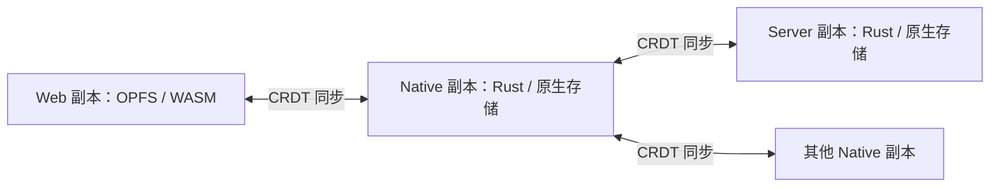

# Vault 与 VaultInstance：存储与网络模型

日期：2026-10-04。状态：本轮确定的目标模型，作为后续实现的结构与行为约束；尚未完成代码迁移。代码基线为 `08c94de`，已有单文档内核、server 文本宿主与恢复测试。本文替代早期以 `opfs | remote` 划分 Vault 类型、所有 UI 都必须持有 WASM core 的组织假设；目录与文本 CRDT 语义继续沿用已有设计。

## 固定的模型边界

1. Vault 是逻辑库的定义，记录 vaultId、historyId 等共享身份信息；它本身不持有内核、文件、存储或网络资源，不由 URL、本地路径或运行平台定义。
2. VaultInstance 是一个 Vault 在本机的具体实例，持有内核、Catalog、文档、存储、目录映射和网络资源。多个实例可以属于同一个 Vault；Vault 列表登记本机实例。
3. 存储、普通文件目录映射、主动连接、对外共享分别配置；没有 master / slave Vault 类型。
4. core 的代码、编辑契约与同步语义统一。Web 在 WASM 中运行，Tauri / server 在 native Rust 中运行。
5. 每个活跃 VaultInstance 是其资源的唯一所有者，文本文档按需驻留。视图通过 EditorService 访问实例。
6. Tauri 使用本机 IPC 访问 native 运行时；独立 server 为同类运行时提供网络入口。Tauri 不必为本机 UI 启动 HTTP 服务。
7. peers 使用共同历史交换 CRDT 更新；输入权限、成员管理权限、是否接受连接与本地存储方式分别判断。
8. 历史持久化、peer 同步和文件保存分别报告状态，保存动作有明确目标。

只保留 Vault 与 VaultInstance 两层概念，领域状态与宿主运行时资源统一由实例持有。CRDT 语境中的“副本”描述实例之间的关系，不作为第三种顶层对象。

下文名称为领域概念与接口边界，伪代码不承诺最终 Rust / TS 序列化格式。具体 transport framing、成员认证实现和性能参数在对应实现阶段确定。

## 身份与列表

| 对象                                  | 生命周期与含义                                                                        |
| ------------------------------------- | ------------------------------------------------------------------------------------- |
| Vault `{ vaultId, historyId }`        | 逻辑库及其历史代次；多个副本共享；真正重新建史时变更代次                              |
| VaultInstanceId                       | 一份本地持久副本的身份，跨正常重启保持；独立复制出来的副本获得新身份                  |
| EntryId                               | Catalog 中一个文件或目录的稳定身份；移动只修改位置和名称                              |
| TextIdentity `{ entryId, historyId }` | 一个文件的文本历史；与现有 DocumentIdentity 对接                                      |
| WriterId                              | 一个可写文档实例的 CRDT writer；恢复实例使用新的 writer；不等于用户或 VaultInstanceId |
| Endpoint                              | 用于连接 peer 的地址与本地连接配置，可以失效、更换，不能充当身份                      |
| ViewId                                | 标签、分栏或窗口中一个编辑视图的本地身份                                              |

peer 是连接的另一份副本，握手时以 Vault 和对方 VaultInstanceId 区分。暂不增加单独的全局 PeerId；每条实际连接还可有短期 session ID，防止将旧连接回包混入新会话。身份标识不自动提供认证，授权通过独立机制验证。

schema / protocol 版本是兼容性信息，不用升级版本号代替 historyId。仅恢复同一份完整历史不更换 Vault；创建独立库或明确重建历史必须使用不同身份。恢复后的 WriterId 与持久 VaultInstanceId 有不同生命周期。

列表项绑定本地 VaultInstanceId，并显示名称及 Vault。一个副本可以配置多个 Endpoint；通过两个地址访问同一逻辑库，不强制创建两个列表项。确实需要同库的两份本地副本时，分别配置存储位置、VaultInstanceId 并明确展示为两个副本。

同一持久存储位置只允许一个写入所有者。多个标签页或进程必须独占使用，或通过明确的单所有者协调共享运行时；不能只因每个实例有新 WriterId 就允许并发改写日志。两个独立副本也不能同时负责写回同一个普通目录。

默认 Web 实例首次初始化独立的 Vault 定义与 VaultInstanceId，以后从 OPFS 恢复。默认项不可删除是应用列表策略，不放进 CRDT，也不由存储 / 网络角色决定。加入另一个 Vault 不合并默认库。

## 持久化配置与运行时

本地已完成创建 / 加入的副本采用以下配置：

```text
VaultInstanceProfile {
  instanceId,
  vault: Vault,
  name,
  storage: StorageConfig,
  fileProjection: FileProjectionConfig | None,
  replication: ReplicationPolicy,
  remotes: EndpointConfig[],
  publication: PublicationConfig | None,
  saveTarget: SaveTarget,
}
```

这份配置保存在本地 profile 注册表，不作为共享 Catalog 数据同步给其他副本。机器路径、端口、连接凭据、缓存策略、保存目标和 UI 偏好不会因为 CRDT 同步而传播。连接凭据引用专门的会话 / 凭据存储，不把令牌放进 Endpoint URL 或 Catalog。

尚未取得 Vault 的连接尝试是 PendingJoin；确认身份、取得共同历史并提交本地 profile 后才成为已加入副本。PendingJoin 可以作为列表中的连接进度显示，不提前生成一份文本历史冒充远端内容。

Vault 是可序列化的逻辑定义。VaultInstanceProfile 记录本机实例的持久配置；加载它并取得资源所有权后形成 VaultInstance，停止实例时释放资源，配置与已提交历史可以继续保留：

```text
Vault {
  vaultId,
  historyId,
}

VaultInstance {
  instanceId,
  vault: Vault,
  core, // Catalog、文本文档、附件引用与可用性
  storage: VaultStorage,
  projection: FileProjection | None,
  sync: VaultSync,
  connections: PeerConnection[],
  publicationState,
  editorSessions,
}
```

remotes 记录连接意图 / 引导地址，connections 记录真实入站与出站会话、对方身份、能力、权限、连接状态及每内容对象的水位。断开一个地址只影响连接；删除连接配置不删除本地副本。丢弃本地副本、删除共享文件和移除 peer 授权是独立操作。

## 存储与文件映射

VaultStorage 负责应用内部的副本持久化，逻辑上包含三组能力：

| 能力            | 内容                                                                     |
| --------------- | ------------------------------------------------------------------------ |
| InstanceStore   | profile 与身份、Catalog / 文本快照、更新日志、原始因果等待包、持久化回执 |
| BlobStore       | 按内容引用保存附件，完整验证后确认可用，支持按需缓存                     |
| LocalStateStore | 文件映射基线 / 意图、复制进度及其他本地协调状态                          |

OPFSStorage 与 NativeStorage 实现这些能力。实现可以采用不同内部文件或数据库，但具备明确提交边界，不能将收到包、改了内存、提交日志统一宣称为持久保存。依赖未齐的包可以已经持久化，不能被计入已应用的因果版本。与普通文件写回分开的历史日志是恢复依据。

FileProjection 负责将 Catalog / 文本 / Blob 的逻辑状态映射为普通目录，并接收普通目录的外部修改：

- Web 默认 Vault 映射到 OPFS 的用户文件目录，私有历史与该目录隔离。
- native 本地 Vault 映射到真实目录，目录操作、受限 IO、外部 watcher 和文本格式处理由 native 适配器负责。
- Web 加入的远端 Vault 默认只有 OPFS 私有副本存储，不自动建立另一份完整可见目录镜像。
- native 加入远端时，默认先建立本地副本存储；指定一个空目录可以启用本地映射。
- 用户以后可为同一副本启用、停用或重定位映射，处理未完成写回后再释放目录；副本身份与远端连接不因此更换。

首期每个副本最多有一个普通目录映射；多个映射需要独立的保存水位与外部编辑协调，后续扩展。映射没有承担 Vault 身份的职责，目录位置变化不必重建逻辑历史。已有 server profile 对规范化路径的绑定仍是原型约束，迁移时需要显式转换，不能直接取消检查让任意目录接管历史。

映射任务绑定 EntryId 和目标版本，执行前重新解析当前路径、删除状态及磁盘基线。路径不可表达、同名冲突或外部修改不丢弃逻辑内容；保留状态并报告投影冲突。native 与 OPFS 的具体文件句柄不会进入 core 的共享数据。

OPFS 文件后端的 watch 继续不发送事件。领域修改由运行时主动通知；多标签协调属于副本所有权 / 同步层，与 watch 分开。

## 复制策略与驻留策略

Catalog、每文件文本历史、不可变 Blob 分别管理。默认复制策略是完整发现可访问 Catalog，合格文本后台补齐，活动文档优先，附件按需取得；未取得的内容显示 unavailable / pending，不以空文本占位。

复制范围、持久缓存与内存工作集分别控制。未打开文档仍参与发现与同步，处理更新时可以临时恢复内核、验证、提交后释放；关闭标签不自动停止该 Vault 的同步。待发本地操作、因果等待包和恢复所需历史不能按普通缓存随意淘汰。

副本只公告自己实际持有且有权提供的内容和水位。开启 publication 不代表完整离线副本，部分缓存副本可按能力提供已有内容；缺失内容可以经调度向其他 peer 补齐，不能承诺自己已持有全部附件。

## 对外共享、主动连接与 P2P

PublicationConfig 表示是否允许其他节点连接本机这份 Vault，以及可提供的服务。进程级 NetworkService 管理监听端点，可以共享一个监听器向不同已发布副本路由；不要求每个 Vault 单独占一个端口。实际实现可以先提供 HTTP，同步协议不以某个进程的监听角色定义文档所有权。

EndpointConfig 表示主动连接入口。一个副本可以同时有零个或多个主动入口、零个或多个入站会话。拨号 / 入站只描述连接建立方向，建立后 CRDT 数据可在权限允许下双向交换。



Web 首期 publication 不可用，仅主动连接产品支持的入口。它仍持有真实 CRDT 副本，可以编辑和发送操作；只读与否由授权决定。native 和 server 可以同时拨号与接受连接，对外服务关闭后仍可同步和编辑。本机 UI 的 IPC 不计作网络 peer 连接。

同步单位是 Catalog、文本历史和 Blob，不是打开的标签。每条连接独立发现内容、交换版本、请求缺失历史 / 附件、确认应用与持久化状态。接收操作保留其原始 writer 与历史，转发不将其重新生成成本机事务。

默认在成功提交本地历史后，才向其他获授权连接转发接收的更新或发出持久化确认；内存已经改变但存储失败时，运行时报告故障并暂停后续写入和确认。因果等待包的接收 / 存储回执与已应用版本分开。

重复交付由更新导入处理；循环拓扑还需要基于版本 / 请求状态避免重复发送，不允许依靠每收到一次包就原样广播所有连接。按权限、背压和缓存策略转发。某个 peer 的持久化确认不代表所有 peer 都已追上，也不代表文件已写回。

首期先实现显式地址与受控成员的文本 / Catalog 同步。不在这轮模型中确定 NAT 穿透、自动发现、加密成员协议或历史 GC 算法；也不依据一个在线 peer 的确认立即删除离线成员可能依赖的历史。

## 保存目标与状态

SaveTarget 是本地 profile 中的显式配置：

```text
SaveTarget =
  HistoryOnly
  | LocalProjection
  | PeerProjection { instanceId }
```

默认 Web 单机与有本机目录的 native 副本使用 LocalProjection。通过链接加入且没有本地映射时，如果对方提供可授权的文件投影服务，默认记录对方 VaultInstanceId 为 PeerProjection，保留当前远端编辑“保存到 server 文件”的含义；否则使用 HistoryOnly，界面明确显示仅保存本地历史。目标是 peer 身份，不以任意在线 Endpoint 替换它。

保存动作先提交本地历史；有 peer 目标时补齐目标所需操作，再通过独立文件投影请求要求目标保存相应文档 / 版本。peer 必须返回实际写回版本与结果，不能用普通同步 ACK 冒充文件保存成功。请求协议可以在当前 server `/save` 基础上演进。

native 设置本地映射时，可以选择保存本机文件；初始化采用此默认值，后续不自动覆盖用户已选定的 SaveTarget。不隐式承诺所有其他 peer 的文件也已经写回。其他副本按自己的保存 / 自动投影策略写回。没有本地目录也没有可用 peer 保存服务时，本地历史仍可以安全提交，不假装完成了文件保存。

自动保存 / 自动投影的调度归宿主策略；网络导入不自动宣告普通文件已保存。用户界面至少区分：

| 状态                                    | 范围                                     |
| --------------------------------------- | ---------------------------------------- |
| appliedVersion                          | 本机某个 CRDT 内容对象已经应用的版本     |
| localDurableVersion                     | 本机成功提交历史的版本                   |
| peerAppliedVersion / peerDurableVersion | 指定 peer、指定内容对象确认的版本        |
| projectedVersion                        | 指定文件映射成功写出的版本               |
| contentAvailability                     | 某个正文 / Blob 是否取得、验证及持久保存 |
| projectionConflict                      | 文件基线、名称或外部修改造成的映射冲突   |

没有映射时 projectedVersion 是不适用，而不是凭空等于当前版本。文件保存目标的正文 dirty 根据当前正文与选定文件保存基线判断；HistoryOnly 则根据本地历史提交状态显示是否已保留，不显示一个永远无法完成的文件保存任务。待同步操作另行判断，不能用一个 dirty 值同时表示文件未写回和 peer 未追上。多个对象的状态不能拼成未经实现的“整个 Vault 原子保存版本”。

远端离线时，保存可以完成本地历史提交并保持待同步任务；界面显示“本地已保留，等待远端保存”。对方没有确认文件投影时不能显示“远端文件已保存”。关闭标签保留待发操作，退出运行时前尝试 flush；应用或浏览器终止时能恢复的是已经成功提交的历史。

## Web、Tauri 与独立 server 的组合

| 宿主与场景             | 内核执行位置 | 私有存储 | 文件映射       | publication | remotes                |
| ---------------------- | ------------ | -------- | -------------- | ----------- | ---------------------- |
| Web 默认本地 Vault     | WASM         | OPFS     | OPFS 用户目录  | 关闭        | 空                     |
| Web 加入 Vault         | WASM         | OPFS     | 默认无         | 关闭        | 一个或多个入口         |
| Tauri 本地 Vault       | native Rust  | 原生存储 | 原生目录       | 可配置      | 可为空                 |
| Tauri 加入 Vault       | native Rust  | 原生存储 | 可配置原生目录 | 可配置      | 一个或多个入口         |
| 独立 server 托管 Vault | native Rust  | 原生存储 | 原生目录       | 开启        | 可为空，也可连接 peers |

Tauri 是 native 宿主，实际持久化能力称 NativeStorage。TauriBackend 是前端访问 native EditorService 的 IPC 适配器，不把“tauri”当作 CRDT 协议或底层文件格式。

```text
纯 Web：UI → EditorService / WASM 适配 → VaultInstance → core 与 OPFS 适配
Tauri：UI → EditorService / IPC 适配 → native VaultInstance → core 与原生适配
server：网络 API → native VaultInstance → core 与原生适配
```

native 运行时同时服务本机 UI 和远端连接，本机 UI 不为调用内核额外经过 localhost HTTP。对外监听功能按 publication 独立开启。独立 server 是 native 运行时的无头部署形式，不要求 Tauri 启动它的二进制。

每份活跃副本只有一套文档实例所有者，先不在 Tauri WebView 再默认增加一个同库 CRDT 副本。CM6 持有正文显示投影、选区与滚动；需要 CRDT 语义的改动都经 EditorService。将来若采用前端乐观副本，需要显式模型、独立 writer 与同步协议，不能偷偷增加另一份可修改正文权威。

EditorService 的语义面包括：读取 / 订阅目录和正文、打开视图会话、提交版本化事务、个人撤销 / 重做、创建 / 移动 / 删除逻辑条目、按目标保存、查询内容可用性和同步进度。API 内核仍以同步操作完成领域变更，服务适配层可以异步返回。

IPC 不能只是机械包装成 Promise。命令需要会话与请求标识，提交使用预期版本，响应 / 事件建立可对账顺序，视图处理本地输入与远端更新的竞争，重连 / 事件缺失时重新读取状态。IME、连续输入、全部选区和撤销位置需要原型验证。服务契约统一，不保证进程通信与 WASM 有相同调用成本。

多视图共享一个文档会话的本地 writer 与撤销历史；视图状态按 ViewId 保存。多副本之间的个人撤销由各自 writer 产生更新，不能调用另一个 peer 的撤销代替自己的撤销。关闭视图、停止运行时、丢弃本地副本是不同生命周期。

## 初始化与加入规则

- 本地创建：初始化新身份与私有历史，建立唯一 Catalog / 文本 seed；配置映射与默认保存目标后登记 profile。
- 连接加入：握手核对身份、权限和服务能力；复用已存在副本或建立隔离存储，以对方的共同 seed 加入，不自行从相同字符串建立另一历史。
- 只有快照 / 内容缺失的条目可以显示 pending，取得共同历史后才进入可编辑状态。
- 远端身份与已绑定 profile 不同：保留现有历史和待发编辑，停止将其发送到该入口；重新绑定 / 迁移是显式操作。
- 加入时指定非空目录：不按同名文件自动合并为同一历史；选择空目录或执行明确的导入 / 冲突处理。当前模型不自动推断两份独立库属于同一 Vault。
- 正常恢复：同一副本从历史恢复，VaultInstanceId 保留，可写文档实例使用新的 WriterId；本地撤销栈不随快照恢复。
- 删除本地列表项：停服务、释放所有权，按明确动作保留或删除本地存储；不发送共享 Catalog 删除，也不删除其他 peer 的文件。

当前 server 仍由 config / CLI 注册目录，客户端加入不获得创建或删除 server Vault 的管理接口。P2P 同步与部署管理分开；对远端副本开放文件保存服务也不自动开放成员、配置和监听器管理。

## 代码边界与实施顺序

`celestite-core` 继续是统一 Rust 库，WASM 放在 feature 后面。它负责 Document、Catalog、身份 / 版本、领域操作及同步状态规则，不引入 Axum、Tauri、OPFS 或 redb 的具体 IO 类型。宿主运行时执行 IO 与调度，并将完成 / 失败反馈给领域状态。

后续让 server 与 Tauri 共享 native 运行时服务，不依赖 server 可执行程序或其 HTTP 路由。具体共享模块 / crate 的物理划分在抽取时选择，本轮不额外确定多个 editor-core / editor-wasm crate。

当前 server 的 `VaultIdentity` 对接逻辑 Vault 定义，Web 中持有 backend / documents 的 `Vault` 逐步迁移为 VaultInstance；现有代码类型尚未在本轮改名。

已有 `VaultBackend` 作为文件 IO 接口可以继续用于映射与附件；`HttpVaultBackend` 是文件访问 / 兼容适配，不再代表副本的存储身份或同步模型。现有 `VaultConnection.kind = opfs | remote`、临时正文 ID、标签页持有全文与 CM6 历史会逐步迁移到 profile、EditorService 与文档会话。

实施顺序：

1. 增加共享身份和副本领域模型，建立与现有类型的迁移规则；保留当前可用文件 API。
2. 实现 Catalog、稳定 EntryId、删除 / 命名 / 目录冲突语义和可测试的 VaultInstance。
3. 从 server 中抽出副本存储、文件映射、保存目标与 native 运行时，增加多 peer 协议和受控转发测试。
4. 接入 Web WASM、OPFS 历史适配、EditorService 与 CM6，完成本地和远端同模型的编辑 / 保存闭环。
5. 单独验证 Tauri IPC 的输入与事件契约，随后复用 native 运行时；Tree-sitter / LSP 消费版本化正文。

关键验收包括：Web 本地无网络可编辑恢复；同一库经不同入口加入仍保持身份；A—B—C 的中间 native peer 同时拨号 / 接入并转发；环形拓扑乱序 / 重复后收敛且不持续回声；关闭标签仍能补齐未打开文件；部分缓存 host 不谎报内容可用；断网、移动 / 删除和外部编辑时，历史确认与文件保存状态正确。IPC 原型还需验证快速输入、IME、远端插入、多视图与个人撤销。

本文确定模型，不表示这些验收已经完成。`08c94de` 的 40 项测试验证的是单文档 / 单 server 的基础，不替代 Catalog、多 peer、Web WASM 和 Tauri 的后续测试。
