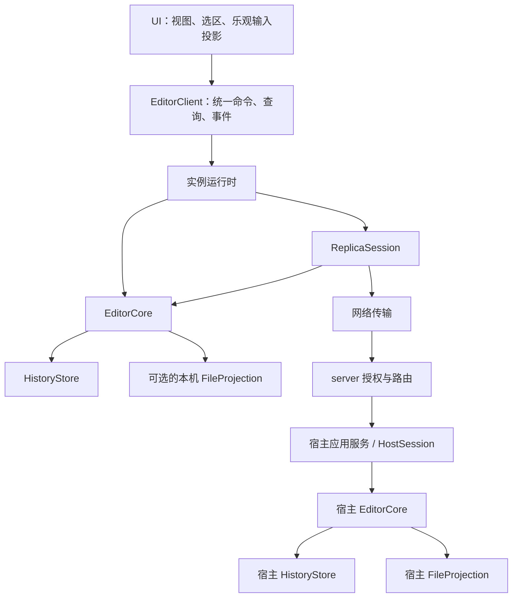

# 协作实现的架构与职责收口调查

日期：2026-10-05。以 C1 提交 `845a3b189267b407d420bf1a56794edd2355f667` 的协作实现为调查基线，整理本轮对 OPFS、remote、host、Memory 通路的代码调查，以及架构、代码组织和迁移方案。代码路径用于定位该基线的调查对象，不跟随后续实现变更更新；目标类型、模块和目录均为设计建议，本文不表示 C2 已实施。不引用外部可变文档。

## 1. 调查范围与主要判断

本轮讨论从多人协作指针、选区的前置基础出发，先检查现有协作实现能否提供清楚的状态、会话和锚点边界。C1 已处理原子接入与重连、明确拒绝输入的恢复、共享保存冲突和关闭语义；本次主要讨论 C2 的职责与契约收口，并明确其与 C3 调度、C4 成员状态、C5 工作集的关系。

现有 Rust `EditorCore` 应当保留。生产通路已经共用正文 CRDT、个人撤销、历史提交、保存恢复和文件协调等逻辑。主要问题集中在 core 外围：状态和前置条件分散维护，平台包装承担业务规则，旧实现与测试入口仍然存在，契约无法完整表达操作是否已经被接受。

整理目标是：统一业务规则，明确状态所有权，再按存储和协作能力装配实例。每条规则应有明确的负责人；平台实现保留各自的 IO 和执行机制。

## 2. 当前通路与职责交叉

### 2.1 实际编辑通路

| 通路           | 主要调用链                                                                                    | 已共用的实现                                                                     |
| -------------- | --------------------------------------------------------------------------------------------- | -------------------------------------------------------------------------------- |
| 浏览器本地     | `WorkerDocuments → EditorClient → serveEditorWorker → EditorHost → EditorBinding`             | `EditorCore<OpfsBackend>`                                                        |
| 浏览器远端副本 | `WorkerDocuments → EditorClient → serveEditorWorker → RemoteEditorHost → MemoryEditorBinding` | `EditorCore<MemoryBackend>`；网络通过 `RemoteTransport` 和 HTTP 文件接口连接宿主 |
| server 宿主    | HTTP / WebSocket / 文件观察 → `Documents` → `NativeBackend`                                   | `EditorCore<NativeBackend>`                                                      |
| 调试副本       | `DebugSession → ReplicaCore → replica-worker → MemoryEditorBinding`                           | 共用 core，但另有手动 HTTP push / pull 和 RPC 通路                               |
| 旧 TS 通路     | `VaultManager` 注入 `openLocal` → `VaultDocuments → VaultBackend`                             | 未走统一 Rust 编辑服务，仍独立实现缓冲、保存与冲突处理                           |

OPFS、remote、host、Memory 描述的是不同维度。它们不应成为同一级的四种编辑器实现。

### 2.2 需要收口的问题

| 调查位置                                                                     | 当前问题                                                                                                    | 建议归属                                                |
| ---------------------------------------------------------------------------- | ----------------------------------------------------------------------------------------------------------- | ------------------------------------------------------- |
| `web/src/lib/editor/remote/host.ts`、`runtime/host.ts`                       | `RemoteEditorHost` 继承 `EditorHost`，却重新处理大部分打开、编辑、撤销、保存、文件操作和生命周期行为        | 统一运行时入口，组合本地或副本装配                      |
| `remote/host.ts`、`client/documents.ts`                                      | 宿主确认布尔值、待处理输入、宿主元数据、变化映射、连接和失败状态跨层维护                                    | 会话记录、core 状态、视图投影分别拥有状态               |
| `contract.ts`、`documents.ts`、`runtime/host.ts`                             | 公共契约反向引用旧业务实现的类型；Rust `EditorDocument` 有 `savedVersion`，TS `CoreDocument` 未完整对应     | 独立契约，生成跨边界 DTO，UI 类型单独定义               |
| `crates/celestite-core/src/editor.rs`、远端包装、UI 文件操作、旧 TS 文档实现 | 文件操作前保存、影响范围、未保存正文保护等规则跨层分布；本地 `readFile` 仍可隐式保存                        | 拥有文件映射的 core 执行业务前置条件，UI 只协调自身输入 |
| 两种浏览器 host 包装                                                         | 打开不支持文件的结果包装重复，通过错误消息中的 `5 MiB` 判断原因并创建临时假文档                             | 共同的结构化打开结果与展示映射                          |
| `crates/celestite-server/src/vault/documents.rs`、`sync.rs`                  | `import_session` 包含 writer 与因果验证，却依赖网络模块中的 `contains`                                      | 核心版本规则与共享宿主会话模块                          |
| `crates/celestite-core/src/backend.rs`                                       | 一个 `Backend` 同时包含历史存储、普通文件 IO、目录恢复意图和易失会话替换，多项能力靠默认 `Unsupported` 区分 | 按存储和文件映射能力拆分接口                            |
| Memory、OPFS、redb 存储实现                                                  | 提交序号、重试、历史身份和加载完整性的检查分布于各实现，覆盖程度不同                                        | 公共验证约束与后端契约测试                              |
| `crates/celestite-server/src/vault/backend.rs` 及 native 文件、存储模块      | 可供桌面复用的 native 能力位于 server 私有模块，依赖 server 配置类型                                        | 提取独立 native 能力包                                  |
| `web/src/debug`、Manager 的旧注入分支与相关测试                              | 测试和调试容易验证另一条业务通路，无法代表生产 Worker / WebSocket 行为                                      | 测试注入 IO / 传输；协作调试使用生产运行时              |

物理 IO 的差异应保留。浏览器锁、OPFS 文件布局、redb 事务、native 文件权限、WebSocket 和 IPC 都有各自的机制；需要统一的是这些机制对业务层提供的语义和证据。

## 3. 实例按能力装配

| 实例                  | 历史存储            | 本机普通文件映射 | 协作职责                         |
| --------------------- | ------------------- | ---------------- | -------------------------------- |
| 浏览器本地 Vault      | OPFS                | OPFS 文件        | 本地管理文档                     |
| 浏览器远端副本        | Memory              | 无               | 客户端会话，向宿主提交操作       |
| server 宿主           | redb 或 Memory      | Native 文件      | 宿主会话，接受并确认操作         |
| 未来 Tauri 本地 Vault | redb 等 native 存储 | Native 文件      | 本地管理文档，可另外装配协作能力 |
| 无头测试实例          | Memory              | 按测试需要注入   | 本地或协作角色均可               |

Memory 不决定实例的协作角色。宿主和无头编辑器也可以使用内存历史；内存逻辑提交成功不意味着重启后能够恢复。

远端 HTTP 文件接口是一项宿主服务。副本能够请求读取、保存或目录操作，不意味着它拥有本机普通文件映射。客户端的 core 不应通过这个接口直接把本地正文当作文件写回。

只读权限独立于存储和角色。只读副本仍需接收正文更新、解析锚点和运行预览，只是不能提交用户修改。分享凭证、有效权限和授权撤销由 server 应用层负责。

## 4. 目标职责与依赖方向



图中的 `EditorCore` 是共同的类型和实现，每个实例各自拥有状态。

| 部分             | 唯一负责的事情                                               |
| ---------------- | ------------------------------------------------------------ |
| `Document`       | CRDT 正文、事务、个人撤销、锚点和因果版本                    |
| `EditorCore`     | 多文档管理、历史提交、保存与恢复、目录操作规则、外部文件协调 |
| `ReplicaSession` | 接入与重连、会话代次、操作记录、宿主确认、结果未知的恢复状态 |
| `HostSession`    | writer 分配、会话有效性、提交验证、去重与回执                |
| `Transport`      | 消息传送、连接、超时、心跳和关闭                             |
| `ViewProjection` | 已接受正文上的待处理输入、选区映射、IME 与界面状态           |
| 平台适配器       | 实际读写文件、存储事务、锁、计时和后台执行                   |
| server 授权层    | 分享凭证、有效权限、撤销以及持续连接授权                     |

共用逻辑的判断标准：换个平台后，操作结果仍应遵守相同规则的部分进入 Rust；依赖文件系统、浏览器或网络机制的部分留在适配器。

### 4.1 用组合装配运行时

建议用 `EditorRuntime` 提供统一入口、事件发布和资源生命周期：本地装配把命令交给本机 core；副本装配把正文编辑交给本机 core，把宿主操作交给 `ReplicaSession`。

两种装配决定命令在哪里执行。正文规则、保存规则、打开结果分类和公共结果转换由共同接口定义，避免远端继续覆盖本地类的大部分方法。

`WorkerDocuments` 中的乐观投影应提取为独立模型。输入协调、RPC 调用、标签管理和失败恢复之间通过明确的状态和事件连接，区分用户已经看到的输入与 core 已接受的输入。

## 5. 状态与结果契约

### 5.1 分开五个事实

| 事实               | 所有者              | 含义                          |
| ------------------ | ------------------- | ----------------------------- |
| 视图输入待处理     | UI 投影             | 用户已看到输入，core 尚未接受 |
| `CoreAccepted`     | core                | 输入进入活动 CRDT 和撤销历史  |
| `HistoryCommitted` | core / HistoryStore | 对应历史完成逻辑提交          |
| `HostConfirmed`    | 同步会话            | 宿主确认对应操作及因果版本    |
| `FileSaved`        | core                | 指定正文版本写入普通文件      |

输入可以已经进入客户端 core，但网络结果未知；宿主可以已经确认历史，但普通文件尚未保存。`pending`、`dirty`、`unconfirmed` 应各自有定义，不能互相代替。

历史提交表示逻辑提交边界，不承诺硬件 fsync；持久性应另外明确。宿主确认应说明它确认的因果版本及宿主历史的持久性，不能让易失宿主的确认被理解为跨重启恢复保证。

### 5.2 显式表达接受与传输结果

以下为概念契约，尚未确定具体字段编码：

```text
编辑结果：
  Accepted(inputId, beforeVersion, afterVersion, changes, historyStatus)
  Rejected(inputId, reason, currentState)

传输状态：
  Queued / Sent / Confirmed / RejectedByHost / Unknown
```

core 是否接受输入由编辑结果回答，宿主是否确认由会话记录回答。历史写入失败若发生在 core 接受之后，应作为 `Accepted` 的历史状态返回，调用方不再通过错误字符串或错误码猜测正文是否已经改变。

本地拒绝与宿主拒绝也要分开。宿主拒绝时，客户端 core 可能已接受输入，恢复过程必须保留正文和相关操作信息，不能简单撤回界面文本。明确拒绝与结果未知继续沿用 C1 的不同恢复方式。

会话的待确认状态从操作记录推导，界面的待处理状态从输入投影推导。可以提供汇总字段，但不在多处分别维护可独立修改的布尔值。

### 5.3 分开正文、会话和视图状态

- 正文状态记录快照、因果版本、撤销、历史提交和文件基线。副本的文件元数据来源于宿主回执，由 core 验证后接纳。
- 会话状态记录连接阶段、代次、有效权限、确认版本和操作结果，不另外保存一份正文真相。
- 视图状态记录已接受正文上的待处理输入、选区、焦点、IME 和标签状态，不决定历史提交或宿主确认。

Rust 定义跨 WASM、IPC、网络使用的核心 DTO，TS 类型从这些定义生成，并验证序列化契约。UI 单独定义标签、焦点、滚动和乐观输入等类型。平台实现文件不作为公共类型的来源。

## 6. 共享会话规则

建议将协议正确性规则放入共享 Rust `sync` 模块，供 WASM 和 native 使用：writer 与会话绑定、因果版本包含关系、操作编号、去重和回执匹配、确认版本推进、接入和重连状态转换、迟到结果的适用性。

WebSocket、Tokio、浏览器定时器和 IPC 留在外层。模块可以接收消息并产生需要执行的动作，不要求持有具体网络连接，也不依赖平台异步运行时。

server 当前的 `import_session` 在隔离历史中验证 writer 和因果依赖，这条规则值得保留。因果判断放回核心版本类型，提交验证放入共享宿主会话模块，消除文档模块依赖网络模块的关系。

重连保留 C1 的既定语义：

- 准备并验证整批新历史、writer 和最终路径状态，成功后原子切换。
- 失败保留旧会话的正文、撤销和订阅状态。
- 新连接使用新的写入身份和个人撤销会话。
- 未确认输入可导出，明确丢弃后重连；不自动重放旧会话修改。
- 迟到消息不能应用到新会话。

Worker RPC 会话、协作会话代次、文档因果版本和视图修订号必须有不同的名称和类型。跨实例比较使用因果版本；视图修订号只在所属视图内有效。异步结果携带所属会话或任务身份，并在提交前检查适用性。

## 7. 存储与文件业务

### 7.1 拆分存储能力

建议拆为两个主要接口：

- `HistoryStore`：历史加载、幂等提交、恢复记录和持久性。
- `FileProjection`：普通文件读取、条件写入、重命名、删除和操作结果证据。

易失副本的整批替换作为专门能力，不要求每种文件后端提供。实例通过构造过程装配有效组合，能力缺失在契约中可见。

Memory、OPFS、redb 共用序号、历史身份、安全重试和加载完整性的约束，提取公共验证函数，并用同一组契约测试验证。物理提交分别使用内存更新、OPFS 文件布局和 redb 事务。

失败提交可能已经完成，同一提交的重试必须安全；加载必须给出完整、可验证的历史或明确错误。易失会话整批替换失败时保留原有状态。文件适配器只在能够证明未修改文件时报告写入未开始，无法证明时保留不确定结果和恢复证据。

Native 文件 IO 与 redb 存储提取为 `celestite-native`，供 server 与未来 Tauri 使用。旧 API、旧包装和旧 import 入口直接迁移并删除；已有持久化格式的必要读取与迁移按存储格式处理。

### 7.2 统一文件操作入口

```text
用户意图
→ UI 提交相关待处理输入
→ 本地执行或发送宿主命令
→ 拥有文件映射的 EditorCore 检查前置条件
→ 保存 / 恢复意图 / 文件 IO
→ 发布统一变化
→ UI 更新投影
```

客户端等待自身输入处理完成属于输入协调；宿主决定目录操作能否执行属于权威业务规则。操作影响范围、未保存正文保护、保存意图和目录恢复不再由客户端重复决定。

读取已保存文件、导出当前缓冲区、请求保存、关闭视图分别定义。普通读取和资源读取具有无副作用契约；需要保存时由明确的产品动作调用保存。关闭视图的前置动作显式指定，底层 `readFile` 或 `close` 不隐藏保存行为。

共享保存等待指定输入的宿主确认，保存请求与实际保存回执携带因果版本。共享冲突保留取消与重试，不能由普通文件写入能力绕过这条规则。

打开文件返回结构化分类，例如可编辑文本、非文本、超过限制等。UI 按分类显示反馈，避免解析消息中的 `5 MiB` 或创建缺少真实历史身份的假文档。

正文使用文档和历史身份索引，路径作为可变属性；同路径删除后重建不能沿用旧历史身份。完整 EntryId / Catalog 留给后续阶段，C2 先收拢现有目录规则。

## 8. 建议的代码组织

```text
crates/
  celestite-core/src/
    document/          CRDT、事务、撤销、锚点
    editor/            文档管理、保存、恢复、目录协调
    storage/           存储接口、公共验证、Memory
    sync/              协议类型、HostSession、ReplicaSession
    preview/           版本化任务与结果接收
    wasm.rs            WASM 包装
    opfs.rs            OPFS 适配器

  celestite-native/src/
    filesystem.rs      native 文件能力
    history.rs         redb 历史能力
    ...

  celestite-server/src/
    app/               Vault 运行时与生命周期
    shares/            分享凭证、授权、撤销
    transport/         HTTP、WebSocket、持续订阅

web/src/lib/editor/
  contract/            生成的跨边界契约
  client/              EditorClient 与 RPC
  view/                输入投影、视图状态、选区映射
  runtime/             统一入口与实例装配
  platforms/
    opfs/              浏览器存储与本地装配
    remote/            网络 IO 与副本装配
  preview/             分析执行器与资源生命周期
```

先通过模块划分落实职责。共享会话规则进入 core 的模块，不必为每个职责单独创建 crate；native 能力因需要同时服务 server 和桌面而提取。

浏览器侧调整 `Host` 命名，让 host 专指协作宿主；客户端使用 `ReplicaSession`、`Connection`，Worker 包装使用 `Runtime`。

依赖约束随迁移落实：

- core 不依赖 server、网络框架或 UI。
- 平台和同步模块不依赖 CodeMirror。
- UI 不直接操作历史存储或执行文件恢复。
- 测试通过生产接口注入 IO 和传输替身，不注入另一套文档业务实现。
- Manager 注入运行时工厂，移除构造旧 `VaultDocuments` 的分支。

当前预览的版本化任务、隔离执行和结果核验边界可以保留。资源读取接入无副作用接口；IME 和待处理选区映射属于共同的视图输入协调，避免只在远端包装中增长特判。

分享权限按既定模型接入 server 应用层。HTTP、WebSocket、持续订阅和调试入口共用授权上下文；core 不处理分享凭证。同 Vault 的不同分享保留独立实例和会话，不合并权限。授权撤销与客户端结果未知恢复连接，但不改变正文历史身份。

## 9. 迁移顺序与完成标准

| 顺序 | 工作                   | 完成标准                                                                                                       |
| ---- | ---------------------- | -------------------------------------------------------------------------------------------------------------- |
| 1    | 统一状态和结果契约     | 接受、提交、确认、保存有独立定义；字段完整；输入 ID、会话代次和变化事件可关联；调用方不再推断接受结果          |
| 2    | 迁移旧通路与测试       | 删除 `VaultDocuments`、全文更新回退及相关重复业务实现；Manager 使用运行时工厂；测试验证实际视图模型和 RPC 接口 |
| 3    | 收拢文件业务与存储约束 | 统一打开分类、文件命令和恢复规则；拆分存储能力；Memory、OPFS、redb 通过共同的适用契约测试                      |
| 4    | 提取共享会话规则       | 宿主提交验证、客户端操作记录和重连转换进入 Rust；会话状态有唯一所有者；协作调试入口迁移到生产通路              |
| 5    | 组合装配与组织调整     | 删除继承包装，提取 native 能力；迁移调用方、import、示例和当前文档，删除被替代入口                             |

每步完整迁移对应接口的调用方，保持构建和相关验证通过，不留下兼容别名。目录移动以职责已经明确为前提，避免只搬文件而保留原来的交叉状态。

### 验证分层

| 层                          | 重点                                                                             |
| --------------------------- | -------------------------------------------------------------------------------- |
| Rust 业务测试               | 正文、撤销、因果验证、接受结果、保存恢复和文件协调，避免重复维护 TS 业务规则测试 |
| 存储契约测试                | 幂等提交、序号与身份、加载完整性、失败后重试、易失批量替换                       |
| 视图测试                    | 待处理输入重映射、接受与拒绝结果、选区、Unicode、IME 与失败正文保留              |
| Worker / WASM / server 集成 | 真实生产会话的多客户端收敛、只读更新、重连、共享保存、迟到结果和资源生命周期     |
| 传输故障注入                | 延迟、断线、回执丢失、重复消息和会话替换；队列超限的完整验收放到 C3              |

调试 UI 使用生产运行时和可控传输。保留的低层 CRDT 实验工具明确用于 core 实验，不能替代生产会话验收；所有对外入口仍经过同一授权上下文。

## 10. 与后续阶段的边界

C2 先落实契约、唯一状态所有权和实例装配。网络 ACK 等待移出编辑流程、有界发送与接收队列、慢 IO 和资源请求隔离属于 C3；C2 不同时改变状态模型和整套调度时序。

C3 中，core 的短状态变更保持串行；耗时工作在外部执行，结果返回后验证会话、文档、版本或文件基线。现有文件差异计算的任务 / 结果核验可作为这种边界的参考。

C4 的成员指针与选区建立在这些接口上：会话管理成员生命周期，core 生成和解析锚点，UI 将锚点位置映射到当前乐观投影并渲染。成员身份与文档 writer 身份分别定义；临时成员状态独立传输，不进入历史或撤销。锚点引用的历史依赖未到达时，需要等待依赖或保留最新待处理成员状态，不能直接把裸偏移当作跨版本位置。

C5 再处理 Catalog 与正文加载分离、首次接入工作集、文档卸载、缓存和历史容量。C2 保留可演进的身份与事件边界，不顺带重写整库加载协议。
