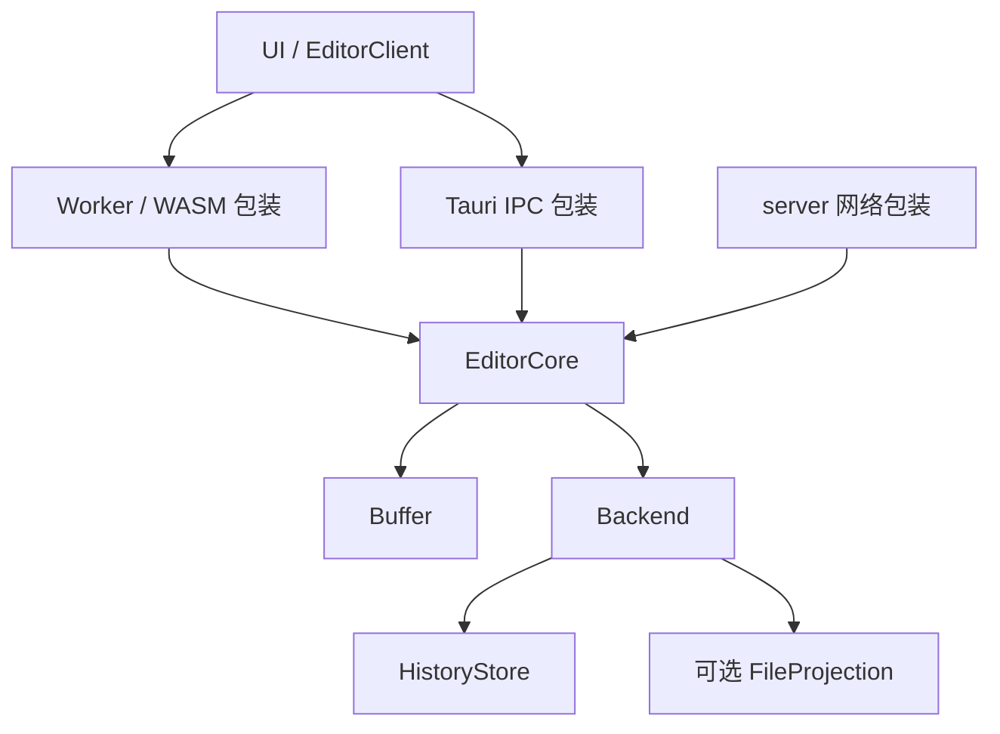

# Celestite 目标架构

Celestite 使用统一的 Rust EditorCore。每个 VaultInstance 构造自己的 core，注入平台 Backend；UI 通过同一套命令、查询与事件接口访问它。实施顺序见 [路线图](roadmap.md)。

## Vault 与 VaultInstance

- **Vault**：逻辑库定义，包含 vaultId、historyId，不持有运行资源。
- **VaultInstance**：Vault 在本机的实例，拥有一个 EditorCore、可选私有存储和连接配置。
- **EntryId**：文件或目录的稳定身份；移动保留身份，复制创建新身份。
- **文档历史与 writer**：每个文本独立保存 CRDT 历史；不同实例使用不同 writer 和个人撤销栈。

本机存储、普通目录映射和协作连接分别配置。URL 是连接入口，文档路径是可变的文件位置，移动不改变当前历史中的文档身份。Web 默认 Vault 独立存在且不可从列表删除；加入远端 Vault 创建或复用另一实例。

### server 托管边界与远端权限

每个 server 进程只服务一个 Vault，以 `[vault]` 配置目录和权限；客户端可以连接多个独立 server。server 协作状态只驻留内存，普通文件通过保存写回托管目录。集中托管多个 Vault 留待 SaaS 场景再设计。

远端连接使用 `https://host/<key>` 作为基址，接口追加 `/api/v1/...`。每个 Vault 固定提供 readonly / edit 两条链接，由秘密值、Vault 身份和独立权限域派生；readonly 使用 `ro-` 前缀，完整 key 参与凭证查找，URL 不含 Vault 名称或磁盘路径。server 的 Vault 身份由秘密值和规范根目录确定，协作历史身份每次启动重新生成。

配置文件和 CLI 均可省略 `share_key`，由宿主生成仅供本次进程使用的随机秘密值。复用显式秘密值与同一根目录可保留链接；修改秘密值或根目录并重启轮换两种链接。固定链接不提供历史恢复。`public_url` 决定公开基址。宿主启动日志输出完整链接，普通请求与诊断脱敏 key。没有动态分享管理或分享初始化流程。

HTTP、WebSocket 和持续订阅共用授权上下文。readonly 允许读取、预览和实时更新；edit 允许正文与目录修改，仍受 Vault 级只读限制。宿主退出关闭持续连接，客户端保留未确认正文及恢复能力。两种链接分别建立客户端实例与编辑会话，不合并权限；完整链接按凭证保存。core 不处理分享凭证，宿主文件观察与协调独立运行。

## core 与平台边界

图中的 EditorCore 是共同的类型与契约，每个实例各自拥有状态。

| 层         | 职责                                                           |
| ---------- | -------------------------------------------------------------- |
| UI         | 渲染、布局、鼠标命中、滚动、IME、文件树交互与待确认输入投影    |
| EditorCore | 文档集合、Vault 目录与身份、编辑会话、保存恢复、同步、语言服务 |
| Buffer     | 单份文本历史的正文、命令、个人撤销、锚点与变更结果             |
| Backend    | 私有历史提交与恢复、可选普通目录 IO、条件写入及外部变化提示    |
| 平台包装   | 创建和承载 core、消息传递、任务执行、进程及连接适配            |

core 定义 Backend Trait，构造时接收其实现；保存和恢复的业务顺序由 core 决定。PeerTransport、LspTransport 独立于存储 Backend。平台 IO 使用异步契约，WASM 支持浏览器执行环境。

| 平台   | core 位置        | Backend                             | UI 通道     |
| ------ | ---------------- | ----------------------------------- | ----------- |
| Web    | Worker 内的 WASM | 浏览器私有历史与 OPFS / 本机目录 IO | Worker 消息 |
| Tauri  | native Rust      | native 存储 / 文件系统              | IPC         |
| server | native Rust      | 内存历史 / native 文件系统          | 网络 API    |

Tauri 的 WebView 只运行 UI，本机访问 core 使用 IPC。server 与 Tauri 复用相同 Rust 业务。WASM 绑定位于 `celestite-core` 的 feature gate 后。

## 编辑与语言服务

每份已加载文本历史在实例中由一个单所有者 Buffer 持有正文、CRDT、因果版本、锚点和个人撤销。所有修改通过同一命令契约，同步返回版本、显示增量、原始操作和撤销上下文；Buffer 不持有 IO、连接或通知队列。EditorCore 负责分发结果、提交历史和协调文件，不让各入口分别生成增量或维护另一套文本历史。

本地输入与隔离的磁盘历史分支使用同一编辑规则，远端与恢复数据导入原始操作，不重放展示差异。导入准备只试算一次；准入或持久化后在原 Buffer 上应用同一结果，实例或状态改变则重新准备，不能替换活动副本来提交试算。文本接受与历史提交分别报告，提交失败不伪装成输入被拒绝。

UI 即时显示输入并按回复与事件对账。同一文档的多个视图共享 Buffer，各自拥有编辑会话、选区和命令状态。共享既有历史不替换本机 Buffer 或清空其撤销，新加入的客户端从共同快照构造自己的副本；协作光标通过独立 presence 通道传递。

协作成员状态独立于持久化文本历史：同步会话维护成员身份、加入 / 离开及最新状态；core 提供按文档历史限定的锚点创建与解析；UI 将解析后的区间映射到待确认投影，再测量实际排版并绘制指针、光标和选区。成员状态允许节流、合并和过期清理，不参与保存与个人撤销。

模式、移动、选区和输入手势属于 UI，由视图端选择显式撤销组 ID，不能按 IO 完成时间分组。Vim 命令与插入会话保持明确的分组，不因输入停顿拆分；core 不解释 Vim 命令名称，UI 不建立第二份撤销历史。编辑、撤销、保存和关闭使用共同契约。Vim 开关沿用全局默认值与 Vault 设置覆盖。

编辑事务使用修改前正文的 UTF-16 区间，正文统一 LF。文档历史从共同快照加入；导入保留原始 writer，个人撤销只撤销自己的操作。RPC 请求有会话与请求标识，事件有连续序号，缺口通过快照对账。

语法高亮与折叠是视图正文的派生展示，包含待确认输入。UI 按文件类型选择 Tree-sitter 语法，在独立 Worker 中增量解析并执行高亮、嵌套语言与折叠 queries；结果按视图正文版本校验，切换语法或销毁视图时释放解析资源。语法资源随前端发布，本地与远端视图共用同一套展示逻辑。

LSP 消费 core 的版本化未保存正文。core 管理分析会话、结果适用性、LSP 文档生命周期和工作区修改；平台运行服务和传输消息；UI 展示诊断与补全。结果按文档版本与服务代次校验。

## 文档预览

`.not`、`.md` 与 `.markdown` 通过 Notist 分析为同一份 Item 树，再由 `notist-html` 输出 HTML 片段。预览是正文的派生结果，不写入文档历史，也不触发文件保存。Rust 预览计算模块接收不可变快照，不持有 Backend 或另一个 EditorCore。Notist 的 `Vault` 负责配置发现、package 清单与递归依赖、开发作用域、IR 转换、组件注册与渲染语义；Celestite 负责提供编译资源快照、版本失效与交互展示。外部依赖的读取授权沿用任务中的清单快照，与分析器装配同一份依赖图。

### 会话与契约

core 按文档维护预览会话；多个视图共享分析结果，各自持有订阅、显示模式和滚动位置。UI 订阅时取得状态快照，之后接收带连续事件序号的更新；取消订阅释放该视图的需求。只有有订阅的文档参与预览调度，最后一个订阅结束或文档关闭时释放会话及缓存。

| 契约               | 内容                                                                                                  |
| ------------------ | ----------------------------------------------------------------------------------------------------- |
| UI 订阅 / 取消订阅 | 文档身份、订阅标识；订阅标识绑定 EditorClient 会话                                                    |
| 分析任务           | 不透明任务标识、预览会话代次、文档身份、正文 Version、Vault 内路径、项目代次、LF 正文、未保存资源覆盖 |
| 计算结果           | 原任务标识、HTML、源码映射、组件描述、正文与跨文件诊断，或执行错误                                    |
| 预览状态           | 支持情况、待更新 / 计算中 / 就绪 / 失败、目标任务标识、最后一份已接受结果及其版本                     |

任务由 core 原子取得正文与版本，只使用 core 已接受的未保存正文。UI 待确认输入继续即时显示；预览允许短暂滞后，不将待确认正文标为已接受版本。输入、撤销、重做、历史导入和外部正文更新统一使预览失效；路径、文件格式或项目资源变化也使任务失效。配置、声明及组件资源的编辑、目录操作和远端文件通知推进项目代次，即使正文版本不变也拒绝旧结果。项目资源的 core 正文优先于已保存文件。

core 保存任务对应的完整上下文，按当前正文版本、路径、配置与会话代次决定是否接受结果，不依赖执行器回传的版本声明，也不对 CRDT Version 作整数大小比较。取消、关闭、重开及执行器重启后的旧结果均丢弃。正文变化时，已显示结果保留并标为待更新；旧结果中的源码诊断定位暂停，直到取得适用于当前正文的结果。

### 调度与执行

首期全量分析、全量生成 HTML。首次订阅立即调度；正文变化以 120 ms 防抖合并，最长合并等待为 500 ms。正在执行的同步分析不假定可以中断；每份文档只保留一份最新待处理快照，不排队处理所有编辑版本。超过合并期限时，执行器一旦空闲即可调度最新快照；这不是分析完成时限。

Web 每个 VaultInstance 按需创建独立分析 Worker，在其内执行 Rust / WASM 预览计算；它不打开 OPFS，也不加入编辑和持久化命令队列。资源准备直接调用 Backend 的只读 IO，不复用会保存正文的文件下载入口，也不占用编辑命令队列；Notist 通过资源接口决定需要读取的路径，平台补齐快照后计算。native 使用后台计算任务。core 决定任务、优先级与结果适用性，平台负责计时、消息传递和任务执行。执行器优先处理当前可见文档，并限制同时执行的任务和缓存总量。

本地与远端 Web 视图共用 EditorClient、预览订阅及分析执行器契约。远端连接在自己的 Worker 中运行客户端 core，以 host 历史建立正文；预览直接消费客户端已接受的正文，WebSocket 会话承载历史同步与保存回执。host 回执不能把客户端内存历史标为本机持久化成功，只读权限限制编辑而不取消正文预览。

首期输入上限 5 MiB，单份 HTML 与诊断输出上限 16 MiB，core 输出缓存总量上限 64 MiB。Web 每个实例同时运行一个预览任务，执行超过 30 秒视为失败；这些上限控制资源占用，不承诺任意输入的计算耗时。

分析中的源码错误保留恢复树，HTML 与诊断一并返回。执行器加载失败、崩溃或超时只使预览失败，保留最后一份结果并允许显式重试；重试创建新执行代次，不自动无限重启。目录核对与文件树刷新不触发预览重算；正文、项目内容变化或显式刷新才更新预览，失败后不轮询重试。取消订阅后丢弃晚到结果；关闭实例时终止执行器并释放资源。

### 显示、链接与资源

UI 提供源码、分栏和预览模式；显示模式作为全局持久化偏好，由所有文档与实例共用，不接受 Vault 配置覆盖。各文档分别保留滚动位置；窄屏将分栏显示为单独预览，窗口变化不改写模式偏好。切换模式保留编辑会话与选区，隐藏预览不继续订阅分析。HTML 挂在 ShadowRoot 内，使用预览专用样式和应用主题变量；其作用是样式与元素身份隔离，HTML 的可信边界仍由 renderer 的转义、属性白名单、URL 策略和受信任扩展决定。

首期整体更新 HTML，保留并按新内容高度约束滚动位置。源码分析、转换与渲染诊断合并展示，按任务原始正文将 UTF-8 字节范围转换为 UTF-16，再用于编辑器定位。配置与声明错误携带自己的路径和源码范围，跳转前校验目标文件仍与诊断快照一致。预览能力按格式判断，独立于文本是否可以只读展示。

core 将链接目标解释为当前文档片段、Vault 内条目或外部 URL。相对路径以任务中的文档目录为基准，规范化后不能越出 Vault；预览容器接管导航，同文档片段在自己的 ShadowRoot 中定位，Vault 内链接通过 EditorClient 打开，外部 URL 使用平台打开能力。浏览器页面 URL 不作为 Vault 相对路径的基准。

Vault 文档路径与编译资源身份分开：依赖路径相对于配置文件解析，可以指向 Vault 外的 package。宿主通过独立的只读通道提供配置声明的 package 的声明文件与组件目录，普通 Vault 文件接口保留自己的路径范围。package 不进入文档文件树、CRDT 历史或保存流程，文档根目录和历史身份不因依赖位置变化而改变。外部 package 的文件通知只使项目预览失效；其诊断源码以只读快照显示。浏览器本机目录允许用户另行选择包含 Vault 的资源授权目录，按两者的相对位置解析依赖；资源权限与 Vault 编辑权限独立，授权记录绑定现有实例。OPFS 实例通过已提供的存储能力解析资源，远端与 native 由各自宿主提供资源通道。

package 组件通过 Notist 提供的运行时注册为 custom element，渲染容器保留 ShadowRoot。组件模块及其相对 JS、WASM 等资源来自同一份 package 快照，由页面作用域的同源虚拟 URL 和 Service Worker 提供；URL 保留资源目录关系并跟随部署 base path。资源服务仅处理预览资源路径。正文与声明变化重新渲染，组件实现变化提示刷新页面；已注册模块及其按需资源随页面存活。

附件通过只读资源查询取得，不复用会隐式保存正文的下载流程。图片等扩展使用结构化资源描述，UI 按需读取并管理 Blob URL；替换、取消订阅和关闭时释放。公式与代码高亮作为独立渲染扩展，扩展输出沿用受信任 HTML 契约。

### 源码映射与交互同步

预览结果携带与 HTML 同次生成的源码映射：输出节点标识、任务正文的 UTF-16 区间和映射粒度。renderer 在实际输出的元素上写入内部标识，源码不能伪造该标识；映射不依赖用户填写的 id，不通过再次解析 HTML 猜测源码位置。透明分组、结构性展开和恢复节点按实际输出记录，空范围或生成内容回退到可定位的父级。

节点标识仅在所属任务内有效，不承担跨版本稳定身份。映射与 HTML 一并接受或拒绝，计入预览容量限制；结果过期或 UI 有待确认输入时暂停定位和同步。计算模块提供源码关系，UI 根据 ShadowRoot 和 CodeMirror 的实际排版取得屏幕坐标；DOM 尺寸与滚动几何不进入 core。

双向定位优先支持标题、段落、列表项、表格行及单元格、代码块。源码点击使预览短暂标示对应内容；预览点击非链接内容选中对应源码。目标已可见时保留视口，屏外目标只滚动到可见位置；长节点以可定位的起点或已可见部分为准，不要求整个选区进入视口。链接保持导航语义，拖选文字不触发定位；分栏定位保留分栏模式，单独预览时可切回源码。连续输入不要求每次移动光标都重新居中预览。

分栏连续滚动以源码映射的内容锚点对齐，并在相邻锚点间插值；不按两侧全文滚动高度的比例换算。点击定位后恢复滚动时，将当前两侧视口加入锚点，连续过渡到内容对齐，避免撤销点击后的视口选择。滚动跟随只移动视口，不修改选区或抢夺焦点。一次用户滚动由一侧驱动，程序产生的跟随滚动不得反向触发同步；新用户操作可以接管驱动侧。布局、宽度、字体或 HTML 变化后重新测量；恢复同步时根据当前视口重新取锚点，不重放旧版本坐标。用户可以关闭连续滚动同步，双向点击定位独立可用。

首版映射以内容范围为准。字符级定位另行保留显示文本到原文的映射，以覆盖转义、实体解码、空白归一化、代码围栏与生成内容；不能将显示字符偏移直接加到 Item 的源码起点。源码映射和滚动同步不依赖增量分析或 DOM 局部更新。

增量分析和 DOM 局部更新分别演进。后续分析会话可以接收编辑并复用旧树，显示层可以匹配节点并复用 DOM；源码偏移和用户填写的 id 不作为自动稳定节点身份。

## 持久化与保存

HistoryStore 保存身份、CRDT 快照、增量与恢复信息；FileProjection 将正文写回普通文件，并协调外部变化。历史的持久性由实例角色决定：本地浏览器实例使用私有存储，server host 与远端 client 的协作历史只驻留内存。server 重启后从实际打开的文件重新建立历史，不恢复未写回正文或操作意图。

普通目录在保存时从已确认的磁盘历史建立隔离分支，先按行定位变化区域，再在区域内做字符级比较，保留未变化字符的身份。平台在 Vault 锁外执行固定算法；core 按文档身份、路径、磁盘基线和观察序号验证结果，重新核对磁盘后合入最新正文。计算期间允许协作历史推进，每份文档只运行一个任务，后续提示合并为最新观察。

协调待完成或失败时，已提交历史保持可读，客户端显示外部修改尚未同步并暂停自动写回。超出预算拒绝整次观察，不按耗时切换为整行或全文替换；相同失败输入采用有上限的退避重试，磁盘内容变化或显式重试立即重新排队。正常完成后清除协调状态。

分别报告本机历史提交、host 历史确认和普通文件写回的版本。保存指定文档与因果版本，回执报告实际写回版本。独立普通目录实例从磁盘基线合入外部修改，保存失败保留正文；需要显式处理的本地冲突提供覆盖、丢弃、取消；共享历史的保存失败只提供取消与重试保存，不能通过保存动作丢弃协作者的修改；移动与删除后的待写任务按稳定身份重新检查目标。

持久化的私有存储只有一个写入所有者，多窗口 / 标签访问同一运行时或独占打开。关闭视图保留历史和待确认操作；关闭实例处理提交并释放资源。具备私有存储的实例恢复时保留身份并使用新 writer。

OPFS watch 可以不发事件，应用内操作由 core 发布领域事件。普通文件目录与私有历史分开，私有数据不出现在文件树中。

浏览器本机目录能力由主线程通过用户操作获取和恢复授权，目录 handle 可持久化并传给编辑 Worker。同一目录关联稳定实例身份，私有历史存于 OPFS；普通文件直接访问所选目录。外部变化只在保存时核对，core 负责磁盘基线与历史协调。浏览器锁只协调遵守协议的同源实例，不承诺与外部程序之间的原子条件写入或目录事务。

## 首期协作：单 host

每个协作 Vault 由一个固定 host 托管，多个 client 连接它。host 管理目录操作、按需加载的共同文本历史和普通文件保存；客户端运行自己的 core，首期只在已验证的在线会话中编辑。每份打开的文本由独立 Buffer 持有 CRDT，本地、host 与 client 共用该模型。

| 实例角色 | 普通目录                                          | 保存目标  |
| -------- | ------------------------------------------------- | --------- |
| 独立实例 | OPFS 默认目录、浏览器获授权目录或 native 本机目录 | 本机文件  |
| host     | host 托管目录                                     | host 文件 |
| client   | 无本地目录镜像，仅会话缓存                        | host 文件 |

host 通过配置指定唯一的 Vault，client 通过 URL 加入。目录创建、移动、重命名和删除由 host 在线校验、排序执行。每个 VaultInstance 使用一条 WebSocket 连接，以当前历史中的稳定文档 ID 多路传递 CRDT 增量、目录提示、操作确认、保存命令和心跳；host 在内存接受后向已订阅该 Buffer 的会话确认或推送，普通文件写回独立完成。HTTP 用于 Vault 发现、目录操作、附件与普通文件传输。完整链接赋予权限，HTTP 与 WebSocket 在入口处验证 key；握手核对协议与历史身份。

客户端 UI 输入由本地 core 接受并生成增量；远端更新先由 Worker 中的 core 导入，再将正文变化事件交给 UI。导入保留 writer 和个人撤销；UI 增量更新正文和选区，对待确认输入重新映射，IME 组合输入期间保留本地投影，不直接覆盖编辑器 buffer。host 快照、订阅和补齐屏障在同一串行边界建立；补齐完成后才开放编辑。正文接受、本机历史提交、host 确认与文件写回分别报告状态；core 的串行修改边界不等待网络确认，传输层按因果依赖有序发送并使用有界队列。保存等待目标版本的 host 确认，资源读取不占用编辑队列。

连接只建立已验证的会话，不加载全文。打开文本时 host 创建或复用 Buffer，客户端从快照建立副本并订阅更新。同一历史内重连按 ID 重新打开此前加入的 Buffer，整批校验快照、最终路径和删除状态后原子替换会话；失败保留旧正文、写入身份、撤销与预览订阅。删除记录不占用活动路径，路径复用按文档身份区分。host 重启或 URL 指向的历史改变时拒绝沿用旧会话，用户保留正文后重新打开连接；旧历史不直接导入。

目录元数据与正文加载分开：文件树按需读取，文本仅在打开时建立 CRDT，附件按需取得。文件监听核对已加载 Buffer，未打开文件的目录变化仍可发现。Buffer 卸载与取消订阅另行设计，必须保留已接受但未写回的共同正文。

离线不能打开或重新进入远端 Vault，也不能打开新的远端文档；整个 Vault 工作区（文件树与编辑区）显示断线遮罩并禁止交互，提供“尝试重新连接”。连接失败、请求超时或权限失效时暂停新操作，UI 与 core 同时限制编辑。旧会话的迟到回复不改变新会话状态，host 按会话有效性校验尚未提交的操作。

重连相当于重新加入：直接从 host 历史重建活动文档，分配新 writer 并清空个人撤销，不重放旧会话操作。尚有未确认输入时，提供当前正文导出，并由用户明确选择丢弃后重连；失败保留原正文。回执丢失但已提交的修改随 host 历史返回。已明确拒绝且未进入历史的输入保留 UI 正文，提供导出和撤回入口；撤回同时移除依赖它的后续输入，并采用当前已接受的历史。结果未知的输入必须走断线恢复流程，不能当作拒绝直接撤回。首期不提供未确认操作核对、合并或恢复界面。独立 OPFS 实例与 host 自身的本机编辑不受远端 client 在线限制。

远端关闭标签或连接只等待编辑确认并释放视图或会话，不触发普通文件保存；已确认的共享正文保留于 host 进程内存，未确认输入阻止关闭。下载读取普通文件投影，不隐式保存共享历史。

首期每个实例在同一 Vault 上选择独立、host 或 client 角色之一。持久化的离线客户端副本、离线编辑、协作目录镜像、Catalog CRDT 和多跳 P2P 后续分别设计。
