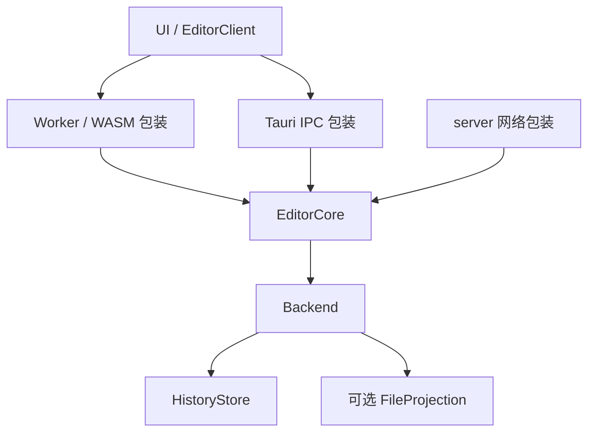

# Celestite 目标架构

Celestite 使用统一的 Rust EditorCore。每个 VaultInstance 构造自己的 core，注入平台 Backend；UI 通过同一套命令、查询与事件接口访问它。实施顺序见 [路线图](roadmap.md)。

## Vault 与 VaultInstance

- **Vault**：逻辑库定义，包含 vaultId、historyId，不持有运行资源。
- **VaultInstance**：Vault 在本机的实例，拥有一个 EditorCore、私有存储和连接配置。
- **EntryId**：文件或目录的稳定身份；移动保留身份，复制创建新身份。
- **文档历史与 writer**：每个文本独立保存 CRDT 历史；不同实例使用不同 writer 和个人撤销栈。

本机存储、普通目录映射和协作连接分别配置。URL 是连接入口，路径是文件位置，都不承担 Vault 身份。Web 默认 Vault 独立存在且不可从列表删除；加入远端 Vault 创建或复用另一实例。

## core 与平台边界

图中的 EditorCore 是共同的类型与契约，每个实例各自拥有状态。

| 层         | 职责                                                        |
| ---------- | ----------------------------------------------------------- |
| UI         | 渲染、布局、鼠标命中、滚动、IME、文件树交互与待确认输入投影 |
| EditorCore | 文档、Vault 目录与身份、编辑会话、保存恢复、同步、语言服务  |
| Backend    | 私有历史提交与恢复、可选普通目录 IO、条件写入及外部变化提示 |
| 平台包装   | 创建和承载 core、消息传递、任务执行、进程及连接适配         |

core 定义 Backend Trait，构造时接收其实现；保存和恢复的业务顺序由 core 决定。PeerTransport、LspTransport 独立于存储 Backend。平台 IO 使用异步契约，WASM 支持浏览器执行环境。

| 平台   | core 位置        | Backend                | UI 通道     |
| ------ | ---------------- | ---------------------- | ----------- |
| Web    | Worker 内的 WASM | OPFS                   | Worker 消息 |
| Tauri  | native Rust      | native 存储 / 文件系统 | IPC         |
| server | native Rust      | native 存储 / 文件系统 | 网络 API    |

Tauri 的 WebView 只运行 UI，本机访问 core 使用 IPC。server 与 Tauri 复用相同 Rust 业务。WASM 绑定位于 `celestite-core` 的 feature gate 后。

## 编辑与语言服务

正文、CRDT、因果版本、锚点和个人撤销由 core 管理。所有文本修改经过统一事务入口；UI 即时显示输入并按回复与事件对账。同一文档的多个视图共享正文，各自拥有编辑会话、选区和命令状态；协作光标通过独立 presence 通道传递。

编辑事务使用修改前正文的 UTF-16 区间，正文统一 LF。文档历史从共同快照加入；导入保留原始 writer，个人撤销只撤销自己的操作。RPC 请求有会话与请求标识，事件有连续序号，缺口通过快照对账。

Tree-sitter 与 LSP 消费同一份版本化正文。core 管理分析会话、结果适用性、LSP 文档生命周期和工作区修改；平台执行解析任务、运行服务和传输消息；UI 展示高亮、诊断与补全。分析读取未保存正文，结果按文档版本与服务代次校验。

## 持久化与保存

HistoryStore 保存身份、CRDT 快照、增量与恢复信息；FileProjection 将正文写回普通文件，并协调外部变化。两者分别提交，保存意图与文件基线用于恢复中断操作和处理冲突。

分别报告本机历史提交、host 历史确认和普通文件写回的版本。保存指定文档与因果版本，回执报告实际写回版本。外部修改保留双方内容并提供覆盖、丢弃、取消；移动与删除后的待写任务按稳定身份重新检查目标。

私有存储只有一个写入所有者，多窗口 / 标签访问同一运行时或独占打开。关闭视图保留历史和待确认操作；关闭实例处理提交并释放资源。正常恢复保留实例身份并使用新 writer。

OPFS watch 可以不发事件，应用内操作由 core 发布领域事件。普通文件目录与私有历史分开，私有数据不出现在文件树中。

## 首期协作：单 host

每个协作 Vault 由一个固定 host 托管，多个 client 连接它。host 管理稳定目录条目、共同文本历史和普通文件保存；客户端运行自己的 core 并持久保存私有历史。

| 实例角色 | 普通目录                        | 保存目标  |
| -------- | ------------------------------- | --------- |
| 独立实例 | OPFS 默认目录或 native 本机目录 | 本机文件  |
| host     | host 托管目录                   | host 文件 |
| client   | 无本地目录镜像，仅私有缓存      | host 文件 |

host 通过配置登记 Vault，client 通过 URL 加入。目录创建、移动、重命名和删除由 host 在线校验、排序执行。文本通过 CRDT 增量交换，host 持久提交后确认并向其他 client 发布；文件写回独立完成。

同步覆盖整个 Vault 的目录与受支持内容，活动文档优先，其他文本后台补齐，附件按需取得。同步范围与内存工作集分开，关闭标签不停止补齐；未取得正文保持不可用。

client 确认断线后只读，保留已有修改。重连核对身份、权限和目录并补齐历史，再恢复可写；被拒绝的修改保留供导出或显式恢复。独立实例与 host 自身的本机编辑不依赖 client 在线。

首期每个实例在同一 Vault 上选择独立、host 或 client 角色之一。完整离线编辑、协作目录镜像、Catalog CRDT 和多跳 P2P 后续分别设计。
