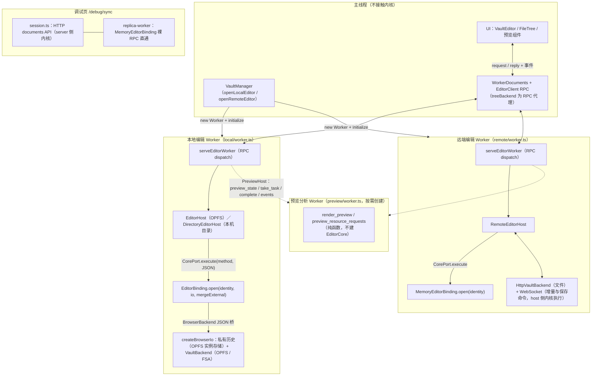
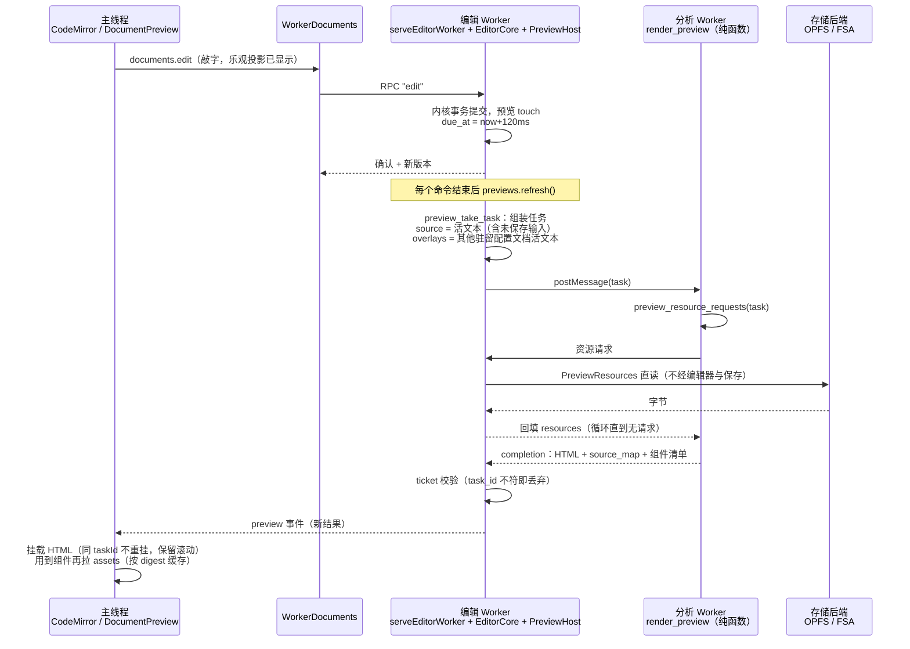

# EditorCore API 面

`EditorCore<Backend>` 是统一编辑器内核：文档身份、CRDT 正文、个人撤销、私有历史、文件保存、外部冲突协调与预览会话。平台 IO 全部经 `Backend` trait 注入，内核不依赖 HTTP、Worker 或 UI。本文按当前实现梳理对外 API 面，行为变化时同步维护；目标架构见 [architecture.md](architecture.md)。

## 构造与选项

Rust 入口：`EditorCore::open(backend)` 与 `EditorCore::open_with_options(backend, EditorOptions)`。

`EditorOptions`：

| 选项 | 取值 | 语义 |
| --- | --- | --- |
| `external_changes` | `Conflict`（默认）/ `Merge` | 无外部写者的实例只做保存时条件写检查；有外部程序的实例在保存时从磁盘基线合并外部修改 |
| `defer_filesystem_diff` | bool | true 时磁盘观察任务交给平台在锁外计算后回报；false 时在调用内联完成 |

三种后端实例化与策略：

| 实例 | Backend | external_changes | defer | 调用方 |
| --- | --- | --- | --- | --- |
| 浏览器本地（OPFS） | `BrowserBackend` | Conflict | false | local worker |
| 浏览器本机目录 | `BrowserBackend` | Merge | false | local worker |
| 远端 client 副本 | `MemoryBackend` | Conflict | false | remote worker、debug |
| server host | `NativeBackend` | Merge | true | server、Reconciler |

## WASM 绑定（`wasm` feature）

| 绑定 | 构造 | 说明 |
| --- | --- | --- |
| `EditorBinding` | `open(identity, io, mergeExternal)` | `EditorCore<BrowserBackend>`；`io` 为浏览器文件与私有历史桥（JSON 字符串调用） |
| `MemoryEditorBinding` | `open(identity)` | `EditorCore<MemoryBackend>`，易失私有历史，无文件投影 |
| `DocumentBinding` | `new` / `from_snapshot` | 底层单文档内核（快照、版本编解码、事务、撤销），供 debug 与测试 |
| `render_preview` / `preview_resource_requests` | 纯函数 | 分析 Worker 直接调用，不建 EditorCore |

前两者统一经 `execute(method, params) -> JSON` 进入下述服务分发面。

## Web 接入形态

内核只在 Worker 内出现，主线程始终经 RPC 与 Worker 通信，不直接接触内核。直接引用 `generated/celestite_core` 的只有四个 Worker：

| Worker | 绑定 | 交给谁 | 说明 |
| --- | --- | --- | --- |
| `lib/editor/local/worker.ts` | `EditorBinding.open(identity, io, mergeExternal)` | OPFS → `EditorHost`；本机目录 → `DirectoryEditorHost` | `io = createBrowserIo(OpfsInstanceStore, VaultBackend)`；`mergeExternal` 仅本机目录为 true |
| `lib/editor/remote/worker.ts` | `MemoryEditorBinding.open(identity)` | `RemoteEditorHost` | 身份每次加入时生成；文件与保存命令另走 `HttpVaultBackend` / WebSocket |
| `debug/replica-worker.ts` | `MemoryEditorBinding.open` | 无 host 层，裸 RPC 直通 | 调试页副本，`debug/session.ts` 驱动 |
| `lib/editor/preview/worker.ts` | `render_preview` / `preview_resource_requests` 纯函数 | 无 EditorCore 实例 | 预览分析 Worker，由编辑 Worker 内的 `PreviewHost` 按需创建 |

交互形状：

- TS 侧对内核的接口收敛为 `CorePort`（`runtime/host.ts`）：`execute(method, params: JSON 字符串)`。`EditorBinding` / `MemoryEditorBinding` 天然满足它，调试副本直接暴露它。
- 本地与远端编辑 Worker 共用 `serveEditorWorker`（`runtime/service.ts`）：主线程 RPC → host 方法 → core；差异只在 host 子类与注入的绑定。
- 变更交付：core 返回的 `EditorDocument` 经 host 投影为 `ServiceDocument` 事件推回主线程；目录形态对保存时磁盘合并做增量发布。
- 远端文件写不经过 client 内核（无投影）：`save` 经 WebSocket 命令由 host 侧内核执行。

## 典型路径：打开、编辑与预览

以打开 `README.not` 为例。全程三类执行体：主线程（UI 与 CodeMirror）、编辑 Worker（服务框架、host、内核、PreviewHost）、分析 Worker（纯函数渲染），外加存储后端。

**打开**：文件树点击 → `documents.open(path)` → RPC `open` → 内核 `open_file`：读盘（字节 + 内容 revision）、解码（BOM / 行尾）、按路径对账私有历史（编辑过则恢复 CRDT 文档，可能含上次未保存正文；首次则以磁盘内容为基线新建）→ 返回 `EditorDocument` → 事件回流主线程建立 ViewRecord 与标签页，CodeMirror 挂载 `snapshot.text`。非 UTF-8 或超 5 MiB 时内核抛 `Unsupported`，host 落到只读占位文档。

**编辑**：`documents.edit` 先把输入压入 `record.inputs`（乐观投影，UI 立即可见），RPC 到内核做版本校验与 Loro 事务提交，回复后用内核规范化回放的 edits 收敛投影。UI 永远是“已接受正文 + 待确认输入”的投影；版本过期时 host 先 rebase，对不上则拒绝该输入并提示，正文不丢。

**预览跟随**：分栏开启时 `preview_subscribe` 建会话；每个命令结束后 `previews.refresh()` 挑选到期的 pending 任务，内核组装任务（`source` 为主文档活文本、`overlays` 为其他驻留配置文档的活文本），分析 Worker 经两阶段请求循环从存储后端直读资源后整体渲染，completion 回内核校验 ticket 后发布，主线程把 HTML 挂到预览区（同 taskId 不重挂，保留滚动）。防抖在内核：连续编辑顺延 `due_at`（120ms 合并，首次脏后 500ms 封顶）；每文档同时只有一个在算任务，过期结果按 task_id 丢弃。

要点：预览渲染的是未保存的活文本（配置文件的未保存修改同样生效）；资源读取与编辑器缓冲区无关；保存（Ctrl+S）是独立路径——读盘核对 revision → 条件写回 → 历史 commit，预览从不等保存，保存也从不触发预览重算（预览失效只由编辑与项目结构变化驱动）。

## 服务分发面 `execute_service`

单入口 `(method, params) -> Value`，JSON 出入。除标注外 `params.id` 选取目标文档，多数方法返回 `EditorDocument`（字段见横切类型）。Web Worker 的全部编辑与文件 RPC 最终落到这里。

### 文档与读取

| 方法 | 参数 | 行为 |
| --- | --- | --- |
| `open` | `path` | 打开或恢复磁盘文件 |
| `read` | `id` | 当前 `EditorDocument` |
| `resident` | — | 全部驻留文档 |
| `replace_text` | `id, text, version` | 视图整文替换：与当前正文 diff 后走编辑事务 |

### 编辑与撤销

| 方法 | 参数 | 行为 |
| --- | --- | --- |
| `edit` | `id, version, edits, context, userEvent` | 因果版本校验的 UTF-16 编辑事务；返回 `EditorEditResult`（含回放用的 `edits`） |
| `undo` | `id, context, redo` | 个人撤销 / 重做，选区位置随变更转换；历史版本核对由调用侧完成 |
| `text_changes` | `before, after` | 纯函数：两份正文的差异 |

### 保存与冲突

| 方法 | 参数 | 行为 |
| --- | --- | --- |
| `save` | `id` | 读盘核对 →（Merge 时先合并外部修改）→ 内容 revision 条件写 → 历史持久化；失败置 `conflict`/`error`，正文与历史保留 |
| `resolve` | `id, action` | 冲突显式处理：`discard` 采用磁盘内容，`overwrite` 以本地正文重写 |
| `retry_observation` | `id` | 立即重试失败的磁盘观察 |
| `retry_history` | `id` | 重试失败的私有历史提交 |
| `flush` | — | 保存全部驻留脏文档 |
| `flush_history` / `close` | — | 重试历史提交；`close` 另清空预览会话 |

### 副本同步（client 角色）

| 方法 | 参数 | 行为 |
| --- | --- | --- |
| `join` | `path, packet, writerId?` | 以快照或增量加入既有历史 |
| `import` | `id, packet` | 导入更新包（乱序、重复安全），返回 `ImportResult` 与文档 |
| `export_snapshot` | `id` | 完整快照包 |
| `export_updates` | `id, version` | 自某版本的增量包 |
| `replica_session` | `documents` | 整体替换易失副本会话（重连重建） |
| `replica_join` | `document` | 单文档加入副本会话 |
| `replica_host_state` | `id, state` | 应用 host 回执：路径、已接受版本、已保存正文与磁盘基线 |

### 预览

| 方法 | 行为 |
| --- | --- |
| `preview_subscribe` / `preview_unsubscribe` / `preview_release_client` | 订阅与客户端会话管理 |
| `preview_state` / `preview_take_task` / `preview_complete` / `preview_retry` | 任务拉取、完成回报与重试 |
| `preview_events` | 拉取排队的事件（点击定位、资源更新） |
| `preview_link` | 建立 / 复用内容锚点链接 |
| `preview_invalidate_project` | 项目级资源失效，下次任务重建 |

### 文件操作（`method = "file"`）

子方法与 `Backend` 文件投影一一对应。入口统一做路径校验；`readFile`、`writeFile`、`rename`、`remove` 会先把受影响路径下的驻留脏文档保存，`writeFile` 完成后核对自身写回，`rename` / `remove` 同步更新驻留文档路径。

| 子方法 | 说明 |
| --- | --- |
| `stat` / `readDir` / `readFile` / `readFileSnapshot` | 只读；`readFileSnapshot` 返回字节与内容 revision |
| `mkdir` / `writeFile` / `rename` / `remove` | 变更；`writeFile` 带 `mode`（`create` / `replace`）与 `expectedRevision` 条件写 |

## Rust 原生方法面

server 与 Reconciler 不经 JSON 直接调用：

- 生命周期与读取：`open_file`、`read`、`resident`、`list`、`identity`、`persistent`
- 编辑：`transact`、`edit`、`undo`、`undo_view`、`import`
- 同步：`join_with_writer`、`snapshot`、`updates`、`apply_host_state`、`commit_replica`、`replace_replica_session`、`join_replica_document`
- 保存与冲突：`save`（带期望版本）、`resolve`、`before_replace`、`retry_history`、`flush`
- 观察与协调：`refresh`、`refresh_path`、`reconcile_files`、`take_file_observation`、`complete_file_observation`、`has_file_observations`、`retry_file_observation`
- 目录：`rename`、`remove`

## 注入契约 `Backend`

server 的 `NativeBackend` 只提供普通文件 IO，历史不落盘；`load` 返回空集合，`commit` 直接成功，目录操作意图保留在内存中。本地浏览器的 `BrowserBackend` 仍将私有历史存入 OPFS。

| 组 | 方法 | 约定 |
| --- | --- | --- |
| 身份与时钟 | `identity`、`persistent`、`new_id`、`now_ms` | 文档 ID 由平台熵源生成 |
| 私有历史 | `load`、`commit(header, entry?)`、`directory_intent`、`set_directory_intent` | `commit` 是 header 与 journal 的逻辑提交边界；失败可能已完成，同一提交重试必须安全 |
| 易失会话 | `replace_volatile_documents` | 整体替换；失败保留原会话 |
| 文件投影（可选） | `has_projection`、`stat`、`read_dir`、`read_file`、`write_file`、`mkdir`、`rename`、`remove` | 默认 `Unsupported`；`write_file` 可在错误上附 `write_not_started` 证明，`expected` revision 条件写 |

## 横切类型与约定

- **`EditorDocument`**（视图契约）：`id`、`path`、`snapshot`（正文 + 版本）、`saved_content`、`dirty`、`deleted`、`conflict`、`error`、`persistence_error`、`external_change`、`undo`、`writer_id`、`durable_version`、`saved_version`、`backend_revision`、`bom`、`line_ending`、`autosave_delay`。
- **`autosave_delay`**：core 只给建议值（脏、有文件投影或托管、无冲突 / 观察失败 / 只读），由 host 决定是否定时保存；远端 host 显式置空，文件保存保持显式命令。
- **版本与身份**：`Version` 为 Loro version vector；writer ID 为 u64，JSON 中保持字符串；`InstanceIdentity`（instanceId + vaultId + historyId）不符时拒绝加入或恢复。
- **`EditorError`**：`code` / `message` / `path`，可选 `write_not_started` 与 `rename` 阶段信息；code 集与 Web 侧 `VaultError` 对齐（如 `Conflict`、`StaleVersion`、`FilesystemReconciliationPending`）。
- **事件模型**：变更经方法返回值交付，预览事件经 `preview_events` 拉取；内核不在 CRDT 提交中回调宿主。
