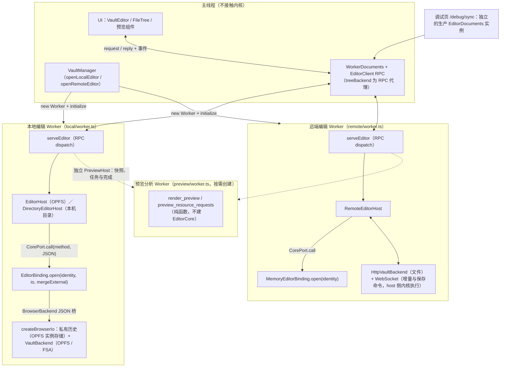
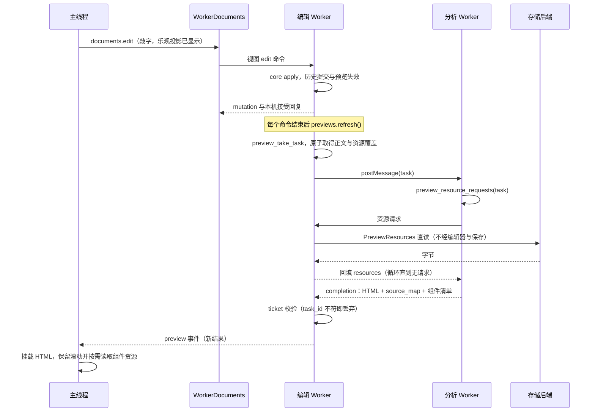

# EditorCore API 面

`EditorCore<Backend>` 是统一编辑器内核：文档身份、CRDT 正文、个人撤销、私有历史、文件保存与外部冲突协调。平台 IO 全部经 `Backend` trait 注入，内核不依赖 HTTP、Worker 或 UI，也不持有预览。派生消费者通过通用只读文档源取得输入，由工作区组合生命周期。本文按当前实现梳理对外 API 面；目标架构见 [architecture.md](architecture.md)。

原生接口按所有者显式导入：`celestite_buffer::Buffer` 与 `celestite_buffer::types` 提供文本契约；`celestite_core::editor::EditorCore`、`backend`、`instance` 与 `source` 提供文档和 IO 契约。状态与回执在 `editor::types`，观察任务在 `editor::observation`，副本输入在 `editor::replica`。两者不通过根模块重新导出其他模块的类型。

## 术语

| 名称                                     | 含义                                                                                                                                                                 |
| ---------------------------------------- | -------------------------------------------------------------------------------------------------------------------------------------------------------------------- |
| peer / peer ID                           | Loro 操作来源身份，不等于在线 Member、网络 Session 或 User；原生使用 `new_peer_id`、`with_peer_id`、`from_snapshot_with_peer_id`、`peer_id` 与 `join_with_peer_id`。 |
| `DocumentIdentity`                       | 文档与历史的逻辑共享身份，不是某个 Buffer 实例的身份，不改为 BufferIdentity。                                                                                        |
| `HistoryPacket` / `HistoryPacketKind`    | CRDT 历史数据及其类别，不是认证网络 packet；正文错误为 `BufferError`，文本差异任务为 `TextChangeTask`。                                                              |
| `state_revision` / `stateRevision`       | Buffer 实例本地状态计数，不是共享因果 `Version` 或文件 revision；历史读取不提供可跨实例比较的本地计数。                                                              |
| `persisted_version` / `persistedVersion` | 本机持久后端已提交历史的版本，不承诺 fsync；不等于普通文件的 `savedVersion` 或 host acknowledged。                                                                   |
| `file_revision` / `fileRevision`         | 普通文件字节基线的不透明版本标记，不是 CRDT 历史进度；`FileSnapshot.revision` 和存储中的 `disk_revision` 保留现有 IO / 历史字段拼写。                                |

Rust / core / WASM 与应用内部统一使用这些名称。协议仍为 v3；server 边界保留 legacy-wire `writerId`、`durableVersion`、`backendRevision`、`snapshot.revision`。WebSocket transport 将 peer 与 host 元数据规范化为 `peerId`、`persistedVersion`、`fileRevision`；正文来自 history packet，不携带文本 snapshot。core 的 `TextSnapshot` 入站仍接受旧 `revision`，出站使用 `stateRevision`。这些旧拼写仅用于兼容，不是双模型；JSON history packet、Version 的 identity / clocks 与 Loro bytes 不变。

## 模块与所有者

| 模块                                                                                                                  | 职责                                                                 |
| --------------------------------------------------------------------------------------------------------------------- | -------------------------------------------------------------------- |
| [`celestite-buffer`](../crates/celestite-buffer/README.md)                                                            | 单份文本历史、peer、个人撤销、锚点；原生字节接口与同步修改效果       |
| [`editor/mod.rs`](../crates/celestite-core/src/editor/mod.rs)                                                         | 文档集合、打开恢复、读取、磁盘基线与协调提交；唯一活动 Buffer 所有者 |
| [`editor/history.rs`](../crates/celestite-core/src/editor/history.rs)                                                 | 正文准入、历史提交、派生状态更新与 mutation 批次交付                 |
| [`editor/projection.rs`](../crates/celestite-core/src/editor/projection.rs)                                           | 保存、冲突处理、目录恢复意图与文件服务                               |
| [`editor/observation.rs`](../crates/celestite-core/src/editor/observation.rs)                                         | 外部修改观察、隔离分支任务、适用性校验与退避                         |
| [`editor/replica.rs`](../crates/celestite-core/src/editor/replica.rs)                                                 | 副本访问状态、退订缓存、整批会话验证与替换                           |
| [`source`](../crates/celestite-core/src/source.rs)                                                                    | 只读目录、源代次与选择性不可变正文捕获，不解释消费者策略             |
| [`editor/types.rs`](../crates/celestite-core/src/editor/types.rs)                                                     | 原生状态与回执类型                                                   |
| [`codec`](../crates/celestite-buffer/src/codec/mod.rs)                                                                | 文本版本与 peer 的规范编码；历史与网络共用表示                       |
| [`protocol`](../crates/celestite-core/src/protocol/mod.rs)                                                            | 外部 JSON 分发、UTF-16 转换与撤销 metadata                           |
| [`preview`](../crates/celestite-core/src/preview.rs) / [`sessions`](../crates/celestite-core/src/preview/sessions.rs) | 独立预览控制器、任务、调度、缓存与 feature-gated 纯计算              |
| [`backend`](../crates/celestite-core/src/backend/mod.rs) / [`wasm`](../crates/celestite-core/src/wasm.rs)             | 平台 IO trait 与存储类型 / 绑定与命令批次封装                        |

内存与浏览器实现分别在 [`backend/memory.rs`](../crates/celestite-core/src/backend/memory.rs) 与 [`backend/browser.rs`](../crates/celestite-core/src/backend/browser.rs)；内存后端导入路径是 `celestite_core::backend::memory::MemoryBackend`。

上述 editor 子模块都是同一个 `EditorCore` 的实现，不各自拥有文档集合，也不引入独立 manager。`Record.replica` 的 `host_authoritative` 表示客户端接受 host 元数据，不表示该 core 是 server host；订阅、只读、文件删除与历史持久性是独立状态。

必须分别理解四种进度：

| 进度           | 所有者与回执                                                               |
| -------------- | -------------------------------------------------------------------------- |
| 正文已接受     | Buffer；`BufferUpdate.after`，即使后续历史 IO 失败也保留                   |
| 本机历史已提交 | EditorCore / Backend；`HistoryCommit`，只有持久后端提供 `persistedVersion` |
| host 已确认    | 协作同步会话；不属于 Buffer，也不把客户端易失历史变成持久历史              |
| 普通文件已写回 | 执行保存的 core；`savedVersion` 与磁盘 revision，和正文接受独立            |

UI 的待确认输入是展示投影，协作会话的发送队列是确认进度；两者都不是另一份正文历史或个人撤销栈。

## 构造与选项

Rust 入口：`EditorCore::open(backend)` 与 `EditorCore::open_with_options(backend, EditorOptions)`。

`EditorOptions`：

| 选项                    | 取值                        | 语义                                                                                 |
| ----------------------- | --------------------------- | ------------------------------------------------------------------------------------ |
| `external_changes`      | `Conflict`（默认）/ `Merge` | 无外部写者的实例只做保存时条件写检查；有外部程序的实例在保存时从磁盘基线合并外部修改 |
| `defer_filesystem_diff` | bool                        | true 时磁盘观察任务交给平台在锁外计算后回报；false 时在调用内联完成                  |

后端实例化与策略：

| 实例               | Backend          | external_changes | defer | 调用方               |
| ------------------ | ---------------- | ---------------- | ----- | -------------------- |
| 浏览器本地（OPFS） | `BrowserBackend` | Conflict         | false | local worker         |
| 浏览器本机目录     | `BrowserBackend` | Merge            | false | local worker         |
| 远端 client 副本   | `MemoryBackend`  | Conflict         | false | remote worker、debug |
| server host        | `NativeBackend`  | Merge            | true  | server、Reconciler   |

## WASM 绑定（`wasm` feature）

| 绑定                                           | 构造                                | 说明                                                                           |
| ---------------------------------------------- | ----------------------------------- | ------------------------------------------------------------------------------ |
| `EditorBinding`                                | `open(identity, io, mergeExternal)` | `EditorCore<BrowserBackend>`；`io` 为浏览器文件与私有历史桥（JSON 字符串调用） |
| `MemoryEditorBinding`                          | `open(identity)`                    | `EditorCore<MemoryBackend>`，易失私有历史，无文件投影                          |
| `BufferBinding`                                | `new` / `from_snapshot`             | 底层 Buffer（正文命令、个人撤销、锚点与历史导出），用于 Buffer 契约测试        |
| `PreviewBinding`                               | `new()`                             | 独立 `PreviewController`，消费只读源快照，不持有 Editor                        |
| `render_preview` / `preview_resource_requests` | 纯函数                              | 分析 Worker 直接调用，不建 EditorCore                                          |

前两者统一经 `call(method, paramsJson) -> JSON` 进入下述服务分发面，返回：

```ts
type CallReply =
  | { status: "ok"; value: unknown; mutations: EditorMutation[] }
  | { status: "error"; error: EditorError; mutations: EditorMutation[] };
```

运行时必须先消费 `mutations`，再处理 `value` / `error`。保存或文件操作可能已接受外部正文更新后才报告 IO 错误；忽略失败回复中的批次会漏掉已发生的修改。JSON 请求解析失败则直接拒绝绑定调用。

## Web 接入形态

内核只在 Worker 内出现，主线程始终经 RPC 与 Worker 通信，不直接接触内核。直接引用 `generated/celestite_core` 的只有三个 Worker：

| Worker                        | 绑定                                                  | 交给谁                                                | 说明                                                                                       |
| ----------------------------- | ----------------------------------------------------- | ----------------------------------------------------- | ------------------------------------------------------------------------------------------ |
| `lib/editor/local/worker.ts`  | `EditorBinding.open(identity, io, mergeExternal)`     | OPFS → `EditorHost`；本机目录 → `DirectoryEditorHost` | `io = createBrowserIo(OpfsInstanceStore, VaultBackend)`；`mergeExternal` 仅本机目录为 true |
| `lib/editor/remote/worker.ts` | `MemoryEditorBinding.open(identity)`                  | `RemoteEditorHost`                                    | 身份每次加入时生成；文件与保存命令另走 `HttpVaultBackend` / WebSocket                      |
| `lib/preview/worker.ts`       | `render_preview` / `preview_resource_requests` 纯函数 | 无 EditorCore 实例                                    | 独立预览计算 Worker，由组合层的 `PreviewHost` 按需创建                                     |

交互形状：

- TS 侧对内核的接口收敛为 `CorePort`（`core.ts`）：`call(method, params: JSON 字符串)`。`EditorBinding` / `MemoryEditorBinding` 天然满足它，调试页直接使用生产远端编辑工厂。
- 本地与远端编辑 Worker 共用 `serveEditor`（`runtime/service.ts`）：主线程 RPC → host 方法 → core；差异只在 host 子类与注入的绑定。
- 变更交付：host 统一消费 `EditorMutation`，按 `BufferUpdate.edits` 更新版本化视图映射，并把 `EditorDocument` 投影为 `ServiceDocument`；普通读取或元数据变化仍可返回文档状态。
- 远端文件写不经过 client 内核（无投影）：`save` 经 WebSocket 命令由 host 侧内核执行。
- 预览计算直接调用 `render_preview(task)` / `preview_resource_requests(task)`，传入普通对象并取得类型化结果。Rust 预览值与版本协议形状通过 `wasm` feature 下的 `tsify` 生成声明；`preview/contract.ts` 只转出生成类型并定义平台接口。缺省字段沿用 Serde 规则，`null`、普通对象 map、字节数组和十进制 peer 键保持原表示；`Ts<T>` 在函数内部进行可失败转换，不采用隐式 ABI 反序列化。
- `serveEditor` 是工作区组合壳，并列持有 `EditorHost` 与独立 `PreviewHost` / `PreviewBinding` / 资源能力。`EditorHost.withSource(ids, consume)` 在 core 队列内读取并同步消费源快照，计算和 IO 使用取得的不可变任务在边界外运行；预览不通过 editor 的 JSON `preview_*` 分发。源目录同步不传全文；失败不使编辑下线。

Web 模块的所有者：

| 模块                                    | 拥有的事实与边界                                                       |
| --------------------------------------- | ---------------------------------------------------------------------- |
| `lib/editor/protocol.ts`                | Rust / 协作 wire 值，转出生成的身份与版本类型，不引入 UI 与平台句柄    |
| `lib/editor/contract.ts`                | 可见文档与异步服务契约；单一 `EditorDocument` 投影                     |
| `client/session.ts`                     | 单文档接受基线、待确认输入、重映射、拒绝与恢复                         |
| `client/documents.ts`                   | 文档集合、工作区操作、RPC 排序和保存 / 关闭协调                        |
| `client/worker.ts`                      | 本地 / 远端 Worker 的启动、失败和终止生命周期                          |
| `queue.ts` / `files.ts`                 | 独占调用与让出 IO 边界；共享文件能力 facade / dispatch，不解释保存策略 |
| `remote/session.ts` / `remote/inbox.ts` | 发送确认与单传输接收预算；IME 暂存仍计入预算，释放幂等                 |
| `components/editor`                     | CodeMirror 缓存、标签 / 状态 / 源码扩展和预览布局；工作区传入设置      |
| `lib/preview`                           | 独立消费者、资源读取、计算 Worker 与组件资源；只读文档源驱动           |

`serveEditor` 的处理表在编译时按 `ServiceMethods` 约束参数与结果，transport 只在入口擦除类型。工作区统一处理页面退出与可见性保存；编辑面板不再重复注册这些全局策略。



## 典型路径：打开、编辑与预览

以打开 `README.not` 为例。全程三类执行体：主线程（UI 与 CodeMirror）、编辑 Worker（服务框架、host、内核、PreviewHost）、分析 Worker（纯函数渲染），外加存储后端。

**打开**：本地 core 构造时从 Backend 恢复已有私有历史；文件树点击 → `documents.open(path)` → RPC `open` → 内核 `open_file`：复用已恢复文档并核对磁盘，或首次读盘（字节 + 内容 revision）、解码（BOM / 行尾）并建立 Buffer → 返回 `EditorDocument` → 主线程建立 ViewRecord 与标签页，CodeMirror 挂载 `snapshot.text`。非 UTF-8 或超 5 MiB 时内核抛 `Unsupported`，host 落到只读占位文档。server 后端启动时不加载正文；远端 client 通过 WebSocket 打开并以 `replica_join` 加入 host 历史，不调用无文件投影的 client `open_file`。

**远端确认**：`SyncSession` 在 core 的串行边界外发送增量、校验回执和维护因果确认点。UI 输入回复只确认本机接受；保存等待目标版本，网络失败保留已接受但未获 host 确认的正文。`release_replica_document` 保留缓存历史与撤销，释放活动路径和预览需求；完整会话替换仅保留活动订阅。

**编辑**：`documents.edit` 先把输入压入 `record.inputs`（乐观投影，UI 立即可见），编辑 Worker 将视图请求交给外部 `EditorAdapter::call("apply", ...)`。适配器校验精确 base，将 UTF-16 范围和位置转换为字节并调用原生 `EditorCore::edit_with` / `replace_text_with` 等方法；Buffer 修改当前独占借用下的正文，不接收协议命令或 base 参数。EditorCore 提交历史并发布原生 mutation，适配器统一编码 UTF-16 效果。UI 永远是“已接受正文 + 待确认输入”的投影；版本过期时 Worker host 先 rebase，对不上则拒绝该输入并提示，正文不丢。Rust 调用方直接取得 `Arc<EditorMutation>`；协议 `apply` 只返回文档 ID，回执从批次取得。

**提交失败**：正文已经接受时 `apply` 仍成功，mutation 的 `history.status` 为 `failed`，文档带 `persistenceError`。core 暂停后续写入，`retry_history` 重试原来的提交；重试不重新编辑，也不发布第二次正文修改。真正的准入错误才返回 `Err`。

**保存**：主线程先 flush 待确认输入；远端 Worker 再等待目标因果版本获得 host 确认，然后发 WebSocket save，由 host core 写回普通文件。这两层等待分别对应 UI 输入接受和协作确认，不是重复保存。core 保存先处理历史提交与外部协调，再持久记录写回意图、条件写盘、提交回执；Merge 可能先接受外部修改，使指定版本过期，此时必须按最新状态重新请求。

**预览跟随**：分栏开启时组合壳的 `preview_subscribe` 调用独立控制器；控制器同步只读目录并挑选到期任务，按所需 ID 原子捕获目标与未保存配置快照，组装不可变任务。分析 Worker 经两阶段请求循环直读资源后整体渲染，completion 回外部控制器校验 ticket 后发布；Editor 不调用预览。防抖仍为 120ms 合并、首次脏后 500ms 封顶；每文档同时只有一个在算任务，旧结果按 task_id 丢弃。



要点：预览读取 core 已接受的未保存正文与配置覆盖，不读取 UI 待确认投影；资源补齐使用独立只读通道，不隐式保存。文件写回本身不推进正文版本；保存期间若接受外部正文或项目变化，仍会使对应预览失效。

## 原生所有权 API

EditorCore 的查询使用 `&self`，修改使用 `&mut self`；需要历史或文件 IO 的方法是异步方法，借用关系不变。所有活动 Buffer 保持私有，调用者不能绕过文档权限、历史提交和派生状态规则取得任意可变访问。

| 方法                                                         | 契约                                                                                  |
| ------------------------------------------------------------ | ------------------------------------------------------------------------------------- |
| `edit(id, edits)` / `edit_with(id, edits, options)`          | 当前正文中的 `(Range<P>, text)`，端点是 UTF-8 字节 offset 或 Anchor，无 base / origin |
| `replace_text(id, text)` / `replace_text_with`               | 目标全文转为同一条编辑路径                                                            |
| `undo(id)` / `redo(id)` / `clear_undo(id)`                   | 个人撤销；`undo_with` / `redo_with` 可传调用方 tag 和 BEFORE 字节位置                 |
| `import(id, packet)` / `import_with`                         | 原始历史包；选项可显式清空个人撤销                                                    |
| `anchors_at(id, positions)` / `resolve_anchors(id, anchors)` | 当前正文中的字节位置与稳定 Anchor 转换；返回普通坐标，不返回刷新 Anchor               |
| `snapshot_at(id, version)`                                   | 显式历史读取；历史快照不具有实例本地 revision                                         |
| `peer_id(id)` / `undo_tags(id)`                              | 原生 u64 peer 与仍被撤销 / 恢复回执持有的调用方 tag                                   |

方法共用修改效果接纳流程，返回值与 `take_mutations()` 批次共享同一原生回执；准入失败与修改已接受后的历史 IO 失败分开表达。消息参数、串行队列和编解码不属于 EditorCore API。

## 外部服务适配 `EditorAdapter`

`celestite_core::protocol::editor::EditorAdapter::call(&mut core, method, params)` 借用原生所有者，解码 JSON 并调用上述方法，不拥有另一份正文或撤销历史。除标注外 `params.id` 选取目标文档。外部 `take_mutations(&mut core)` 将原生效果转换为 UTF-16 协议批次；编码失败保留回执，WASM 自动封装批次。原生调用方无需经过该适配器。

### 文档与读取

| JSON 服务名       | 参数                      | Rust 原生方法        | 返回                                               |
| ----------------- | ------------------------- | -------------------- | -------------------------------------------------- |
| `open`            | `path`                    | `open_file` + `read` | `EditorDocument`                                   |
| `read`            | `id`                      | `read`               | `EditorDocument`                                   |
| `resident`        | —                         | `resident`           | 全部驻留文档，包括退订缓存                         |
| `observe_files`   | `ids`                     | `observe_files`      | 文档数组；观察失败由原生业务记录在状态中           |
| `anchors_at`      | `id, version, positions`  | `anchors_at`         | 批量锚点；必须是当前精确版本                       |
| `resolve_anchors` | `id, checkpoint, anchors` | `resolve_anchors`    | 当前版本与解析位置；必须包含 checkpoint 的因果依赖 |

### 编辑与撤销

文本消息入口是外部 `apply(id, command)`，按类型调用原生 edit / undo / import 等方法，不是 EditorCore 或 Buffer 的通用命令入口。JSON 返回文档 ID；mutation 包含 `document`、`update` 与 `history`。消息坐标仍是 UTF-16，原生效果中的坐标与长度是字节，不能直接序列化原生 mutation 交给 UI。

| `command.kind`  | 必要字段                          | 行为                                                                                           |
| --------------- | --------------------------------- | ---------------------------------------------------------------------------------------------- |
| `edit`          | `base, input`；可选 `group, undo` | `input.kind = edits` 提交 UTF-16 区间，或 `input.kind = text` 提交目标全文；两者走同一编辑规则 |
| `undo` / `redo` | `base`；可选 `context`            | 个人撤销 / 重做，转换并恢复调用方位置与元数据                                                  |
| `import`        | `packet`；可选 `resetUndo`        | 导入原始操作，保留 peer；乱序待依赖的原包仍需提交历史                                          |
| `clear_undo`    | —                                 | 清空个人撤销，不修改 CRDT 正文                                                                 |

例如：

```json
{
  "id": "document-id",
  "command": {
    "kind": "edit",
    "base": {
      "identity": { "document_id": "document-id", "history_id": "history-id" },
      "clocks": {}
    },
    "input": {
      "kind": "edits",
      "edits": [{ "from": 0, "to": 0, "insert": "hello" }]
    },
    "group": "gesture-1"
  }
}
```

消息中的 `base` 必须来自当前已接受快照，不能自行构造；原生修改不要求回传版本。`BufferUpdate.operation` 是历史提交原包；`local_operation()` 只选本地产生的操作供上行发送，不能用展示 edits 重建操作。协议 undo metadata 由适配器关联原生 tag，按 `undo_tags` 的实际生命周期回收；原生 UndoContext 不携带 JSON。

### 保存与冲突

| JSON 服务名               | 参数         | Rust 原生方法                     | 返回与语义                                                        |
| ------------------------- | ------------ | --------------------------------- | ----------------------------------------------------------------- |
| `save`                    | `id`         | `save(id, None)` + `read`         | 文档状态；保存错误记录在 `error` / `conflict`，不作为服务错误抛出 |
| `resolve`                 | `id, action` | `resolve` + `read`                | `discard` 采用磁盘，`overwrite` 以本地正文重写；错误抛出          |
| `retry_observation`       | `id`         | `retry_file_observation` + `read` | 立即重试观察                                                      |
| `retry_history`           | `id`         | `retry_history` + `read`          | 重试全 core 历史提交，返回选中文档                                |
| `flush`                   | —            | `flush`                           | 保存全部未删除驻留文档；返回 null                                 |
| `flush_history` / `close` | —            | `retry_history`                   | 只处理历史；外部组合所有者释放派生消费者；返回 null               |

Rust `save(id, Some(version))` 有精确因果版本前置条件；JSON core 服务不暴露该参数，远端保存通过 WebSocket 协议表达。client 无本地文件投影，不能用其 core `save` 代替 host 保存。共享保存失败只允许重试，不调用独立实例的覆盖 / 丢弃流程。

### 副本同步（client 角色）

| JSON 服务名          | 参数                    | Rust 原生方法                          | 返回与语义                                                             |
| -------------------- | ----------------------- | -------------------------------------- | ---------------------------------------------------------------------- |
| `join`               | `path, packet, peerId?` | `join_with_peer_id` + `read`           | 以完整快照加入私有历史，不含 host 元数据                               |
| `export_snapshot`    | `id`                    | `snapshot`                             | 完整历史快照                                                           |
| `export_updates`     | `id, version`           | `updates`                              | 按因果版本补齐                                                         |
| `replica_session`    | `documents`             | `replace_replica_session` + `resident` | 验证整批快照与最终目录后原子替换，使用新 peer 和撤销会话               |
| `replica_join`       | `document`              | `join_replica_document` + `read`       | 同时验证新文档快照与 host 元数据                                       |
| `replica_release`    | `id`                    | `release_replica_document`             | 退订，释放活动路径与预览需求，保留 Buffer / peer / 个人撤销；返回 null |
| `replica_host_state` | `id, state`             | `apply_host_state` + `read`            | 接受路径、保存基线和权限；回执版本必须已在客户端历史中                 |

同会话重开已有缓存通过导入补齐和 host 状态恢复，不重建 Buffer；重连则整体替换活动订阅目录，丢弃关闭缓存。新会话验证或 Backend 替换失败时保留旧状态，不按逐个文档中途切换。

### 独立预览服务

下面是 Web 组合壳的 RPC，转入外部 `PreviewHost` / `PreviewBinding`，不属于 `EditorAdapter`。原生调用直接组合 `PreviewController` 和文档源。

| 方法                                                                               | 行为                                         |
| ---------------------------------------------------------------------------------- | -------------------------------------------- |
| RPC `preview_subscribe` / `preview_unsubscribe`；`PreviewBinding.release_client()` | 订阅与客户端会话管理                         |
| `PreviewBinding.state()` / `take_task()` / `complete()`；RPC `preview_retry`       | 独立任务状态、完成与重试                     |
| `PreviewBinding.events()`                                                          | 独立控制器拉取合并状态事件                   |
| `preview_link`                                                                     | 校验当前结果并解析片段、Vault 路径或外部 URL |
| `preview_invalidate_project`                                                       | 项目级资源失效，下次任务重建                 |

### 文件操作（`method = "file"`）

外部子方法调用原生 `file_stat`、`file_read_dir`、`file_read_snapshot`、`file_read`、`file_mkdir`、`file_write`、`file_rename`、`file_remove`。路径校验与业务顺序由原生方法维护；`readFile`、`writeFile`、`rename`、`remove` 先保存受影响路径下的驻留文档，`writeFile` 完成后核对自身写回，`rename` / `remove` 同步更新路径。JSON 分发不访问 Backend 或活动 Record。

| 子方法                                      | 说明                                                                            |
| ------------------------------------------- | ------------------------------------------------------------------------------- |
| `stat` / `readDir` / `readFileSnapshot`     | 不保存正文；`readFileSnapshot` 返回字节与内容 revision                          |
| `readFile`                                  | 先保存受影响的驻留文档，再返回文件字节；不是无副作用的资源查询                  |
| `mkdir` / `writeFile` / `rename` / `remove` | 变更；`writeFile` 带 `mode`（`create` / `replace`）与 `expectedRevision` 条件写 |

## Rust 专用协调能力

Rust 原生名与 JSON 服务名是两层入口，不要求同名；上表列出映射。额外的原生协调能力：

- 读取：`status`、`resident_status`、`host_document` 不获取当前全文；`read` 获取完整视图快照。`list` 只核对驻留文档，不扫描目录创建 Buffer。
- 文档源：`document_source(ids)` 在同一只读边界返回完整活动目录与指定 ID 的不可变正文。`ids=[]` 仅取元数据；删除、退订和未知 ID 不出现在快照中。成功整批替换推进源 `epoch`，拒绝不推进；读取不编辑、保存或交付 mutation。
- 准入：`prepare_import` / `commit_import` 用同一个单次准备结果完成配额、peer 或会话检查；后者保持原 Buffer，准备过期则拒绝。
- 交付：`take_mutations` 每次命令后取走批次，返回值与批次共享同一 `Arc` 回执，不重复消费。
- 文件：`before_replace` 拒绝覆盖有未保存正文的历史；`save` 可指定期望版本。
- 观察与协调：`refresh`、`refresh_path`、`reconcile_files`、`take_file_observation`、`complete_file_observation`、`has_file_observations`、`retry_file_observation`
- 目录：`rename`、`remove`

## server 的网络入口

远端 Web 编辑使用一条 WebSocket 会话完成打开、订阅、操作上传、host 确认和显式保存。正文输入仍由客户端 core 接受；server 复用同一个 core 的导入与文件业务。

REST `/documents`、`/documents/open`、`/documents/{id}`、`snapshot`、`updates` 和 `events` 保留为只读历史检查接口，供无头检查与集成测试使用。`POST .../updates` 的请求体是起始 `Version`，响应为导出的增量，不是上传操作；`open` 可加载 Buffer，读取时可核对外部文件，但这些接口不接受本地正文命令，也不显式保存文件。它们不建立协作 peer 或快照 / 订阅屏障，不能代替 WebSocket 会话。完整网络契约见 [server README](../crates/celestite-server/README.md)。

## 注入契约 `Backend`

server 的 `NativeBackend` 只提供普通文件 IO，历史不落盘；`load` 返回空集合，`commit` 直接成功，目录操作意图保留在内存中。本地浏览器的 `BrowserBackend` 仍将私有历史存入 OPFS。

| 组               | 方法                                                                                         | 约定                                                                                               |
| ---------------- | -------------------------------------------------------------------------------------------- | -------------------------------------------------------------------------------------------------- |
| 身份与时钟       | `identity`、`persistent`、`new_id`、`now_ms`                                                 | 文档 ID 由平台熵源生成                                                                             |
| 私有历史         | `load`、`commit(header, entry?)`、`directory_intent`、`set_directory_intent`                 | `commit` 是 header 与 journal 的逻辑提交边界；失败可能已完成，同一提交重试必须安全                 |
| 易失会话         | `replace_volatile_documents`                                                                 | 整体替换；失败保留原会话                                                                           |
| 文件投影（可选） | `has_projection`、`stat`、`read_dir`、`read_file`、`write_file`、`mkdir`、`rename`、`remove` | 默认 `Unsupported`；`write_file` 可在错误上附 `write_not_started` 证明，`expected` revision 条件写 |

## 横切类型与约定

- **`DocumentStatus` / `HostDocument`**：轻量状态与 host 元数据，不携带当前正文、个人撤销或本机 peer；保存正文按基线变化发送。
- **锚点**：原生 `anchors_at(id, positions)` / `resolve_anchors(id, anchors)` 使用字节位置；消息适配层校验 version / checkpoint，返回 `[Version, number[]]` UTF-16 位置。
- **`EditorDocument`**（视图契约）：`id`、`path`、`snapshot`（正文 + 版本）、`saved_content`、`dirty`、`deleted`、`conflict`、`error`、`persistence_error`、`external_change`、`undo`、`peer_id`、`persisted_version`、`saved_version`、`file_revision`、`bom`、`line_ending`、`autosave_delay`。
- **`autosave_delay`**：core 只给建议值（脏、有文件投影或托管、无冲突 / 观察失败 / 只读），由 host 决定是否定时保存；远端 host 显式置空，文件保存保持显式命令。
- **版本与身份**：`Version` 为限定到 `DocumentIdentity` 的共享、不透明 Loro version vector；原生 peer 为 u64，集中 JSON 编码保持字符串和既有 clock map 格式，直接 WASM peer getter 为 bigint。Buffer 校验文档与历史身份；Vault / 会话握手由宿主负责，core 不认证分享凭证。
- **`EditorError`**：`code` / `message` / `path`，可选 `write_not_started` 与 `rename` 阶段信息；code 集与 Web 侧 `VaultError` 对齐（如 `Conflict`、`StaleVersion`、`FilesystemReconciliationPending`）。
- **事件模型**：正文变更统一经原生 mutation 批次交付，修改方法同时返回该回执；适配器编码协议批次。独立预览控制器持有自己的派生状态事件，Buffer 不持有通知队列，也不在 CRDT 提交中回调宿主。

## 测试职责

同一行为在拥有该规则的层证明一次，上层只验证接线与独有边界，不逐层重放完整算法。新增回归先确定缺失的契约与所属层；不以测试数量或覆盖同一路径的次数作为完成标准。

| 层                       | 主要契约                                                                                           |
| ------------------------ | -------------------------------------------------------------------------------------------------- |
| Buffer / 文本差异        | 字节与 Unicode 边界、稳定锚点、精确操作包、个人撤销与位置恢复、待依赖导入、准入隔离和 tag 生命周期 |
| Editor / 文件协调 / 预览 | 所有者隔离、历史提交与接受分离、保存证据与恢复、后台结果适用性、会话原子替换、预览调度和资源契约   |
| 协议适配                 | UTF-16 转换、版本精度、旧请求拒绝、元数据关联与已接受效果交付                                      |
| server                   | 真实授权与传输入口、peer / 因果准入、订阅与成员生命周期、文件监听接入、保存与重启                  |
| Web 单元                 | 待确认投影、异步回复顺序、确认队列、presence / IME、交互状态与失败处理                             |
| 浏览器集成               | 真实 Worker / WASM / OPFS 的接入与恢复、UI 动作接线；不重复内核算法矩阵                            |

同一规则的输入变体使用有场景名的表格，保留可定位的失败信息；不同风险不塞入一个大流程。fixture 只共享启动、存储或连接等机械步骤，不定义第二套命令语言。Loro 与 Notist 的内部算法留给各自项目验证，本仓库验证它们在上述边界中的使用。
