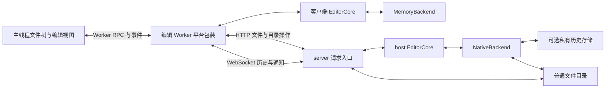

# Web 当前状态与请求交互

本文描述 Web 当前实现的状态归属、存储、加载范围与远端请求流程。目标架构见 [architecture.md](../architecture.md)，实施阶段见 [roadmap.md](../roadmap.md)。行为变化时同步维护本文。

当前远端 Vault 的 UI 按打开的标签建立编辑 buffer，但 Worker 会同步 host 已登记的全部文本历史；目录树按展开范围读取条目，非文本内容按需取得。客户端文本副本驻留内存，没有 OPFS 持久化或普通目录镜像。

## 实例与职责

每个打开的 VaultInstance 拥有独立的编辑 Worker、Rust EditorCore、文件树状态和编辑 buffer。切换 Vault 只切换视图，保留原实例的运行资源。远端实例各自建立一条 WebSocket，按文档 ID 多路传输文本历史。

| 层                          | 持有的状态                                                 | 职责                                                     |
| --------------------------- | ---------------------------------------------------------- | -------------------------------------------------------- |
| 主线程文件树                | 已读取的目录子项、展开、选中、剪贴板、滚动                 | 展示条目，发起文件操作，响应变化提示重新读取             |
| 主线程文档视图与编辑 buffer | 打开标签的正文投影、待确认输入、选区、滚动、IME 与命令状态 | 即时交互，按 Worker 回复和事件更新投影                   |
| 编辑 Worker 的 Rust core    | 文本正文、CRDT 历史、版本、writer、个人撤销和预览会话      | 接受编辑、导入历史、管理文档状态与预览任务               |
| 编辑 Worker 的平台包装      | 网络会话、请求关联、host 元数据、计时与 IO 适配            | 承载 core，调度请求与事件，选择存储和传输通道            |
| server host                 | 共同文本历史、文档身份、磁盘基线、目录与普通文件           | 校验并提交编辑，串行执行目录操作，协调外部修改和文件保存 |

UI 的正文是 core 已接受正文与待确认输入的投影；CRDT 历史和个人撤销由 core 管理。预览另有按需创建的分析 Worker，计算结果与资源快照也是内存中的派生状态，不构成文档持久化。

## 两种 Backend 契约

代码中需要区分两种 Backend：

- Rust `Backend`：EditorCore 注入的存储与 IO 契约，包含身份、历史恢复与提交、可选普通文件投影。浏览器使用 `BrowserBackend` 或 `MemoryBackend`。
- TypeScript `VaultBackend`：文件访问契约，提供 `readDir`、`stat`、字节读写、目录操作、变化监听和关闭。OPFS、本机目录与 HTTP 文件适配器实现该接口；UI 通常使用经 Worker RPC 转发的 `treeBackend`。

远端实例的 Rust core 使用 `MemoryBackend` 保存客户端历史；它的文件访问由 `HttpVaultBackend` 连接 host。HTTP 文件适配器不会将客户端历史存入 OPFS。WebSocket 则承担独立的文本同步与保存命令。

## 存储与持久化

| 数据                           | 本地默认 Vault                     | 远端 Vault 客户端                                 |
| ------------------------------ | ---------------------------------- | ------------------------------------------------- |
| 普通文件与目录                 | OPFS `/vaults/default`             | host 的普通目录；浏览器没有镜像                   |
| core 私有历史与实例身份        | OPFS `/editor-instances/default`   | `MemoryBackend`；每次创建 Worker 分配新的实例身份 |
| 当前正文、撤销、视图与目录缓存 | 当前实例内存                       | 当前实例内存                                      |
| 全局设置                       | OPFS `/celestite/settings.json`    | 同一份应用设置                                    |
| 远端连接记录                   | OPFS `/celestite/connections.json` | 保存 URL 与名称，不保存正文、CRDT 历史或认证令牌  |

应用设置与连接记录在存储能力不可用时可以退回会话内存；默认本地 Vault 的 OPFS 后端不降级为内存存储。普通目录和 core 私有历史分开，文件树不展示私有历史目录。

本机目录 Vault 通过 File System Access API 直接访问所选目录，私有身份与历史仍存于 OPFS `/editor-instances/directory-<uuid>`。目录 handle 与连接身份位于 IndexedDB，按同一目录去重；页面启动只加载连接，用户点击后申请读写权限并打开独立 Worker。同一实例仅允许一个标签页持有内核。移除连接不删除普通文件或私有历史；再次登记会创建新的实例身份。

本机目录预览可另行授权包含 Vault 的共同父目录，仅通过 package 资源接口读取外部依赖。资源 handle 按实例保存在 IndexedDB，`resolve()` 确定 Vault 在授权范围中的相对位置；编译资源使用 `/workspace` 虚拟命名空间，文件树与写回仍使用原来的 Vault handle。授权更新使项目预览失效，取消或选错目录保留原授权；资源权限失效不阻止文档编辑。

连接列表显示已授权目录与 Vault 的相对位置，不提供完整系统路径。源码 / 分栏 / 预览模式存于全局 `editor.previewMode`，由所有文件与 Vault 共用，刷新恢复且不接受项目级覆盖；各文档独立记录预览滚动位置。

目录核对只刷新文件树与实际变化的正文，不使未变化的预览失效；成功或失败的预览均不定时重新计算。浏览器侧未打开的配置与外部 package 变更通过“刷新预览”重新读取；失败时按钮显示“重试预览”。显式刷新同时重新取得组件资源快照。远端收到真实项目资源变化通知时更新预览。

本机目录在前台定期、恢复焦点及页面可见时核对已登记文档，core 从磁盘历史合入外部修改。未打开文件不主动加载正文，文件树按缓存范围刷新；IME 期间延后后台核对。保存前再次核对，失败保留正文；暂存写入在提交前复查内容 revision。Web Locks 无法协调本机程序，检查与最终写入／删除之间仍存在竞争窗口。

host 的历史是否跨重启保留取决于服务端是否配置持久化存储，描述响应通过 `persistentHistory` 报告。历史提交与普通文件保存分别确认：host 已确认但尚未写回普通文件的正文，在启用持久化历史时仍可跨 host 重启恢复。

客户端刷新后从 host 重建会话。未获 host 确认的输入没有客户端 OPFS 恢复副本；它们只能在当前页面仍存活时保留和导出。

## 加载范围与内存工作集

### 文件树

`FileTreeModel` 按父目录缓存直接子项：

```text
children[""]      = [notes/, assets/, README.md]
children["notes"] = [a.md, b.md]
expanded          = {"notes"}
```

读取目录取得路径和条目类型，不读取正文；大小和修改时间通过 `stat` 查询。刷新读取根目录并递归读取已展开的目录；首次展开目录读取其直接子项。折叠隐藏子项，已有子项缓存可以保留到下一次刷新。

这是一份局部目录缓存，不是完整全库 Catalog，也不参与 CRDT 合并。当前目录操作主要按路径寻址，目录和非文本文件尚无统一的稳定条目身份模型。

### 文本历史

host 启动时恢复私有历史，并递归核对普通目录，尝试将可编辑文本载入 core；监听和定期核对继续覆盖未打开文件。非 UTF-8 文本、超过当前文本限制的文件等不会作为新的可编辑文本加入。

客户端初次连接收到 host 已登记文档的 CRDT 快照，通常覆盖全库受支持文本。其后变化持续向各连接推送，不以客户端打开的标签作为筛选条件。客户端 Worker 保存这些文档的正文、历史与 host 元数据；`MemoryBackend` 同时保存内存中的历史记录。

打开标签后，主线程才建立该文档的视图记录与编辑 buffer。关闭标签移除视图记录和 buffer，Worker 中的文档继续保留并同步；当前没有文档级卸载或取消同步订阅。

因此，文本内存占用随已同步的库内容与历史增长，不只随标签数量增长。当前初始同步需要完成后才开放交互，尚未实现活动文档优先、其他正文后台补齐或有界历史工作集。

### 非文本与预览资源

图片、PDF 等文件不会随初始文本快照全量传输，下载或使用资源时再读取字节。预览资源通过只读文件访问取得；组件资源可能按所需目录递归读取，并缓存任务资源快照。这些资源读取独立于文件树的展开范围，也不建立普通目录镜像。

## 远端请求通道



UI 调用统一的文档和文件接口，经 Worker RPC 到编辑 Worker。远端 Worker 再选择 HTTP 或 WebSocket；本地 Worker 则由 core 调用 OPFS 后端，不访问 host。

下表 HTTP 路径相对于 `/api/v1/vaults/{id}`，WebSocket 命令共用该 Vault 的 `/sync` 连接。

| 行为               | 网络请求                                             | 返回与后续处理                                                         |
| ------------------ | ---------------------------------------------------- | ---------------------------------------------------------------------- |
| 取得 Vault 描述    | HTTP `GET` Vault API 根地址                          | 身份、历史身份、权限和能力                                             |
| 读取目录           | HTTP `GET /directory?path=…`                         | 直接子项，更新目录缓存                                                 |
| 查询条目信息       | HTTP `GET /stat?path=…`                              | 类型、大小、修改时间或不存在                                           |
| 打开文本标签       | WebSocket `open {path}`                              | 文档元数据、CRDT 快照与 writer，建立 UI buffer                         |
| 编辑、撤销、重做   | WebSocket `updates {id, packet, version, operation}` | host 提交确认，并推送文档变化                                          |
| 保存文本           | WebSocket `save {id, version}`                       | host 按版本写回文件，返回文档与保存状态                                |
| 查询编辑是否已提交 | WebSocket `probe {id, version}`                      | host 是否已包含指定因果版本；协议支持，当前生产 Web 编辑流程不主动调用 |
| 心跳               | WebSocket `ping`，server 推送 `heartbeat`            | 检查连接存活                                                           |
| 创建目录           | HTTP `POST /directory`                               | 成功或错误，触发目录变化提示                                           |
| 移动、重命名       | HTTP `POST /rename`，正文为 `{from, to}`             | 成功或错误，更新文档路径并通知目录变化                                 |
| 删除               | HTTP `DELETE /entry`                                 | 成功或错误，发布相应删除状态与目录变化                                 |
| 下载文件、读取资源 | HTTP `GET /file?path=…`                              | 完整字节与 ETag                                                        |
| 创建或替换普通文件 | HTTP `PUT /file?path=…&mode=…`                       | 新 ETag；替换通过 `If-Match` 校验读取基线                              |

远端生产编辑 Worker 使用 WebSocket 接收变化通知；HTTP 适配器另外提供 SSE `watch`，不是此编辑流程的通知通道。

## 连接、编辑与变化传播

### 初始连接

1. HTTP 读取 Vault 描述；创建 Worker、内存后端与客户端 core。
2. WebSocket 首条握手提交协议版本、认证令牌和 Vault / 历史身份；server 校验后返回会话 ID。
3. server 逐文档发送初始快照和分配的 writer，避免一次构建整库的初始 JSON 快照集合。
4. 在 host 的同一串行边界核对已发送版本、补齐传输期间变化并建立后续订阅，随后发送 `ready`。
5. 客户端整批校验初始快照、补齐增量、最终路径和删除状态，再原子替换会话；全部成功后开放交互。删除记录不占用活动路径，重连失败保留旧正文、writer、撤销和预览订阅。

server 逐文档发送不代表客户端只驻留一个文档：客户端传输层会收集初始帧，直到 `ready` 后交给 core 导入。连接完成后已有的 Worker 文档也不会自动变成打开的 UI 标签。

### 编辑与保存

```text
UI 即时显示输入
  → Worker core 接受编辑并生成 CRDT 增量
  → WebSocket updates
  → host 校验会话、writer 与因果依赖，合入并提交历史
  → 返回提交确认，向连接的客户端推送文档变化
  → 客户端 core 导入，更新已打开标签的正文投影
```

请求以 `sessionId` 和 `requestId` 关联；编辑的 `operation` 序号用于检查提交顺序及重发内容。host 为每条连接记录已发送的文档版本，后续从该版本导出增量。文档推送带连续序号，已处理的旧帧不会重新覆盖状态。

`updates` 确认共同历史提交，`save` 要求普通文件写回，两个动作分别完成。保存携带客户端已见的因果版本；host 状态已经前进时，客户端先取得新状态再重试，不直接覆盖尚未见过的正文。

远端关闭标签只等待输入确认，再移除视图；关闭连接只处理历史提交并释放资源，不写回共享文档。下载读取普通文件的已保存字节，不隐式保存共享正文。移动、删除和普通文件写入仍可能先保存涉及的未保存文本；预览资源访问使用只读查询。

core 明确拒绝的输入保留在 UI 投影中，工作区暂停交互并提供导出与撤回入口。撤回同时移除依赖它的后续输入，重新读取当前已接受正文后继续编辑；结果未知的输入只能走重连恢复。共享文档的保存冲突提供取消与重试保存，不提供独立实例的覆盖或丢弃动作。

### 目录与非文本变化

```text
HTTP 目录或普通文件操作
  → host 校验并执行
  → WebSocket 推送 {kind: "tree"}
  → 客户端使目录缓存失效
  → HTTP 重新读取根目录和已展开目录
```

`tree` 是粗粒度变化提示，不携带完整目录树或精确目录操作增量。移动涉及文本时，host 同时更新文档路径并保留文档 ID 与 CRDT 历史；删除会发布文档的删除状态。目录刷新与文档历史推送是独立的状态更新。

非文本替换是完整字节版本的条件写入，不合并二进制内容。一个客户端成功替换后，另一个客户端使用旧 ETag 替换会收到冲突。目录操作由 host 排序执行，例如移动目标已存在时返回错误；当前目录操作没有 Catalog CRDT 历史。

host 普通目录的外部修改由文件监听提示和定期核对发现。文本修改通过 host 的文件系统桥接转为历史操作，再沿 WebSocket 推送；目录与普通文件变化提示使客户端重新查询相关状态。

## 关闭与重连

| 操作                         | 状态与连接的生命周期                                                                |
| ---------------------------- | ----------------------------------------------------------------------------------- |
| 关闭文档标签                 | 远端等待输入确认后移除 UI buffer，不保存普通文件；Worker 历史继续同步               |
| 切换 Vault                   | 保留原实例的 Worker、文档、目录缓存与远端连接                                       |
| 远端断线                     | 保留当前内存正文；工作区遮罩，停止编辑和文件操作                                    |
| 重新连接                     | 核对身份后采用 host 快照重建活动历史，分配新 writer，清空个人撤销；不重放旧会话操作 |
| 删除远端连接记录             | 未确认输入阻止关闭；确认后释放实例，不隐式保存或删除 host 文件                      |
| 页面刷新、关闭或 Worker 终止 | 客户端内存副本结束；下次打开从 host 建立新会话                                      |

有未确认输入时，重新连接需要先导出正文或明确选择丢弃。迟到的旧连接回复不导入新会话；host 已提交但回执丢失的编辑可以随新会话历史返回。客户端内存中的历史提交不代表本机持久化成功，host 回执也不改变这一点。

## 实现入口

- [VaultManager](../../web/src/lib/vault/manager.ts)：实例创建、切换、关闭与连接记录。
- [FileTreeModel](../../web/src/lib/file-tree/model.ts)：局部目录缓存、展开与刷新。
- [WorkerDocuments](../../web/src/lib/editor/client/documents.ts)：主线程视图投影、文件 RPC 与关闭标签。
- [本地 Worker](../../web/src/lib/editor/local/worker.ts)、[远端 Worker](../../web/src/lib/editor/remote/worker.ts)：core 与后端的构造。
- [RemoteEditorHost](../../web/src/lib/editor/remote/host.ts)、[RemoteTransport](../../web/src/lib/editor/remote/transport.ts)：远端命令、快照导入、请求关联与重连。
- [HTTP 文件适配器](../../web/src/lib/vault/http.ts)、[预览资源读取](../../web/src/lib/editor/preview/resources.ts)：普通文件访问与只读资源。
- [BrowserBackend](../../crates/celestite-core/src/browser.rs)、[MemoryBackend](../../crates/celestite-core/src/memory.rs)：客户端存储实现。
- [EditorCore](../../crates/celestite-core/src/editor.rs)：历史恢复、文件发现、编辑、身份与保存。
- [server 同步](../../crates/celestite-server/src/sync.rs)、[HTTP 文件入口](../../crates/celestite-server/src/lib.rs)、[文件核对](../../crates/celestite-server/src/reconcile.rs)：host 协作与普通目录协调。
